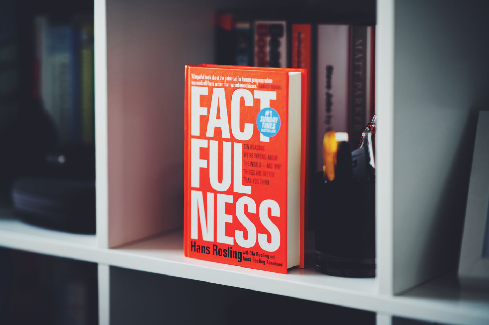

How is that possible that chimpanzee outperforms bunch of C-level executives in a simple test about global trends? But, of course, there is not necessarily something wrong with CEOs, CFOs and CTOs of well-known organisations because this issue applies to all of us — we are a bunch of ignorants stuck with the massively distorted vision of humanity. To top it off, people are full of negative beliefs inspired by events from the distant past, but in reality, society is in a much better state than the majority of us think.

["Factfulness"](https://www.goodreads.com/book/show/34890015-factfulness) results from the last few years of work that Hans Rosling dedicated to fighting against people's ignorance. Co-authored with Ola Rosling and Anna Rosling Rönnlund book offers a new framework for thinking about the world. The book is split into sections about instincts that let us fall into beliefs far from reality. Insightful facts supported by a bunch of numbers and beautiful diagrams.

I highly recommend it to everyone. Eye-opening and easy to follow publication that makes you think 📕
