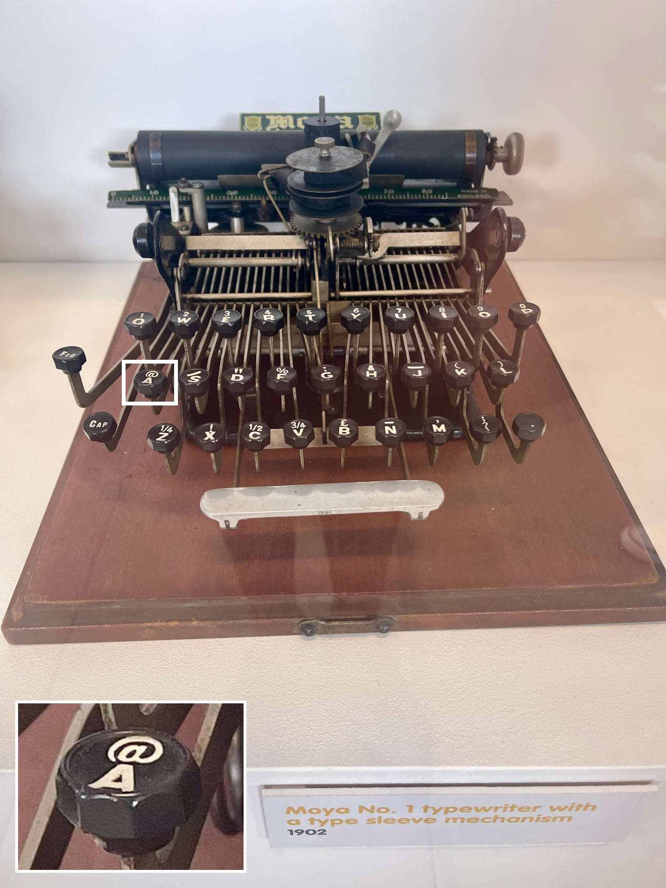

It was an ordinary Saturday when my girlfriend and myself decided to visit [Abbey Pumping Station Museum in Leicester](https://www.leicestermuseums.org/abbey-pumping-station/) while waiting for the mechanic to fix our car. Massive beam engines to support local sewage systems and all that is super cool, but something that caught my attention was Moya No. 1 typewriter machine from 1902. Typewrites fascinate me a lot, but something that triggered my curiosity was the @ sign. Surely email addresses and Twitter were not a thing back then.

Like a typical millennial, I thought that [the @ sign](https://en.wikipedia.org/wiki/At_sign) is an invention of the 70s for email addresses and other protocols like SSH. Wrong assumption! The first discovered usage of @ character goes back to 1345, but it was popularized in the 16th century in Spain and Portugal as an abbreviation for the unit of weight, mass or volume — [arroba](https://en.wikipedia.org/wiki/Arroba).

I have a fun and little known fact for y'all. In Polish, it is called “małpa” which translates to “monkey”. Yeah, literally “example”, “monkey”, “gmail.com”.

I asked three of my friends if they knew any use case of the @ sign other than obvious modern usage. Unfortunately, none of them could tell me anything more than I already knew, so I wrote this post down. Until next time, stay curious 🧐
