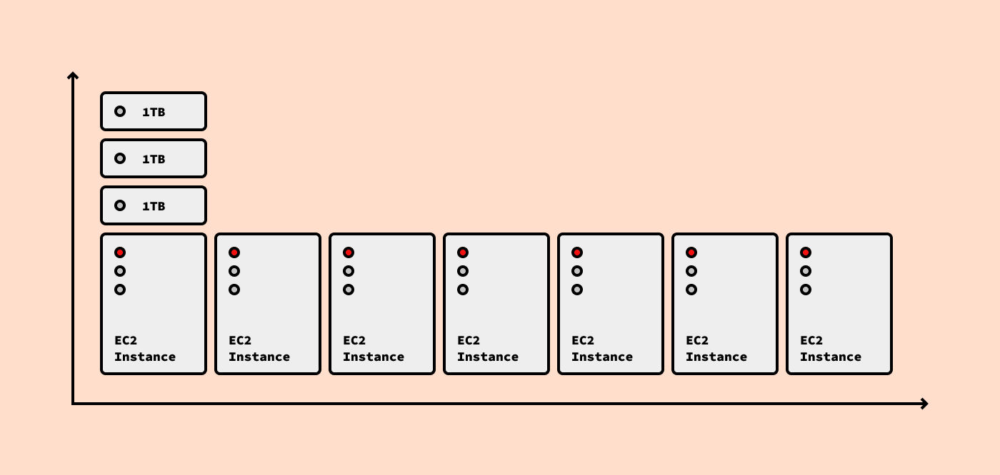

Scalability is the ability to increase or decrease resources based on demand. There are two types of scalability: vertical and horizontal. Whenever I hear one of these two terms, I need to stop for a second to think which one is which. I always imagine a simple diagram that helps me to understand the concept. This mental shortcut helps me a lot, so maybe it will help you too.

Vertical scalability is all about increasing the resources on the instance. For example, it may increase storage on the server, increase the number of cores on the processor, or add more RAM. It is applicable in no non-distributed systems and is limited by the hardware.

Horizontal scalability (sometimes also called elasticity) is adding extra instances to the system. This scaling applies to distributed systems and contributes to the high availability of the system.

## Not only applicable for software development

These two terms have a broader use case. For example, we can use them in different fields like finance, business, production etc.

Hopefully, that helped you out to visualize the concept. I will see you again in the following article 👋
