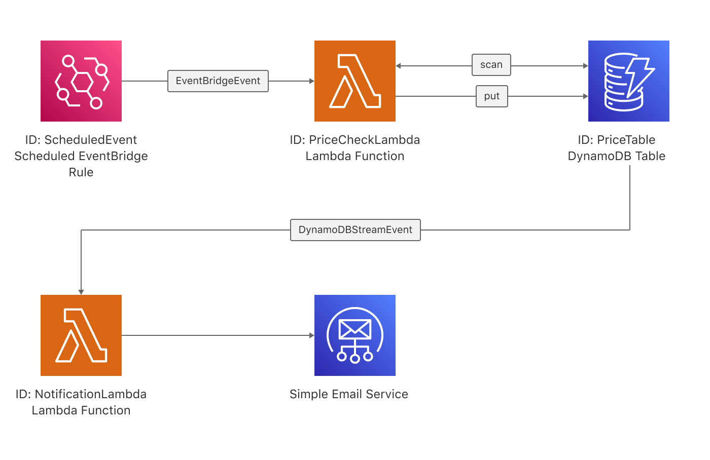
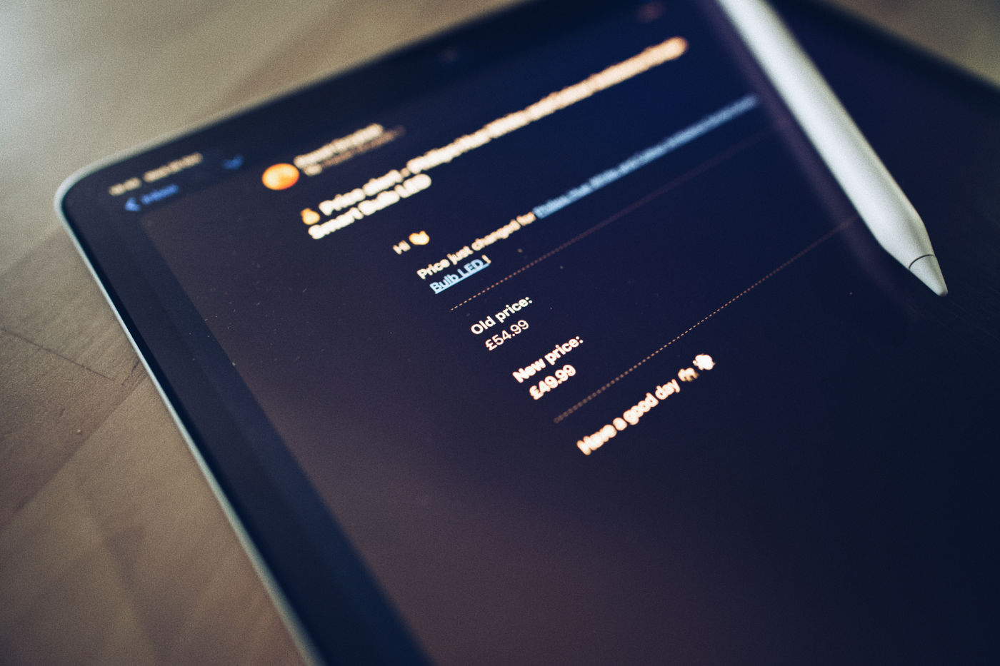

I wanted to buy a PlayStation 5 but it was out of stock all over the place, so I spent a short amount of time building a price monitor using [AWS CDK](https://aws.amazon.com/cdk/), [Lambda](https://aws.amazon.com/lambda/), [DynamoDB](https://aws.amazon.com/dynamodb/) and [SES](https://aws.amazon.com/ses/). The implementation turned out to be simple enough, so I decided to share the core parts with you. This article assumes that you have at least some basic understanding of the AWS platform and CDK framework.

## Price monitor architecture

Everything starts from a scheduled EnventBridge rule (`ScheduledEvent`) that triggers the Lambda function (`PriceCheckLambda`) every so often (in my case, 15 minutes). This function reads current product prices stored in DynamoDB (`PriceTable`), compares with a current price online and updates DB accordingly. Updates in DynamoDB trigger a second Lambda (`NotificationLambda`) that sends an email to my mailbox. Done!



I deliberately stripped down the noise and kept only the core parts. You can find my full implementation of the [price monitor on my GitHub](https://github.com/pawelgrzybek/price-monitor).

### CDK stack

To provision architecture, I used AWS CDK. On one of the previous projects, I used pure CloudFormation templates, and I don’t miss these times since the day I embraced CDK.

```ts
// stack.ts

import * as path from "path";
import * as cdk from "@aws-cdk/core";
import * as events from "@aws-cdk/aws-events";
import * as targets from "@aws-cdk/aws-events-targets";
import * as lambdaNodejs from "@aws-cdk/aws-lambda-nodejs";
import * as lambda from "@aws-cdk/aws-lambda";
import * as dynamodb from "@aws-cdk/aws-dynamodb";
import * as iam from "@aws-cdk/aws-iam";
import * as awsLambdaEventSources from "@aws-cdk/aws-lambda-event-sources";

export class Stack extends cdk.Stack {
  constructor(scope: cdk.Construct, id: string) {
    super(scope, id);

    const dynamoDbTable = new dynamodb.Table(this, "PriceTable", {
      partitionKey: {
        name: "id",
        type: dynamodb.AttributeType.STRING,
      },
      stream: dynamodb.StreamViewType.NEW_AND_OLD_IMAGES,
    });

    const lambdaPriceCheck = new lambdaNodejs.NodejsFunction(
      this,
      "PriceCheckLambda",
      {
        entry: "./price-check.ts",
        environment: {
          TABLE_NAME: dynamoDbTable.tableName,
        },
      }
    );

    const lambdaNotification = new lambdaNodejs.NodejsFunction(
      this,
      "NotificationLambda",
      {
        entry: "./price-notification.ts",
      }
    );

    dynamoDbTable.grantReadWriteData(lambdaPriceCheck);

    lambdaNotification.addEventSource(
      new awsLambdaEventSources.DynamoEventSource(dynamoDbTable, {
        startingPosition: lambda.StartingPosition.TRIM_HORIZON,
        batchSize: 1,
      })
    );

    lambdaNotification.addToRolePolicy(
      new iam.PolicyStatement({
        actions: ["ses:SendEmail"],
        resources: ["*"],
      })
    );

    new events.Rule(this, "ScheduledEvent", {
      schedule: events.Schedule.rate(cdk.Duration.minutes(15)),
      targets: [new targets.LambdaFunction(lambdaPriceCheck)],
    });
  }
}
```

### Price check Lambda

This function is responsible for comparing prices from the database to current prices online. I used [cheerio](https://cheerio.js.org) for the web scraping part, but most likely, I will replace it with [Puppeteer](https://developers.google.com/web/tools/puppeteer).

```ts
// price-check.ts

import fetch from "node-fetch";
import cheerio from "cheerio";
import {
  DynamoDBClient,
  ScanCommand,
  PutItemCommand,
} from "@aws-sdk/client-dynamodb";
import { ScheduledHandler } from "aws-lambda";
import { marshall, unmarshall } from "@aws-sdk/util-dynamodb";

interface PriceRow {
  selector: string;
  id: string;
  url: string;
  email: string;
  item: string;
  price: string;
}

const { AWS_REGION: region, TABLE_NAME: TableName } = process.env;

const dbClient = new DynamoDBClient({ region });

const handler: ScheduledHandler = async (event) => {
  try {
    const { Items, Count } = await dbClient.send(
      new ScanCommand({
        TableName,
      })
    );

    if (!Count) {
      return;
    }

    const itmesUnmarshall = Items?.map((i) => unmarshall(i)) as PriceRow[];

    const newPrices = await Promise.all(
      itmesUnmarshall.map(({ url }) =>
        fetch(url).then((response) => response.text())
      )
    );

    const diff = itmesUnmarshall.reduce((acc, item, index) => {
      const $ = cheerio.load(newPrices[index]);
      const price = $(item.selector).text();

      if (price === item.price) {
        return acc;
      }

      return [...acc, { ...item, price }];
    }, [] as PriceRow[]);

    if (diff.length) {
      const updateCommands = diff.map((item) =>
        dbClient.send(
          new PutItemCommand({
            TableName,
            Item: marshall(item),
          })
        )
      );
      await Promise.all(updateCommands);
    }

    return;
  } catch (error) {
    console.error(error);
    throw new Error("Uuuups!");
  }
};

export { handler };
```

### Notification Lambda

This function is responsible for parsing the DynamoDB stream that contains old and new prices and sending a notification email. I used SES to handle email communication, but you know — you do you.

```ts
// price-notification.ts

import { unmarshall } from "@aws-sdk/util-dynamodb";
import { SESClient, SendEmailCommand } from "@aws-sdk/client-ses";
import { DynamoDBStreamHandler } from "aws-lambda";

const { AWS_REGION: region } = process.env;

const sesClient = new SESClient({ region });

const handler: DynamoDBStreamHandler = async (event) => {
  const record = event.Records[0];
  const {
    // @ts-ignore
    dynamodb: { NewImage, OldImage },
    eventName,
  } = record;

  if (eventName !== "MODIFY") {
    return;
  }

  const unmarshalledNewImage = unmarshall(NewImage);
  const unmarshalledOldImage = unmarshall(OldImage);

  const { price, item, email } = unmarshalledNewImage;

  try {
    await sesClient.send(
      new SendEmailCommand({
        Source: email,
        Destination: {
          ToAddresses: [email],
        },
        Message: {
          Body: {
            Html: {
              Charset: "UTF-8",
              Data: `Old price: ${unmarshalledOldImage.price}, new price: ${price}`,
            },
          },
          Subject: {
            Charset: "UTF-8",
            Data: `💰 Price alert - ${item}`,
          },
        },
      })
    );

    return;
  } catch (error) {
    console.error(error);
    throw new Error("Uuuups!");
  }
};

export { handler };
```

## To summarise

Creating this service was very enjoyable — good Philips Hue deals on Amazon and my new discounted pair of kicks I like even more. I pay for this service absolutely nothing, thanks to generous AWS free tier. By the way, I don’t want to buy PS5 anymore. Hopefully, you found it helpful 🤪


