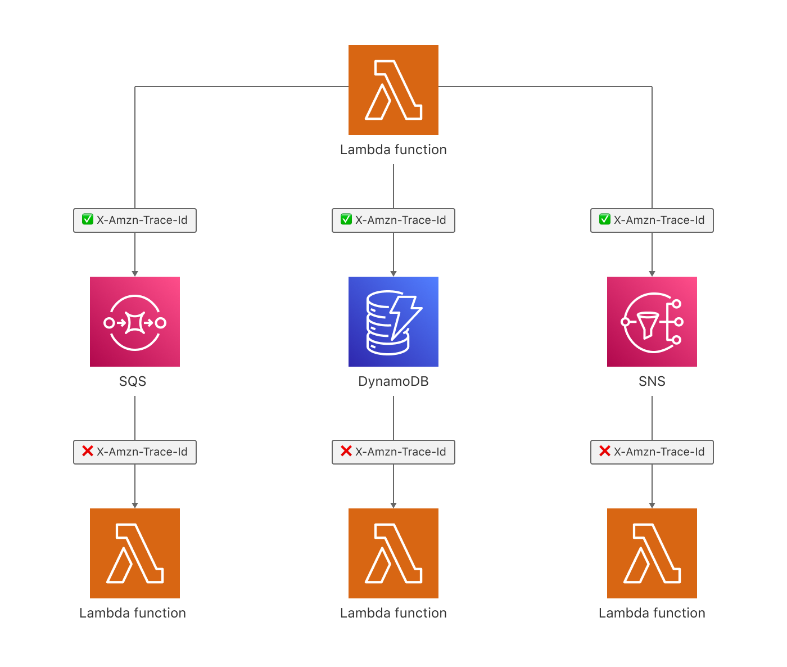

I faced a challenge where I wanted to propagate AWS X-Ray tracing `X-Amzn-Trace-Id` header from one Lambda through DynamoDB stream triggered by `put` operation up to another Lambda. The documentation doesn't cover working with AWS X-Ray and DynamoDB, but I found the answer in the ["Amazon SQS and AWS X-Ray" section](https://docs.aws.amazon.com/xray/latest/devguide/xray-services-sqs.html) that follows a very similar flow. If you're facing a similar challenge in your project, I have bad news. This integration is currently impossible.

> It is not currently possible to connect a trace passed into an SQS queue to the Lambda consuming it on the other end. This is because although the trace header is propagated in the SQS message, you cannot set it in the Lambda because segments in Lambda are immutable.

If you expect a better level of traceability of your service, for now, the only option is to use a third party service.[The Epsagon Service Map](https://docs.epsagon.com/docs/application-performance-monitoring/visualize-applications) is what I used and it worked great for me, but I know that [Datadog](https://www.datadoghq.com)  comes with a similar feature. Fingers crossed that AWS X-Ray will become more powerful in the future, as it would be nice to have a sufficient level of tracing and not to leave AWS world.
