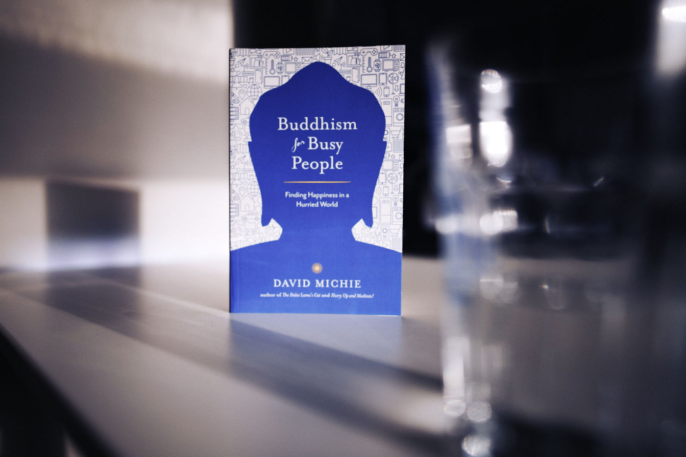

One of my best friends was fascinated by Buddhism. Sadly, he passed away more than a decade ago. I promised myself that one day I would try to explore this subject as a symbol of respect to him and fulfil my natural curiosity. There are plenty of resources out there, but after some quick research, none of them looked more appealing to me than ["Buddhism for Busy People" by David Michie](https://www.goodreads.com/book/show/746610.Buddhism_for_Busy_People).

This is a story of a successful PR Executive from London living in the middle of a rat race, who found genuine happiness in meditation. Over the years, he followed by exploring other techniques of the Buddhism lifestyle. Many anecdotes and life recollections enriched David's life transformation tale. However, I'm not sure if it's the right book for anyone who would like to explore the basics of Buddhism. It is partially about the subject, but it feels too autobiographical to me for the most part. Also, it can be hard to read for a non-native English speaker like me.

I will continue exploring the topic. Feel free to drop a comment below if you have any recommendations for me, please. For now, stay curious 🧐
