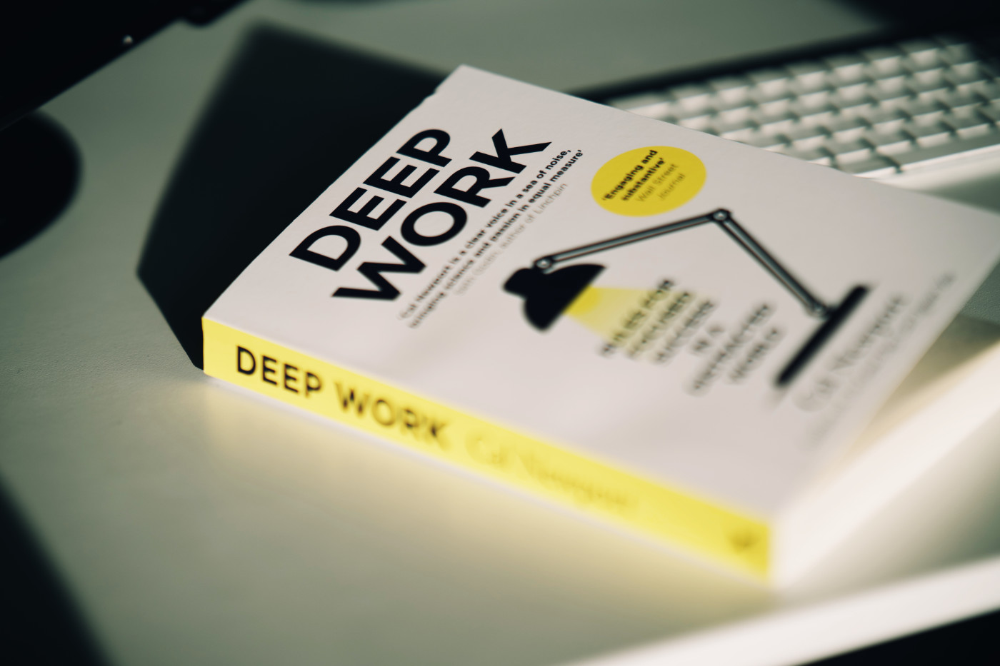
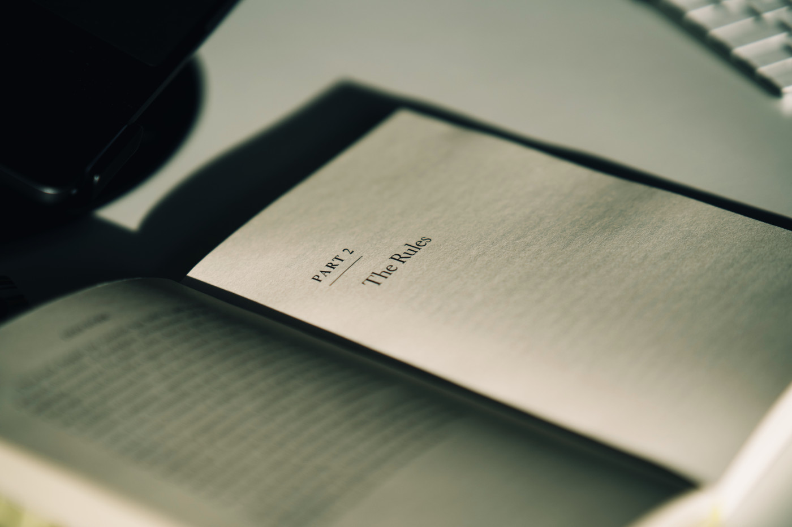

After reading "Digital Minimalism" by Cal Newport, I knew this wouldn't be the last book I read by this author. So, being fascinated by the results of a distraction-free lifestyle, I decided to give this almost legendary publication a read.

"Deep Work" starts from the precise definition of deep and shallow effort and why the prime one is crucial for impactful work in economics nowadays. Significant capital, being exceptionally good at something, and deep focus work are the only three ways to achieve impact. Still, distraction-free, uninterrupted work is the only one you can train by following a few simple rules. This book helps to define these rules and provide easy to follow actionable advice.

The author is obsessed with productivity, and as much as I admire him, I can't agree with everything he says. I think you absolutely can achieve a fulfilled life without scheduling every minute of it. I tried that, and it very quickly became a paranoiac race to tick off all my "to do" list items. Nah — never again!

I highly recommend this book to everyone interested in boosting their productivity by actual deep work — a good balance of theory and rules which are easily applicable to your everyday life.
