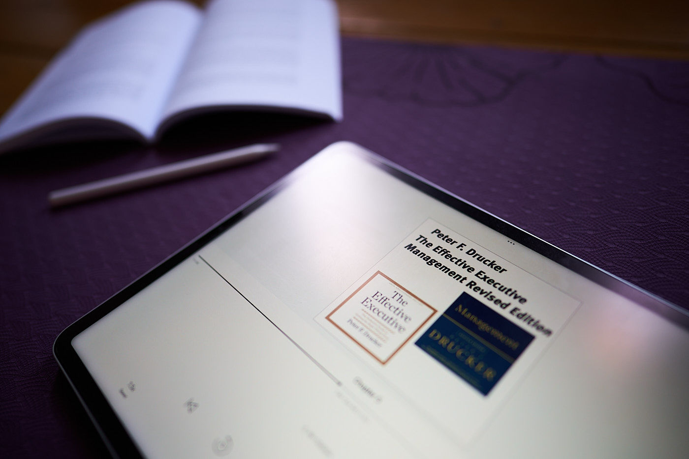
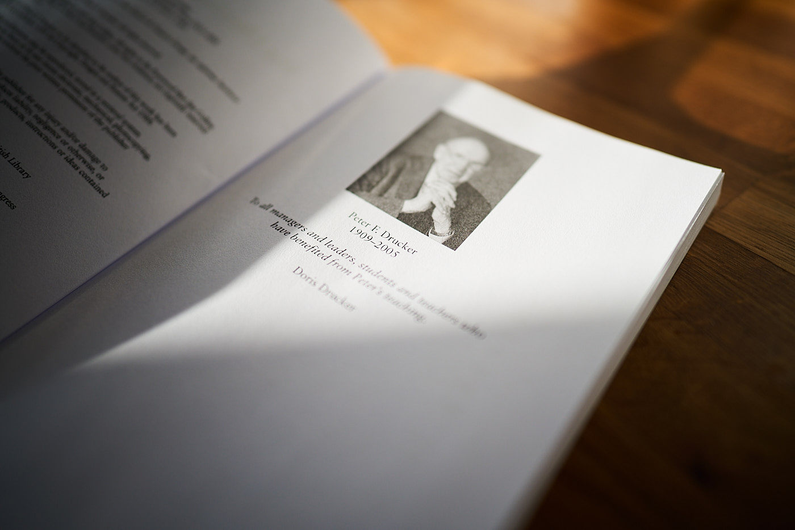

Reading self-development books is my favourite way of boosting productivity. It doesn’t matter if it is only a motivational kick that keeps me going for a few weeks or perhaps it introduces a new habit in my life — as long as it helps me get things done, I'm a happy man.

I heard about ["The Effective Executive" by Peter F. Drucker](https://www.goodreads.com/book/show/48019.The_Effective_Executive) numerous times. After reading this book, I no longer wonder why this publication is so popular. If I could recommend only one self-development book, it would be this one.

Even though the book was published in 1967, nothing in this book is outdated. A half of a century later, Drucker is still called The Father of Modern Management. The core principles of being an effective executive didn’t change at all — just time and tools to support us went through many iterations.

The book is focused on a few factors to help us become effective executives: time management, contribution, identifying your strengths, task prioritization and decision making. Each aspect is explained in detail, and the author helps us master them. Frankly, none of these are a thing that we are born with, but we can learn all these skills. Intelligence, knowledge and a bit of creativity are all we need.
