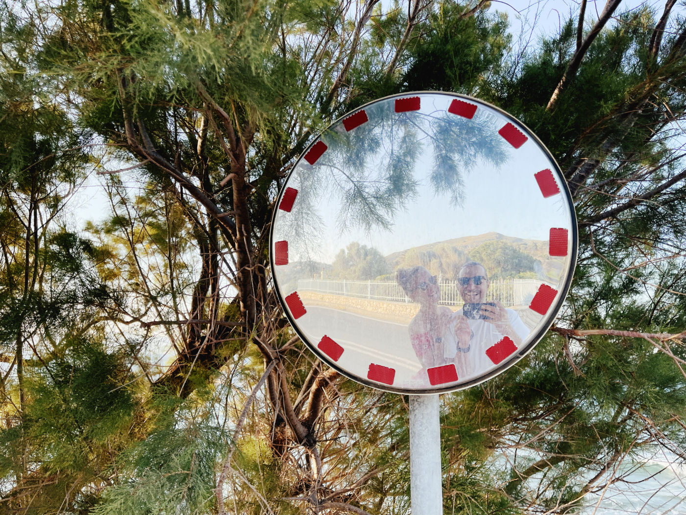
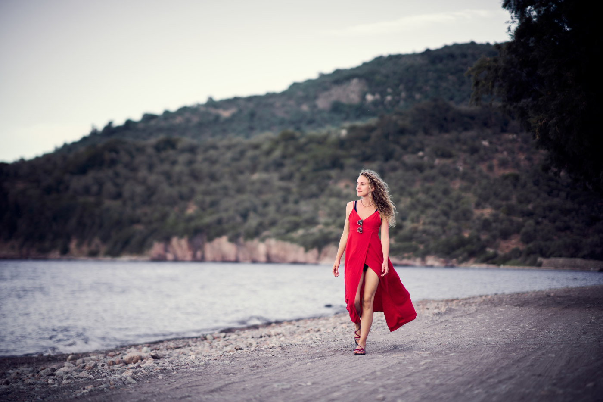
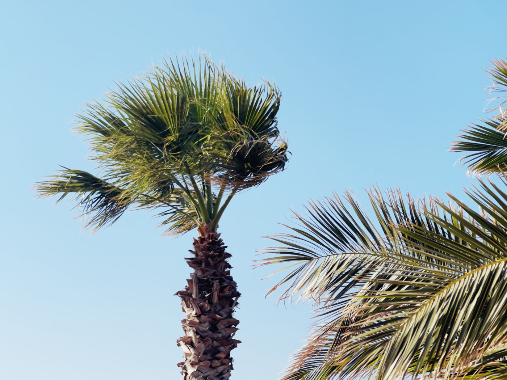
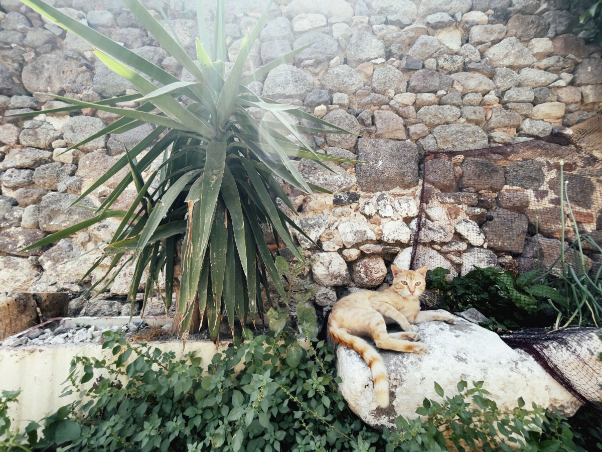
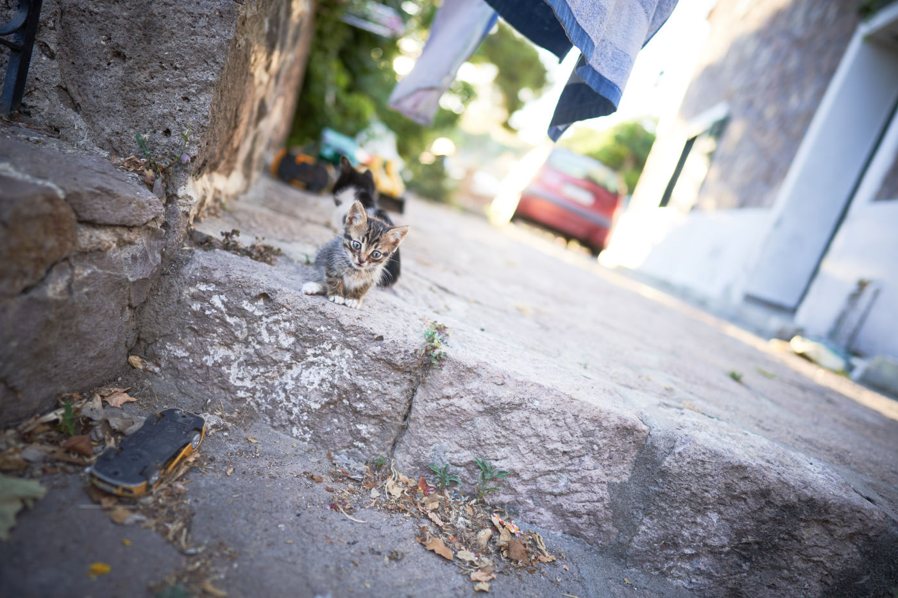
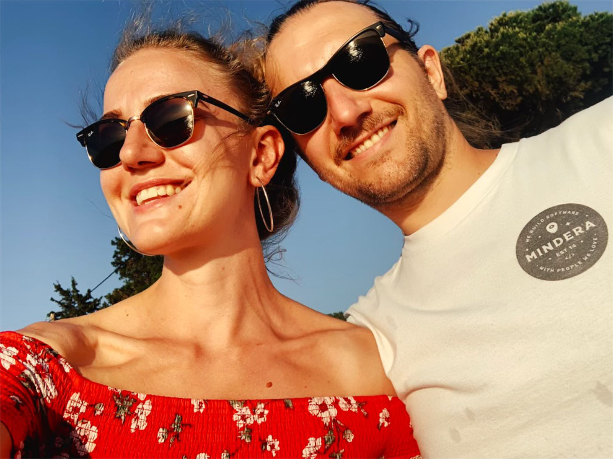
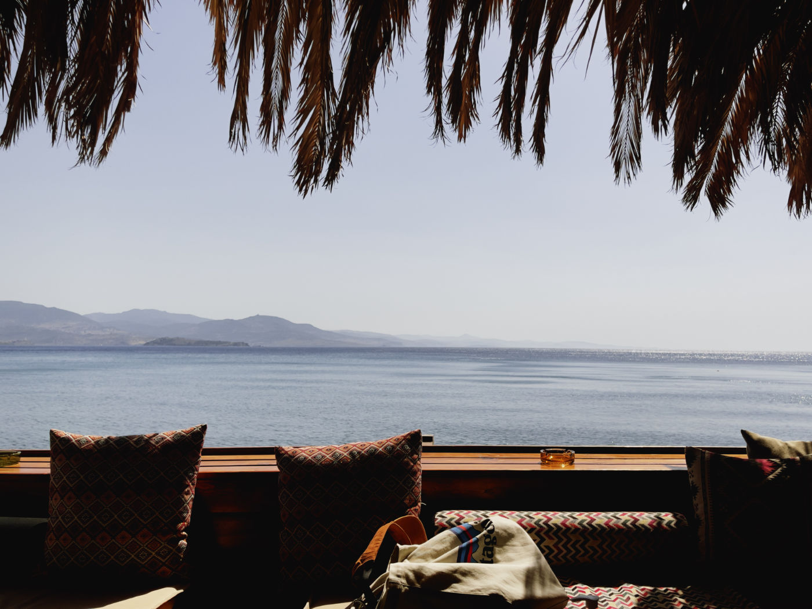

This post is just a quick reminder to you all about the importance of switching off occasionally. With my better half, we recently travelled to Lesbos, a Greek island close to Turkey. We met amazing people down there, ate tons of excellent food, drove around the island and most importantly, had a break from an intense day-to-day lifetime.

I also wanted to share some photos with you, but I didn't want to do that on Facebook or Instagram because all these social media is just garbage. However, I already own a tiny corner of the World Wide Web (this is the website you are on), so I decided to put it here.

I took most of these pictures using iPhone 12 Pro Max and only a couple with my beefy Sony α7R III. Can you guess which one is which? Enjoy 📸

