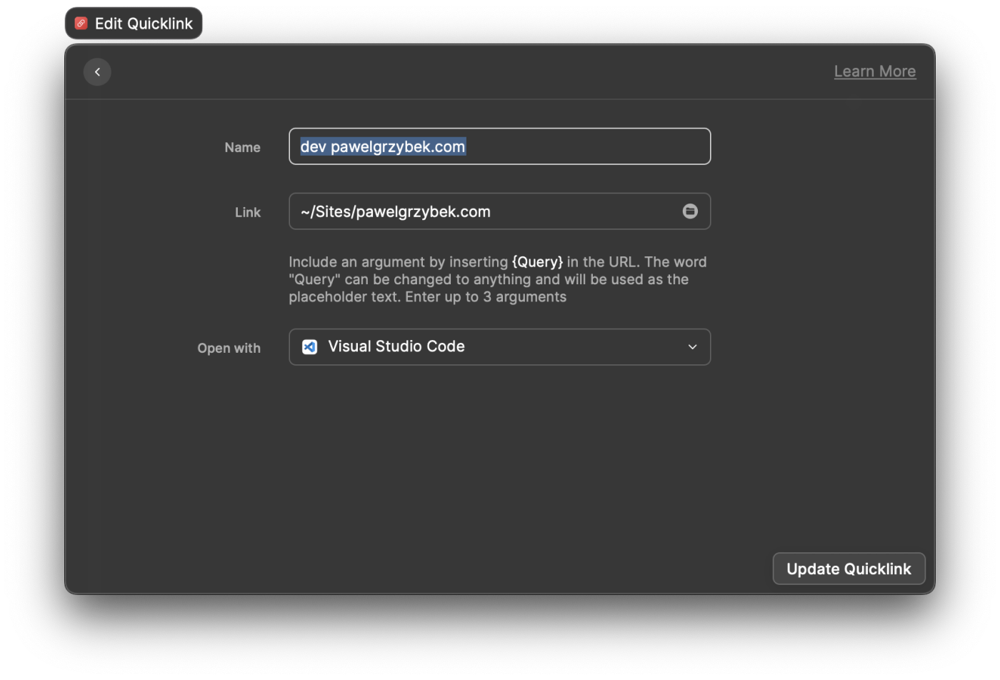

Most likely, we work on multiple projects in Visual Studio Code hence the high popularity of [the Project Manager extension](https://marketplace.visualstudio.com/items?itemName=alefragnani.project-manager). If you are a Raycast user, you can achieve the same functionality using [Quicklinks](https://www.notion.so/Quicklinks-8cc9c64a077a440189858c074492e8d8).

You can also use it with other IDEs, but Visual Studio Code is [the most popular one](https://insights.stackoverflow.com/survey/2021#section-most-popular-technologies-integrated-development-environment), and I wanted to grab your attention 😜 Did it work?

Pick an easy-to-remember and quick-to-type "name", pass the path to your project as a "link", and pick your IDE of choice to the "Open with" field. Look at this quick example.

- Name: `dev pawelgrzybek.com`
- Link: `~/Sites/pawelgrzybek.com`
- Open with: `Visual Studio Code`

I hope it helped and gave you tons of creative ideas on using Raycask Quicklinks. I use it hundreds of times a day, and over time this quick tip will save me a lot of time. If something can be automated, it should be, right? Thanks for reading, and until next time keep automating things 👋
