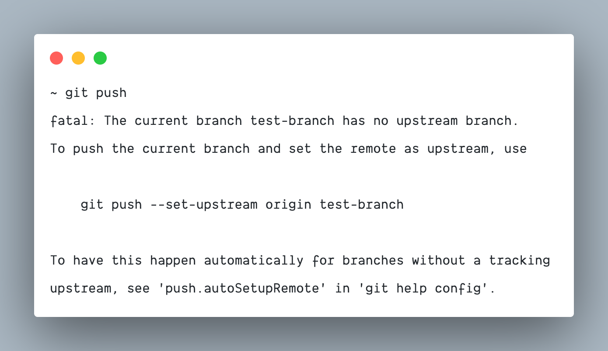

A little [git tip published on Twitter by James Ide](https://twitter.com/ji/status/1546948817462800384) went viral a few days ago, and it inspired me to write down this post. You usually see this when you try to `git push` a local branch that misses a remote upstream.

In most cases, something that we need in this case is to push the current branch to the remote repository under the same branch name. Luckily we have two helpful configuration options to do it.

1. `git config --global --add push.default current`
1. `git config --global --add push.autoSetupRemote true`

Setting any of these confuguration options ([`push.default`](https://git-scm.com/docs/git-config#Documentation/git-config.txt-pushdefault) or [`push.autoSetupRemote`](https://git-scm.com/docs/git-config#Documentation/git-config.txt-pushautoSetupRemote)) will automatically push to the receiving end a branch with the same name. Additionally, `push.autoSetupRemote` (added to git 2.37.0) sets the upstream tracking to the corresponding branch.

No more `git push --set-upstream origin test && git push` again! Bye 👋
