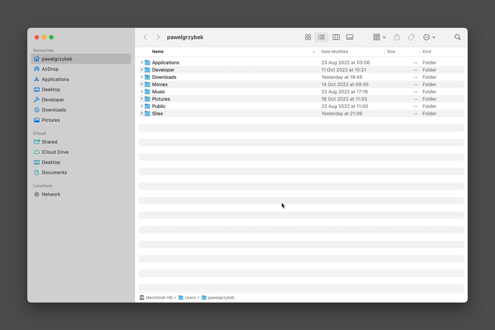
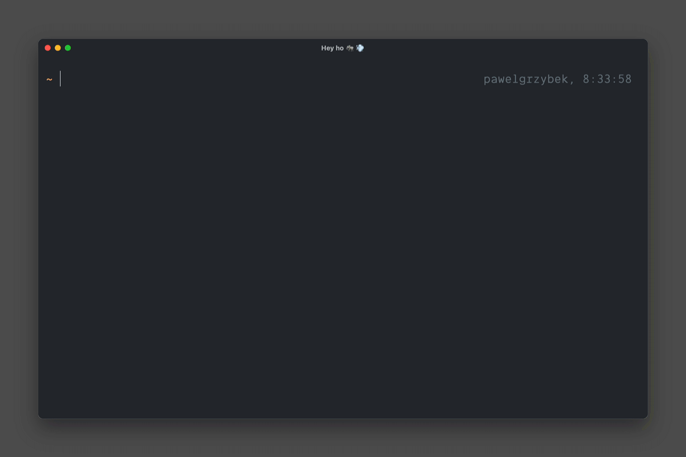
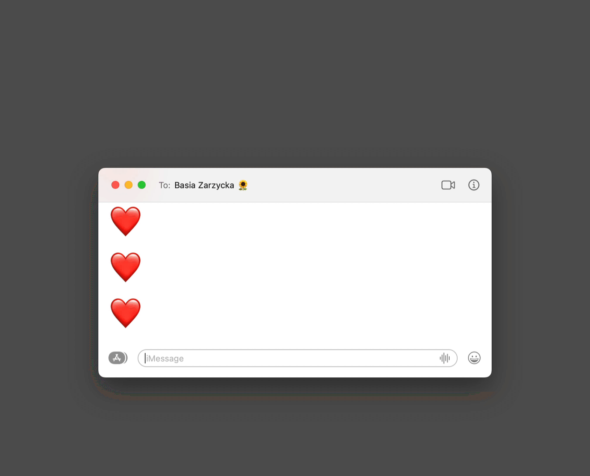
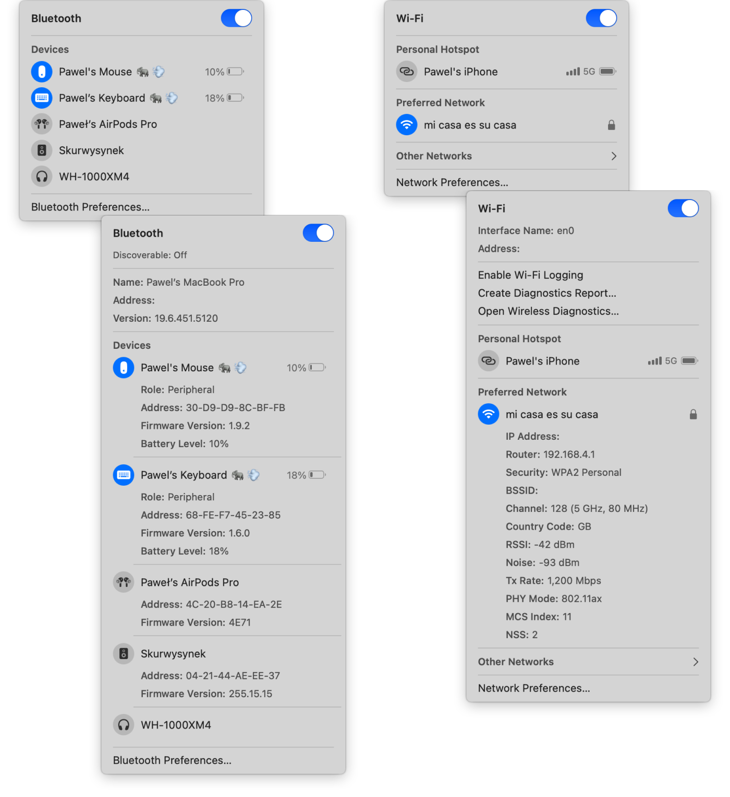

Over the years, I collected an arsenal of little "how did you do it" kinda macOS tips and tricks. Let me share some of them with you. This post doesn't assume you have XYZ software installed — just pure macOS stuff here. Enjoy!

- [Show/hide hidden files (dotfiles)](#showhide-hidden-files-dotfiles)
- [Built-in network quality testing tool](#built-in-network-quality-testing-tool)
- [Fine-grained volume/brightness control](#fine-grained-volumebrightness-control)
- [Quick reply and tapback shortcut in Messages](#quick-reply-and-tapback-shortcut-in-messages)
- [Reduce duration and delay of Dock auto-hiding](#reduce-duration-and-delay-of-dock-auto-hiding)
- [Details about Bluetooth devices and Wi-Fi network](#details-about-bluetooth-devices-and-wi-fi-network)
- [Quickly toggle the “Do Not Disturb” mode](#quickly-toggle-the-do-not-disturb-mode)
- [Screenshots (8 methods)](#screenshots-8-methods)
- [Change the screenshot format](#change-the-screenshot-format)

## Show/hide hidden files (dotfiles)

Hidden files are those whose names start with the dot (.) character, so sometimes people call them dotfiles. There are two ways of toggling their visibility — terminal commands and <kbd>Command ⌘ + Shift ⇧ + .</kbd> keyboard shortcut.

```bash
# Show hidden files
defaults write com.apple.Finder AppleShowAllFiles true

# Restart Finder
killall Finder
```

```bash
# Hide hidden files
defaults write com.apple.Finder AppleShowAllFiles false

# Restart Finder
killall Finder
```



## Built-in network quality testing tool

I am sure you know and use [Speedtest by Ookla](https://www.speedtest.net) or [Fast.com](https://fast.com) to check your network performance. However, did you know that the `networkQuality` comes built-in and does the same thing?



## Fine-grained volume/brightness control

Two pairs of keys can control brightness and volume, <kbd>F1</kbd> /  <kbd>F2</kbd> and <kbd>F11</kbd> / <kbd>F12</kbd>, respectively. Holding the <kbd>Shift ⇧ + Option ⌥</kbd> during the adjustment allows for much more granular control (a quarter of a step).


## Quick reply and tapback shortcut in Messages

A quick reply and tapback keyboard shortcuts can save time by avoiding using the mouse. Hit the <kbd>Command ⌘ + r</kbd> shortcut to reply. The <kbd>Command ⌘ + t</kbd> followed by <kbd>1</kbd>, <kbd>2</kbd>, <kbd>3</kbd>, <kbd>4</kbd> or <kbd>5</kbd> is the fastest way to react to the previous message.



## Reduce duration and delay of Dock auto-hiding

One of the best ways to remove the clutter on your screen is enabling "Automatically hide and show Dock" in the "Dock & Menu Bar" System Preferences section. Unfortunately, by default, the delay before showing the Dock and the duration of the animation are annoyingly slow. Luckily we can control these parameters using `defaults` CLI. ["Change macOS user preferences via command line"](/change-macos-user-preferences-via-command-line/) that I published a few years ago explains the power of this command in depth. Unfortunately, as far as I know, these parameters cannot be controlled via UI (user interface).

```bash
# Automatically hide and show the Dock (animation duration)
defaults write com.apple.dock autohide-time-modifier -float 0.4

# Restart Dock
killall Dock
```

```bash
# Automatically hide and show the Dock (animation delay)
defaults write com.apple.dock autohide-delay -float 0

# Restart Dock
killall Dock
```


## Details about Bluetooth devices and Wi-Fi network

You can alt/option-click on Bluetooth or Wi-Fi icon in the menu bar to show the details about the connected devices and current Wi-Fi connection. Just compare the amount of information between the regular and detailed panels.




## Quickly toggle the "Do Not Disturb" mode

This one saved my butt during the screen-sharing session so many times. You can alt/option-click the clock to toggle "Do Not Disturb" mode.


## Screenshots (8 methods)

There are shocking 8 methods to take a screenshot in macOS (or maybe more that I don't know about).

- <kbd>Command ⌘ + Shift ⇧ + 3</kbd> — capture the entire screen (saved to Desktop by default)
- <kbd>Command ⌘ + Shift ⇧ + 3 + Control ⌃</kbd>  — capture the entire screen (saved to clipboard)
- <kbd>Command ⌘ + Shift ⇧ + 4, drag</kbd> — capture selected portion (saved to Desktop by default)
- <kbd>Command ⌘ + Shift ⇧ + 4, drag + Control ⌃</kbd> — capture selected portion (saved to clipboard)
- <kbd>Command ⌘ + Shift ⇧ + 4, spacebar, left-click</kbd> — capture selected window (saved to Desktop by default)
- <kbd>Command ⌘ + Shift ⇧ + 4, spacebar, left-click + Option ⌥</kbd> — capture selected window without shadow (saved to Desktop by default)
- <kbd>Command ⌘ + Shift ⇧ + 4, spacebar, left-click + Option ⌥ + Control ⌃</kbd> — capture selected window without shadow (saved to clipboard)
- <kbd>Command ⌘ + Shift ⇧ + 5</kbd> — the UI for all of the above and additional screen recording features

## Change the screenshot format

By default, macOS saves all screenshots in PNG format. However, you can change this behaviour and use JPG, TIFF, GIF or PDF instead.

```bash
# Change the screenshot format to png
defaults write com.apple.screencapture type png

# Change the screenshot format to jpg
defaults write com.apple.screencapture type jpg

# Change the screenshot format to tiff
defaults write com.apple.screencapture type tiff

# Change the screenshot format to gif
defaults write com.apple.screencapture type gif

# Change the screenshot format to pdf
defaults write com.apple.screencapture type pdf

# Restart SystemUIServer
killall SystemUIServer
```
