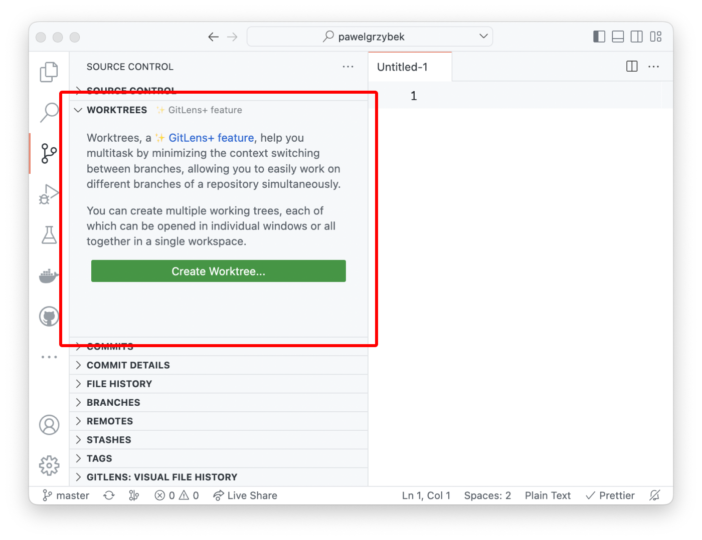

The most recent update of one of my favourite Visual Studio Code plugins, [GitLens](https://marketplace.visualstudio.com/items?itemName=eamodio.gitlens), triggered my curiosity when I saw a new (to me) “Worktrees” panel on the sidebar. After a quick research, I’m excited about finding a way of working with `git` that doesn’t restrict me. So let me explain what I didn’t like about my workflow and how multiple working trees solve my problem.



## The end of messy stashes and WIP (work in progress) commits

Let's say that we are halfway through the feature, intensely focused on a task, when a critical bug needs to be fixed out of the blue. Happens to us all the time! Should we stash the current changes? Should we quickly smash `git add . && git commit -m "wip"` and promise that we will sort this mess out later?

Working with stashes is not appealing to me, especially when we have more than one of them in the "clipboard". Furthermore, reading the output of the `git stash show` command doesn't give me enough context to apply it with confidence.

How about "work in progress" commits? I always promise that I will return and reset my `HEAD` to the state before applying it, but I never do. I usually end up doing some interactive rebasing to squash embarrassing commits. That's when I transitioned from one issue to another because of what kind of insane person you need to be to remember how to use interactive rebase. Well done to you if you do — you are crazy 😜


## Multiple working trees for the rescue

[The `git worktree` command](https://git-scm.com/docs/git-worktree) allows you to work on multiple branches simultaneously. It is like cloning your repo multiple times into individual directories, but better because it is tracked by `git`, which can save you from potential collisions. Let me show you a simple example of working with multiple working trees.

There is no chance that I sit down, write a single post on this blog from the very beginning to the end and publish it in one go. I always work on multiple articles at the same time. This sounds like a perfect use case for the hero of this article. Look!

```bash
# Just to confirm I am in a right working directory
$ pwd
~/Sites/pawelgrzybek.com
```

```bash
# Obligatory status check
$ git status
On branch master
Your branch is up to date with 'origin/master'.

nothing to commit, working tree clean
```

```bash
# Create a new working tree for new "post one"
# at ~/Sites/pawelgrzybek.com-post-one
$ git worktree add ../$(basename $(pwd))-post-one
Preparing worktree (new branch 'pawelgrzybek.com-post-one')

# Create a new working tree for new "post two"
# at ~/Sites/pawelgrzybek.com-post-two
$ git worktree add ../$(basename $(pwd))-post-two
Preparing worktree (new branch 'pawelgrzybek.com-post-two')
```

```bash
# List all woring trees
$ git worktree list
~/Sites/pawelgrzybek.com            [master]
~/Sites/pawelgrzybek.com-post-one   [pawelgrzybek.com-post-one]
~/Sites/pawelgrzybek.com-post-two   [pawelgrzybek.com-post-two]

#             👆                             👆
#          Location                     Branch name
```

By doing so, I created two new directories (`~/Sites/pawelgrzybek.com-post-one` and `~/Sites/pawelgrzybek.com-post-two`) on the same level where the origin lives (`~/Sites/pawelgrzybek.com`). Additionally, `git` created two new branches by following the names of new working trees (`pawelgrzybek.com-post-one` and `pawelgrzybek.com-post-two`).

Now I can work on multiple posts with ease without messy interruptions. Also, as I mentioned at the beginning of this post, Visual Studio Code equipped with the GitLens plugin comes with incredible support for this feature. So flipping between working trees cannot be easier!


It is cool, isn't it?! Yo 👊
