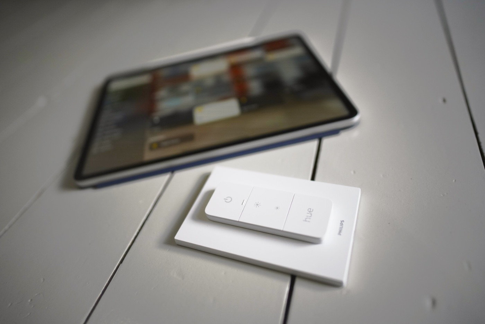
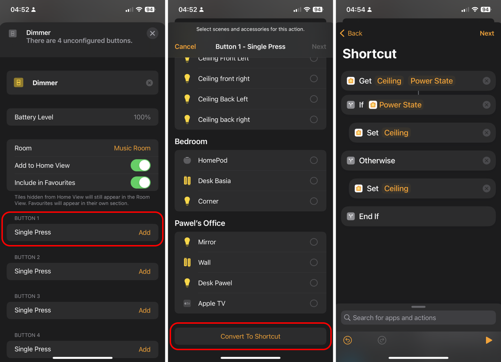

So you just bought a [Philips Hue Dimmer Switch](https://www.philips-hue.com/en-gb/p/hue-dimmer-switch--latest-model-/8719514274617) or [Smart Button](https://www.philips-hue.com/en-gb/p/hue-smart-button/8719514342668), added them to your HomeKit and want to use it as a toggle switch? Well, it takes work. It is not as straightforward as setting it in the Philips Hue app, which you probably don't want to use because you have a gazillion other devices already configured in the Apple Home app.

Unfortunately, you cannot reimplement every feature from the Philips Hue app for these devices (double tap, long press, etc.). However, you can use it as a toggle button with some Apple Shortcut scripting.

1. Hit the "Add" action to configure the desired button in the Home app
1. Instead of configuring devices manually, hit the "Convert to Shortcut" button at the very bottom of the screen
1. Add conditional logic within the "If" statement based on the output of the "Power State" of a particular device

Hopefully, this will unstuck you and save you time going through misleading Google results that I, unfortunately, hit trying to achieve that functionality. Thanks for reading, and I will catch you next time 👋
