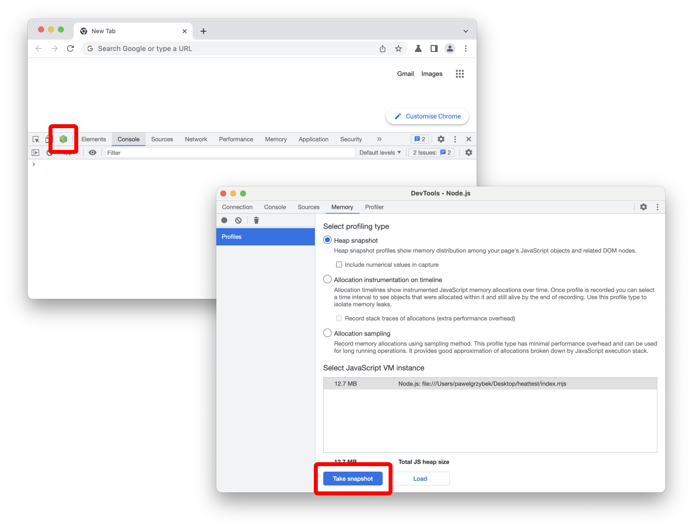

Comparing heap dumps is an excellent technique for finding memory leaks. You can use it to obtain much more information about your application, but I mainly use it for this. There are several methods how you can capture them in Node.js. In this post, I will show you how to do it.

## Chromium DevTools Memory tab

The easiest way is to use a Chromium-based browser that allows you to attach to any Node.js process invoked with an `--inspect` or `--inspect-brk` flag.

```
node --inspect index.mjs
```



## Using the `--heapsnapshot-signal` flag

Available from Node.js version 12 [`--heapsnapshot-signal` flag](https://nodejs.org/api/cli.html#--heapsnapshot-signalsignal) allows you to capture a heap snapshot when a process receives a signal. Remember to pass a valid signal name as a value — `SIGUSR1` or `SIGUSR2` are the most common choices.

```
node --heapsnapshot-signal=SIGUSR1 index.mjs
```

```
ps aux | grep node | awk '{print $2}'
12345
```

```
kill -USR1 12345
```

```
ls
Heap.20230124.000000.12345.0.001.heapsnapshot
```

## Using V8 `writeHeapSnapshot` method

You can generate a heap snapshot programmatically in reaction to a signal emitted or an HTTP request using [`v8.writeHeapSnapshot() method`](https://nodejs.org/api/v8.html#v8writeheapsnapshotfilenameoptions). The example below could be better because, in a real-world scenario, you would want this endpoint to be protected, but it is just to show you how it works.

```js {hl_lines=[1,6]}
import { writeHeapSnapshot } from "node:v8";
import Fastify from "fastify";
const fastify = Fastify();

fastify.get("/heap", (request, reply) => {
  writeHeapSnapshot();
  reply.send({ message: "heap snapshot saved" });
});

fastify.listen({ port: 3000 });
```

```
curl http://localhost:3000/heap
{"message":"heap snapshot saved"}
```

## Enjoy profiling

[The official Node.js guide](https://nodejs.org/en/docs/guides/diagnostics/memory/using-heap-snapshot/#using-heap-snapshot) also provides another way to capture heap snapshots using inspector protocol, but I haven't found it very useful in practice. I am very curious about similar functionality in other runtimes like Deno and Bun, but I haven't found anything yet — if you know of any, please let me know in the comments.
