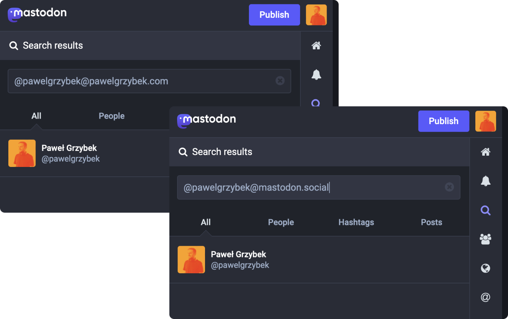

Look at this trick! You can access my Mastodon account via `@pawelgrzybek@mastodon.social` and `@pawelgrzybek@pawelgrzybek.com`, even though I don't host my own instance.

1. On your server, create a file `/.well-known/webfinger`. In my case it is [`https://pawelgrzybek.com/.well-known/webfinger`](https://pawelgrzybek.com/.well-known/webfinger).
2. Copy/pasta 🍝 content of `${INSTANCE_ORIGIN}/.well-known/webfinger?resource=acct:${YOUR_USERNAME}@${INSTANCE_HOST}`. In my case it is [`https://mastodon.social/.well-known/webfinger?resource=acct:pawelgrzybek@mastodon.social`](https://mastodon.social/.well-known/webfinger?resource=acct:pawelgrzybek@mastodon.social).
3. Job done! Share with the rest of the world!

I know fuck all about the Webfinger protocol. Full credit for this magic goes to [Alex Guyot](https://mastodon.macstories.net/@alex/109836437717763915). Have a fab weekend y'all 😙
