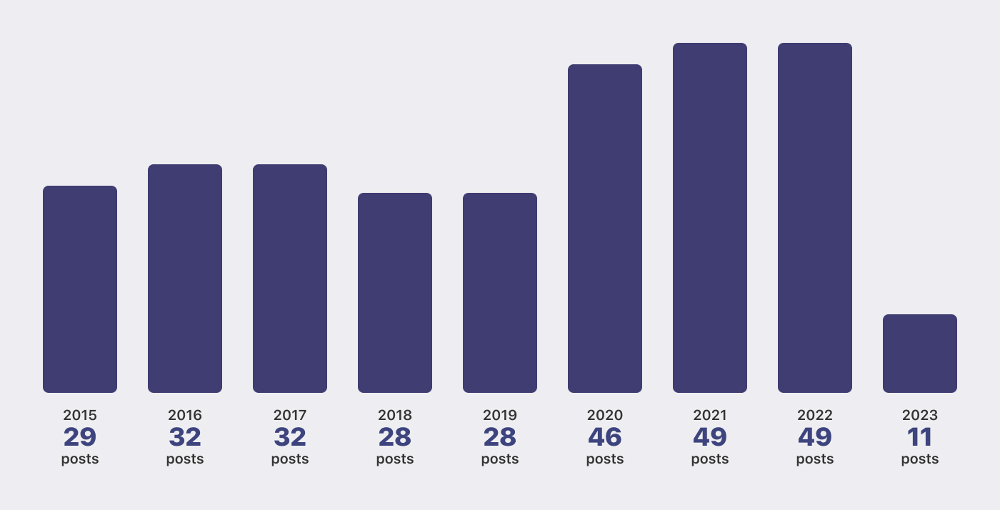
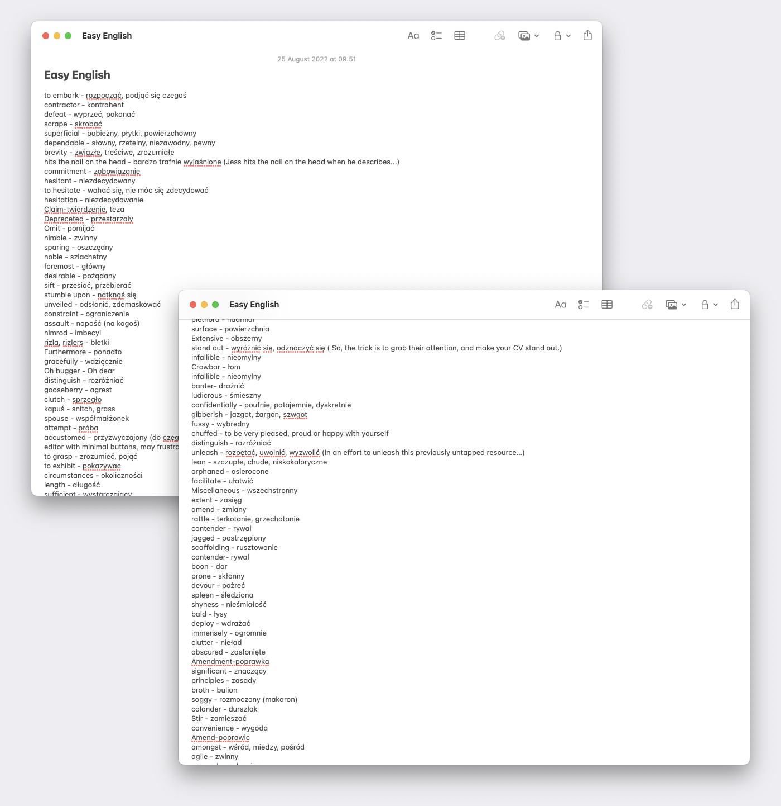

Exactly eight years ago, I published ["Hello there!"](/hello-there/) on this website. Since then, I have published hundreds of articles. Persistent writing is excellent for many reasons and is the best thing I have ever done for my personal and professional development.

In this post, I'm not planning on bragging about the opportunities I got from blogging (maybe a little bit). What I will give you are a few reasons to buy your domain[^1] and start writing.

[^1]: Although it is not mandatory to buy a domain to start blogging, I am a strong advocate of owning your content. It would be best if you detached from publishing giants like WordPress or Medium to achieve this. Today, it is easier than ever to do so.

## Your little corner of the Internet

Times are crazy — social media platforms are legal brainwashing machines, folks pay real money for a blue icon next to their name, and kids spend more time scrolling through cringy videos rather than having fun with their friends. For some, even the word "friends" is a tab next to "settings". Considering that short clips on TikTok, Instagram and YouTube dominate how people consume media, we can assume that the quality of content is also going downhill.

Don't get me wrong. I like to scroll through my [Mastodon feed](https://mastodon.social/@pawelgrzybek) and interact with other like-minded geeks. Occasionally, I toot[^2] some ephemeral thoughts that are bouncing around in my head. But, it is not a good place for something I want others to read. So, even if you don't write for others and only for yourself, you will be much better off publishing it on your own platform, with your own rules.

[^2]: A "toot" was a name for a "post" on Mastodon since the inception up to version 4 of this social network server.

Having one canonical place for your thoughts, research insights, or something that brings joy is the way to go. Thanks to the power of a URL, you can then share it with your real friends and "friends". To top it off, RSS allows you to follow others without AI nonsense and recommendations (ads) that you don't care about.

## Playground to experiment

There is no better place to experiment with new browser features than your own website. If you mess things up, your readers will tell you about it and most likely give you a solution.

Over the years, this website allowed me to test multiple built tools and hosting services. I went through a few strategies for serving images. After playing around with many commenting systems, [I wrote one by myself](/i-built-a-thing-jamstack-commenting-system-using-aws-cdk-api-gateway-lambda-and-dynamodb/). After writing about [the basics of CSS Grid](/lets-get-into-the-basics-of-css-grid-layout-model/) in 2015, I adopted it before any browser added support. CSS Custom Properties is finally getting widespread adoption, but I didn't hesitate to use them on this website since I published ["CSS Custom Properties explained"](/css-custom-properties-explained/) in 2016. A little bit of feature detection here and there, and you can go crazy. I posted ["Native feature detection with CSS.supports() API"](/native-feature-detection-with-csssupports-api/) all about it back in 2017.

## Writing crystalises your thoughts

Every time I write about something, I do it out of passion, although you need a bit more than passion to write a good article. A technical (or not) post requires a certain understanding of the subject. Unfortunately, having both doesn't guarantee a good piece either.

The long process of crystalising your thoughts and finding an easier way to explain a complex subject puts you a step closer to clicking the "publish" button. Spending more time on this process improves your understanding of the subject, and the more you understand it, the easier it gets to compress the insights and explain them.

## Easy English

Education wasn't my strength when I was a teenager. However, when I got into programming, I started regretting my life choices when it came to learning languages, so I decided to catch up with my English. As a result, for the last decade, I have maintained an ever-growing note in Apple Notes, titled "Easy English". I return to it occasionally, delete vocabulary that has settled down in my long-term memory and add a bunch of new words.

Native English speakers don't appreciate how fortunate they are. Being able to understand people from around the globe is a life-changing skill. Even better than understanding others, is the ability to express your thoughts. Like I said above in the ["Writing crystalises your thoughts" section](#writing-crystalises-your-thoughts), writing is not easy, especially when language is a barrier. Writing taught me a lot!

I know my English could be better, but when I compare my communication skills from today and the day I published my first post, I'm very proud of myself. Also, many of you read my writing, so my pride level increases.

## Have fun

Last but not least — blogging is fun! If it wasn't fun, I wouldn't have continued over the last eight years to write this crap for you all, right? Having a little space on the Web where you can do whatever the heck you want is fun. Using it for learning new skills and teaching others is fun. Exchanging links with others is fun!

So go get that domain and build a website. It doesn't need to be fancy. Please share your stories and keep them authentic. You don't want to sound like somebody else, you want to sound like you! Most importantly, have lots of fun 😘
