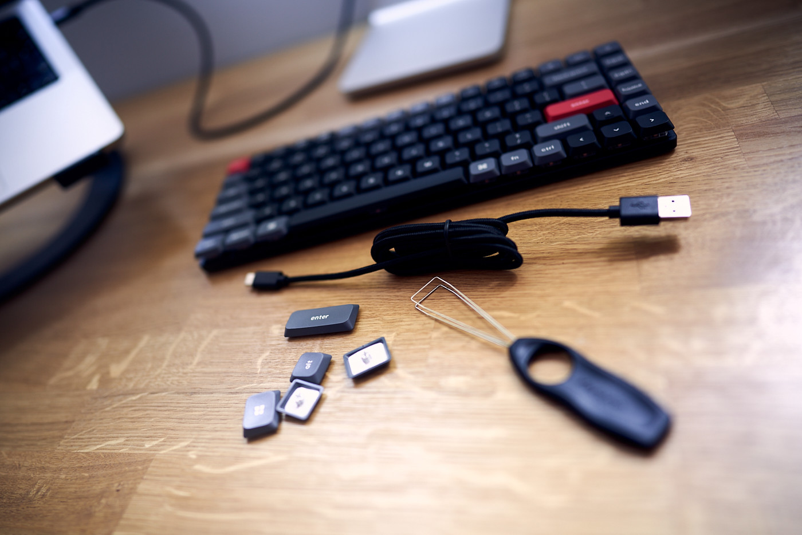
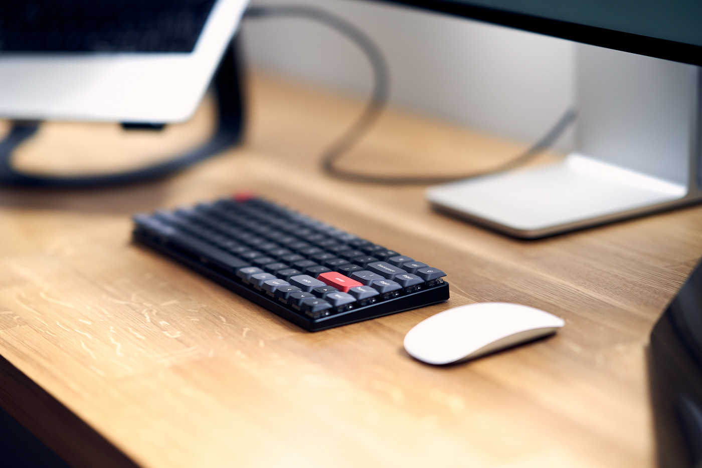
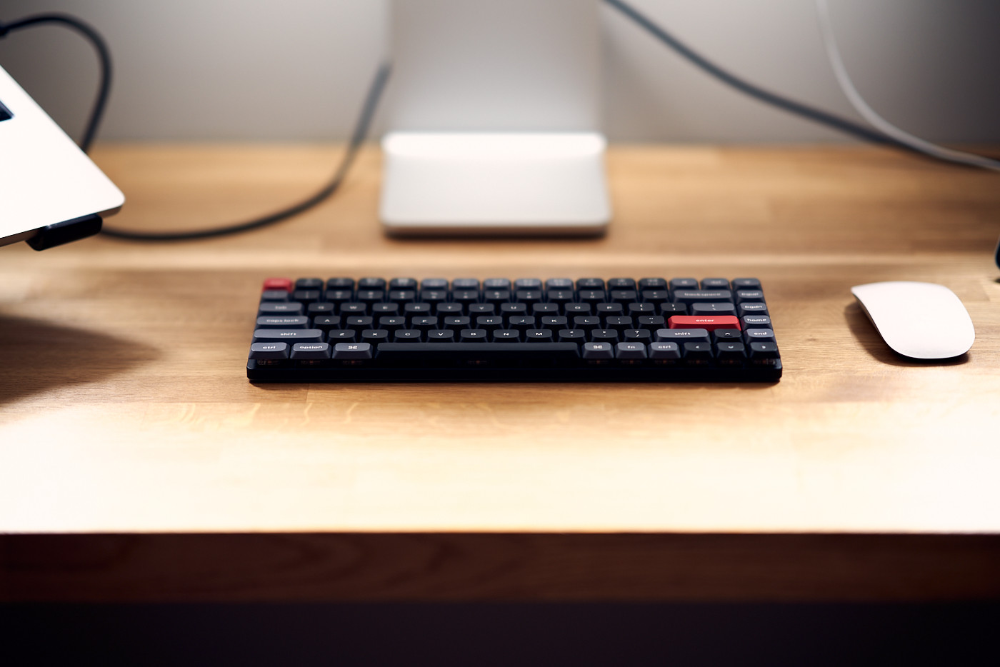
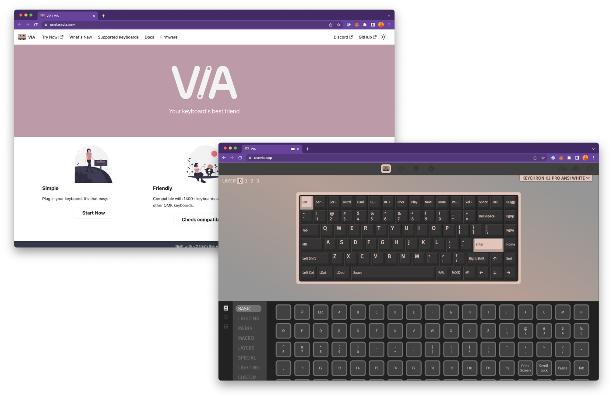

Over the last 16 years, I have been using Apple computers. Also, since then, I have used only a few generations of Apple keyboards. As I started experiencing connectivity issues with my Magic Apple Keyboard a few weeks ago, I thought it was time for a new one. Instead of blindly getting one from the Apple store, I decided to try something new. Less than a week after placing an order, I received my [Keychrone K3 Pro](https://www.keychron.com/products/keychron-k3-pro-qmk-via-wireless-custom-mechanical-keyboard) with a white backlight and brown switches. I have some thoughts that I would love to share with you.

Here is a heads-up for all die-hard mechanic keyboard enthusiasts out there. I could be a better touch typist. I have no clue about hot-swappable switches and PBT keycaps. I couldn’t care less about the patterns of RGB backlights syncing with your soul or whateva. I am just an ordinary bloke trying one of the most frequently recommended keyboards by YouTubers and having some fun.

## Quality

The quality of this keyboard exceeded my expectations. The aluminium housing adds a premium feel to it, and due to its weight, it sits rock-solid when placed on a desk. Slightly angled keycaps are well-sized and are very pleasant to type on. The height of it is just right so I feel comfortable using it without the palm rest.

If you allow me to be picky, the only thing I found disappointing was Type-A to Type-C cable in the box. But, again, no biggie, but having Type-C to Type-C would be my preference.

## Typing experience

After my first day using this keyboard, I was frustrated and nearly switched to the old and familiar Apple Magic Keyboard. However, I am glad I persisted because only a few days later, I consider typing on this keyboard very joyful. In addition, the physical feedback of mechanical switches and the apparent gaps between them make typing much easier than I have ever experienced using other keyboards.

Thanks to this keyboard, I became a better typist. Since the day I got it, I spent 10 minutes daily on [keybr.com](https://www.keybr.com/), and to my surprise, I see a significant improvement in WPM (words per minute) count and accuracy.

## Customizability

Customizability is where this product shines! Every single key on Keychrone K3 Pro can be customizable using [VIA](https://www.caniusevia.com/). Thanks to the [WebHID API](https://wicg.github.io/webhid/), a Chromium-based browser is everything you need to make your keyboard really yours. Key-remapping, custom macros and functions keys responsible for backlight adjustments can be changed to your preference in no time.

I remapped <kbd>Caps Lock</kbd> to <kbd>Cmd ⌘ + Spacebar</kbd>, which opens my beloved [Raycast](https://www.raycast.com). The right <kbd>Cmd ⌘</kbd> works as an <kbd>Option ⌥</kbd> to allow me to use diacritics popular in the polish alphabet ("ą", "ć", "ę", "ł", "ń", "ó", "ś", "ż" and "ź"). Right <kbd>Control ⌃</kbd> works as an input switch between English and Polish keyboards.

## Well-spent money

Thorough review and going through every single feature of this keyboard was not my intention. Instead, I wanted to share my very early impressions and a few outstanding features I liked the most.

Considering that the Keychron K3 Pro goes for the same money as the basic version of the Apple Magic Keyboard, I have absolutely no regrets about buying it.
