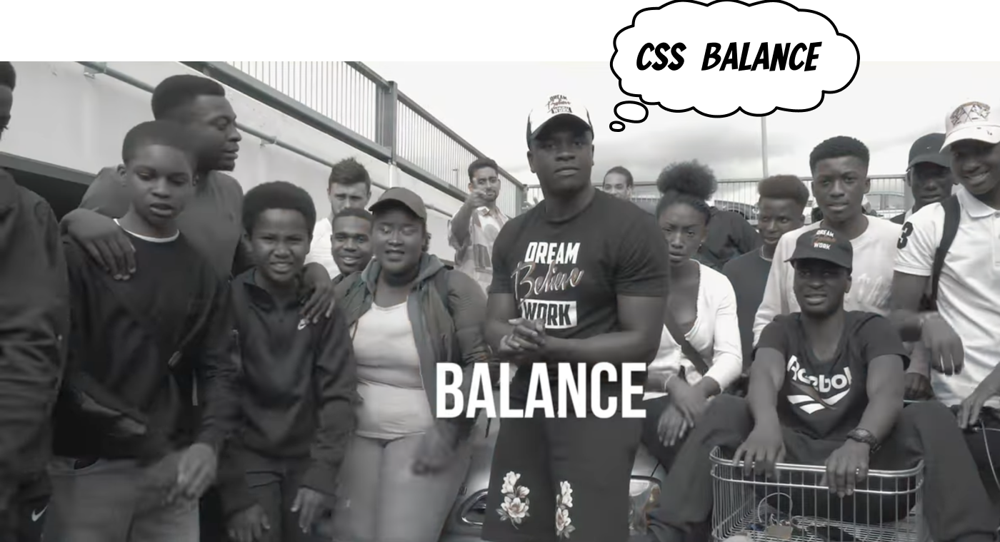

Since I heard about the CSS `text-wrap: balance`, I can't stop singing, "You need to know the balance, NatWest balance, CSS balance". The origin is the song by [MC Quakez & Shakes "Balance"](https://youtu.be/KPxYYo--mCE), which we always sing with my friends!

Jokes aside because CSS `text-wrap: balance` is really cool. It is defined as part of the [CSS Text Module Level 4](https://www.w3.org/TR/css-text-4/#text-wrap), and at the time of writing this article works only in Google Chrome Canary behind the "Experimental Web Platform features" flag. 



It breaks multiple lines of text to visually better distribute the remaining space and prevents typographic widows. Unfortunately, due to the resource-hungry algorithm, this functionality is limited to text length. The specification draft sets this limit to 10, but the currently shipped Google Chrome Canary implementation limits this feature to 4 lines of text. So soon, we may not need [React Wrap Balancer](https://react-wrap-balancer.vercel.app) anymore. Have a look at the difference!

You need to know the balance, NatWest balance, CSS balance 🎶
