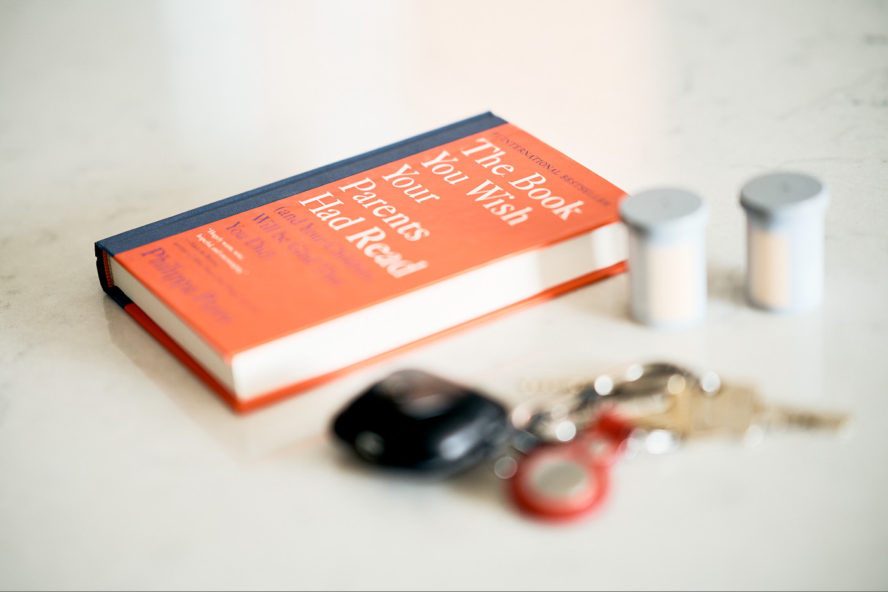

My close friends and those who follow me here and there won’t be surprised by the drastic subject change. From books about programming and self-development to parenting. Yes, you guessed it, I will be a father soon. I am well excited but also overwhelmed by the mission of raising a little human. I will do my best to be the best father, but I must do my homework! ["The Book You Wish Your Parents Had Read (and Your Children Will Be Glad That You Did)" by Philippa Perry](https://www.goodreads.com/book/show/42348818-the-book-you-wish-your-parents-had-read) is by far the most recommended book for new parents, and now I can see why.

From the get-go, the first chapter, "Your Parenting Legacy", helps to pick up patterns inherited from childhood that probably should be avoided. With full respect to my amazing parents, I can retrospectively think of a few things I would like to do differently. "Your Child's Environment" shares a good piece of wisdom applicable to every relationship, not only families expecting a little one. It is about the values of relationships, handling the pain when things do not go accordingly to the plan and mutual respect. The following chapters discuss pregnancy and managing complicated emotions straight after birth. Babie's first play and dialogues and recognising their feelings. Throughout the book, the author illustrates many challenging situations that help us understand the right solution in all stages of parenting.

The list of reasons I loved this book is long, but I will stop here and ask you to read it yourself. It is a good read not only for upcoming parents but for everyone. Everyone!
