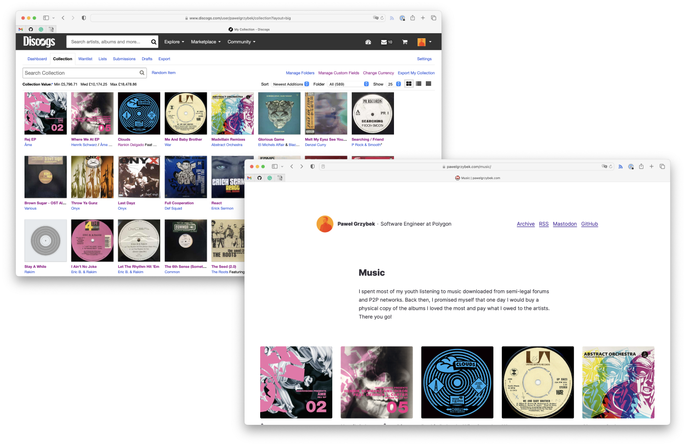

I spent most of my youth listening to music downloaded from semi-legal forums and P2P networks. Back then, I promised myself that one day I would buy a physical copy of the albums I loved the most and pay what I owed to the artists.

Fast forward a few years, and I am a keen records collector. Another thing that I also have is a website. Inspired by [Andy Bell’s collection page](https://andy-bell.co.uk/music-collection/), I created my [Music page](/music). Luckily, I log my records on Discogs, so it was just a matter of a few API calls.

I hope you like it, and our collection pages will inspire you to create a similar one. Share it with me if you have one!
