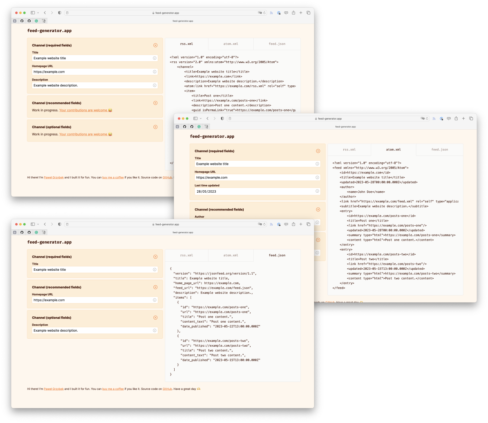

After reading ["Date and Time with a Static Site Generator" by Jim Nielsen](https://blog.jim-nielsen.com/2023/date-and-time-in-ssg/), I realised I used an incorrect date format on my RSS feed. Unfortunately, not only date was invalid, but the whole feed was a mishmash of different specifications. All fixed now!

I spent a few hours digging into the specifications of RSS, Atom and JSON feeds, and as a result, I have a simple copy/paste example that you can adapt for your blog. I also created a simple tool that allows you to generate a feed in all three formats and compare them.

## Multiple formats

There are three dominant feed specifications: RSS, Atom and JSON Feed. It is a common practice to serve multiple formats as I do on my blog (RSS and JSON Feed). Thanks to [HTTP Archive](https://httparchive.org) dataset, we can determine the breakdown of feed formats on the web.

- 58% of the HTTP Archive sample use any feed type
- 50% of the HTTP Archive sample use RSS
- 8% of the HTTP Archive sample use Atom
- <1% of the HTTP Archive sample uses JSON Feed

Thank you, [Rick Viscomi](https://rviscomi.dev), for helping me set up HTTP Archive dataset on the GCP BigQuery and crafting some magical SQL queries.

### RSS 2.0 — blog feed example

RSS (Really Simple Syndication) is the oldest feed format, with its first version released in 1999. The latest version, 2.0, was released in 2009. Despite its limitations, it is still the most popular feed format.

```html
<link type="application/rss+xml" rel="alternate" href="https://example.com/rss.xml" title="Example - RSS Feed" />
```

```xml
<?xml version="1.0" encoding="utf-8"?>
<rss version="2.0" xmlns:atom="http://www.w3.org/2005/Atom">
    <channel>
        <title>Example website title</title>
        <link>https://example.com</link>
        <description>Example website description.</description>
        <atom:link href="https://example.com/rss.xml" rel="self" type="application/rss+xml" />
        <item>
            <title>Post one</title>
            <link>https://example.com/posts-one</link>
            <description>Post one content.</description>
            <guid isPermaLink="true">https://example.com/posts-one</guid>
            <pubDate>Mon, 22 May 2023 13:00:00 -0600</pubDate>
        </item>
        <item>
            <title>Post two</title>
            <link>https://example.com/posts-two</link>
            <description>Post two content.</description>
            <guid isPermaLink="true">https://example.com/posts-two</guid>
            <pubDate>Mon, 15 May 2023 13:00:00 -0600</pubDate>
        </item>
    </channel>
</rss>
```

### Atom — blog feed example

Atom was developed as an alternative to RSS to address problems concerning date formats, internationalisation, and modularity. It became popular due to its adoption by many Google products.

```html
<link type="application/atom+xml" rel="alternate" href="https://example.com/atom.xml" title="Example - Atom Feed" />
```

```xml
<?xml version="1.0" encoding="utf-8"?>
<feed xmlns="http://www.w3.org/2005/Atom">
    <id>http://example.com/</id>
    <title>Example website title</title>
    <updated>2023-05-22T13:00:00.000Z</updated>
    <author>
        <name>John Doe</name>
    </author>
    <link href="https://example.com/atom.xml" rel="self" type="application/rss+xml" />
    <subtitle>Example website description.</subtitle>
    <entry>
        <id>https://example.com/posts-one</id>
        <title>Post one</title>
        <link href="https://example.com/posts-one"/>
        <updated>2023-05-22T13:00:00.000Z</updated>
        <summary type="html">https://example.com/posts-one</summary>
        <content type="html">Post one content.</content>
    </entry>
    <entry>
        <id>https://example.com/posts-two</id>
        <title>Post two</title>
        <link href="https://example.com/posts-two"/>
        <updated>2023-05-15T13:00:00.000Z</updated>
        <summary type="html">https://example.com/posts-two</summary>
        <content type="html">Post two content.</content>
    </entry>
</feed>
```

### JSON Feed — blog feed example

JSON Feed is the newest format, released in 2017 and last time updated in August 2020. It is based on JSON compared to XML-based RSS and Atom. Due to its simplicity, it is gaining quick adoption by client applications.

```html
<link type="application/feed+json" rel="alternate" href="https://example.com/feed.json" title="Example - JSON Feed" />
```

```json
{
  "version": "https://jsonfeed.org/version/1.1",
  "title": "Example website title",
  "home_page_url": "https://example.com",
  "feed_url": "https://example.com/feed.json",
  "description": "Example website description.",
  "items": [
    {
      "id": "https://example.com/posts-one",
      "url": "https://example.com/posts-one",
      "title": "Post one content.",
      "content_text": "Post one content.",
      "date_published": "2023-05-22T13:00:00.000Z"
    },
    {
      "id": "https://example.com/posts-two",
      "url": "https://example.com/posts-two",
      "title": "Post two content.",
      "content_text": "Post two content.",
      "date_published": "2023-05-15T13:00:00.000Z"
    }
  ]
}
```

## I built a thing

Looking at the blobs of text doesn’t help us understand the differences between the formats. So I built the [feed-generator.app](https://feed-generator.app) to help you with that. It’s a simple tool that allows you to generate a feed in all three formats and compare them. At this point, it serves as a simple use case for generating a feed for a blog, but I plan to add more fields and make it more universal in the future.



I used this little web app as an opportunity to learn the basics of [SolidJS](https://www.solidjs.com). The documentation for this framework is fantastic, and I highly recommend [Solid JS Crash Course Tutorial by The Net Ninja on YouTube](https://www.youtube.com/playlist?list=PL4cUxeGkcC9gU_GvFygZFu0aBysPilkbB).

## Helpful resources

- [The RSS 2.0 Specification](https://www.rssboard.org/rss-specification)
- [The Atom Syndication Format Specification](https://validator.w3.org/feed/docs/atom.html)
- [The JSON Feed Version 1.1 Specification](https://www.jsonfeed.org/version/1.1/)
- [RSS and Atom Feed validator](https://validator.w3.org/feed/)
- [JSON Feed validator](https://validator.jsonfeed.org)

