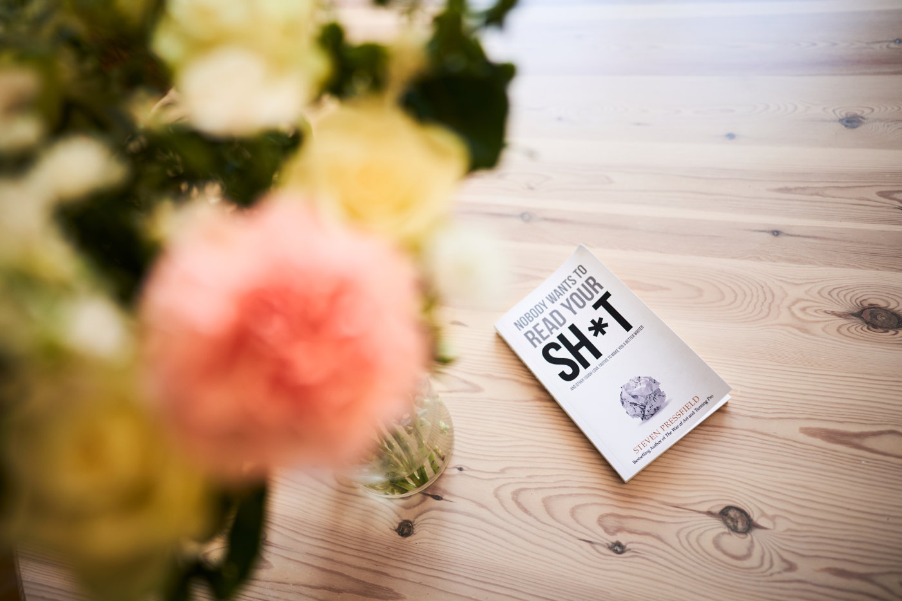

I picked this book up before [our last trip to Sicily](/sicily-2023/) just to keep me busy on the plane. For some reason, I assumed it is going to be similar to ["On Writing Well" by William Zinsser](/book-review-on-writing-well-by-william-zinsser/) that I really enjoyed. I was so wrong on this assumption, but I had a good time listening to this audiobook.

The title sums it up perfectly: "Nobody Wants to Read Your Sh*t". This is the overall message of the book by Steven Pressfield, in which he shares many ideas on how to keep the reader reading, which he learned in his career as a professional writer. The book is targeted more towards novelists than hobbyist technical bloggers, but there is plenty of applicable lessons for all sorts of publishers. It consists of many short chapters and each of them is straight to the point with no unnecessary nonsense like in plenty of other self-help books. Speaking off no nonsense…

> What Nobody Wants to Read Your Shit means is that none of us wants to hear your self-centered, ego-driven, unrefined demands for attention. Why should we? It's boring. There is nothing in it for us.  Can you sing the blues? Can you make a shoe? Make it beautiful. Make it fun and sexy and interesting and I'll buy it. I'll wear it. I'll tell my friends about it.
