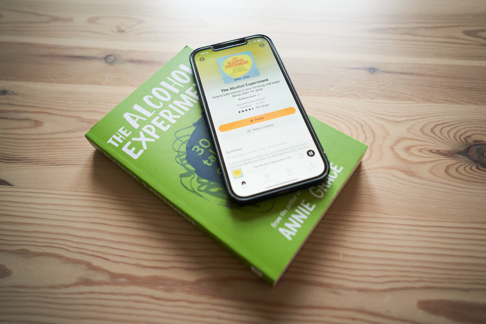

At the end of last year, I started questioning my relationship with alcohol. Most evenings, I would have a glass or two of wine. It was not unusual for me to get drunk on a weekend night. Meeting a friend without three pints of craft DIPA (Double Indian Pale Ale) or shopping without checking the wine section was nearly impossible.

New Year's Eve brought my fiancée and me big news — we are becoming parents! I decided to stop drinking. I wasn’t sure if it would be a nine-month break or a permanent change. Now I know — it is a life change.

## "The Alcohol Experiment" by Annie Grace

I picked up ["The Alcohol Experiment" audiobook by Annie Grace](https://www.goodreads.com/book/show/40712498-the-alcohol-experiment) long after I had stopped drinking. I was curious about this book's scientific data, the author's story, and the participants' reflections. I am glad I gave it a listen, as it helped me to understand my former relationship with alcohol thoroughly and to articulate my thoughts after quitting.

The book is a 30-day, well-thought-out action plan. Of course, abstaining from alcohol for a month is the central part of it, but there is much more to it. Daily, Annie draws participants' attention to different aspects of life. Each chapter contains science-backed information, Annie's story, and the participants' experiences. I couldn't believe how much I could relate to some of them.

## Let's get a bit personal

As I said before, this book helped crystallize my thoughts about alcohol. I wanted to share some of them with you and maybe inspire you to try an alcohol-free life. No particular order, just a brain dump.

- **Hair and Skin Quality**. Not only do people tell me I look younger, but when I look in the mirror, I see a lot of positive changes. My skin looks healthier without any random colour spots. My hair is thicker, and I don't have to wash it every day anymore.
- **Sex Life**. Without going into details, being 100% present at the moment is a game-changer. Even if you think you are more confident after a few drinks, what is the point of wild, crazy sex if you don't remember it the next day?
- **Relationship with my Partner**. Overreacting to small, totally unimportant things was the primary source of arguments in our relationship. We still occasionally argue, but the level of understanding and empathy is much higher.
- **I want to be the best father I can be for my daughter**. I can recall many unpleasant memories from childhood when my father was drunk. I don't want my daughter to have similar experiences.
- **Social Life**. Stepping away from all alcohol-related events acted as a filter for "friends" who were only interested in drinking with me. They weren't that keen to visit me to listen to the latest Little Simz album together (it's a good one) or get out for a tennis session instead. But the time I spend with those who stayed close to me is much better than ever.
- **Money Savings**. I had an expensive beer taste, so now I have a lot more <del>money</del> [records](https://pawelgrzybek.com/music/). Also, every date night with my better half is now half the price.
- **Sleep Quality**. I do sleep better than ever. Longer, more regular, and when I wake up, I feel rested.
- **Overall Health**. Without exaggeration, I feel 10 years younger than 6 months ago. I am more in control of my physical and mental health. I regularly ride my bike and play tennis. I can't imagine starting my day without a 30-minute yoga routine anymore. I have great satisfaction from observing how my body reacts to new challenges or diet experiments without letting alcohol interfere with the results.
- **Productivity**. Last but not least, I am much more productive since I stopped drinking. My attention span has been extended, and I can now dedicate more time to quality, deep work. Obviously, the time I used to spend on hangovers is directly resulting in more articles written, more books read, more code written, and so on.

Uff! That was a lot longer book review than I usually publish. Hopefully, you found it interesting and inspiring. If you are about to write a comment about "wine that is good for your guts" or "another good reason to have a beer after a workout", please don't. I don't care about your [confirmation bias](https://en.wikipedia.org/wiki/Confirmation_bias). Good luck, and stay safe!
