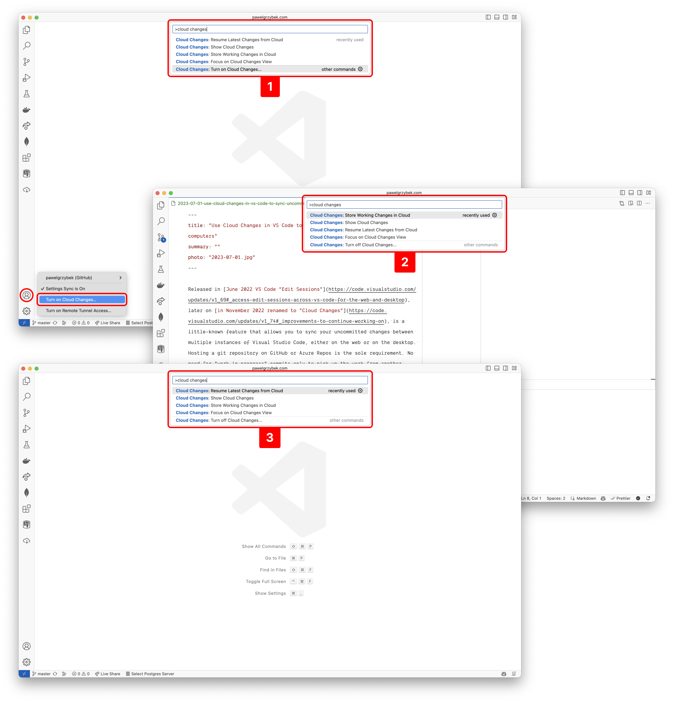

Released in [June 2022 VS Code "Edit Sessions"](https://code.visualstudio.com/updates/v1_69#_access-edit-sessions-across-vs-code-for-the-web-and-desktop), later on [in November 2022 renamed to "Cloud Changes"](https://code.visualstudio.com/updates/v1_74#_improvements-to-continue-working-on), is a little-known feature that allows you to sync your uncommitted changes between multiple instances of Visual Studio Code, either on the web or on the desktop. Hosting a git repository on GitHub or Azure Repos is the sole requirement. No need for "work in progress" commits only to pick up the work on another machine.

1. Enable the feature on both machines by selecting "Cloud Changes: Turn on Cloud Changes" from the Command Palette <kbd>Command + Shift + P (macOS) / Ctrl + Shift + P (Windows/Linux)</kbd>. Alternatively, enable it under accounts settings UI.
1. Run "Cloud Changes: Store Working Changes in Cloud" from Command Palette on the first machine.
1. Run "Cloud Changes: Resume Latest Changes from Cloud" from Command Palette on the second machine.

It is cool, isn't it? Did you know about this feature? Stay curious 😘
