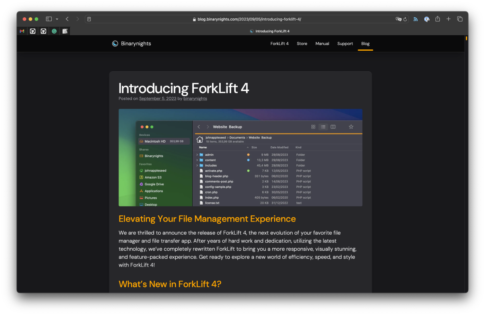

There is a group of makers whom I admire so much and blindly "buy" their creations. When [Cleo Sol](https://cleo-sol.com) releases a new album, I purchase a record. When [SmarterEveryDay](https://www.youtube.com/@smartereveryday) uploads a new video on YouTube, I watch it. When [Seth Godin](https://seths.blog) publishes a post, I read it.

There are also software companies that I sympathize with and buy new releases of their apps without even trying them. [ForkLift by BinaryNights](https://binarynights.com) is one of them, so when I saw [an announcement of ForkLift 4](https://blog.binarynights.com/2023/09/05/introducing-forklift-4/), without hesitation, I decided to support them and upgrade[^1]. I use it occasionally to connect to remote servers and AWS S3 buckets. [Comparing and syncing two directories](https://binarynights.com/manual#sync) is the feature I mainly use it for. Highlighted in the release notes, the 20x faster analysis of synced files made me super happy.

[^1]: Upgrade in software, by definition, doesn't guarantee feature parity and can lead to feature removal and breaking changes. Fair play, BinaryNights.

Quickly after purchasing the app, I joined a group of unsatisfied users. The comments section under the announcement post is full of unimpressed customers reporting an unfair license model, removed features, missing translations, bad UI choices, stability issues, and plenty more. Some people did what I like the most: they blogged about it. ["ForkLift 4 Beta design review" by Vlad Gerasimov](https://vlad.studio/blog-post/forklift-4-design-review) is a beautiful way of providing feedback to developers because it also suggests solutions. Inspired by Vlad, I decided to write about a single feature that has significantly complicated my workflow.

## Compare and sync folders downgrade

As mentioned earlier, comparing and synchronizing two folders is the primary feature I use ForkLift for. This functionality is crucial to ["My Amazon S3 photo backup solution"](https://pawelgrzybek.com/my-amazon-s3-photo-backup-solution/). Once in a while, I compare my local Pictures folder with the remote backup. I select the items that are important for me to keep in sync and, as you guessed it, I sync them.

One of the highlighted features of the 4th version of the app is "up to 20x faster analyzation than ForkLift 3". In my experience, it slowed down quite a lot. Preparing for a sync of 30k files between a local folder and an AWS S3 bucket took almost no time in ForkLift 3 (less than a second). ForkLift 4 took 40 seconds to do the same task, and the UI kept me waiting without a clear indication of progress happening in the background. Changing a single sync parameter started this process over again. It's not a great start, but this is not my biggest issue with this feature.



After initial analysis of two locations, the previous version of the app allowed to cherry-pick files and folders to exclude from sync by clicking the arrows between the columns. It was such an intuitive and elegant way of explicitly controlling content to sync. In ForkLift 4, this feature is gone. Unfortunately, this little detail makes my workflow much less efficient, and I can either keep using an old version of the app or find an alternative. Any suggestions?

## Ready or not?

Not for the first time in software development history, a product was released too early. Pricing model changes? Fair enough, we all want to make money. UI tweaks? People will get used to them. Performance issues can be addressed in future updates. Typically, I don't mind functionality changes, but I do mind when alternatives are not provided for core features like the one described above.

I hope that developers will listen to the feedback. I am sticking with ForkLift 3 and will keep an eye on the other apps in this category.


Looks like developers from BinaryNights do listen to community feedback. [ForkLift 4.0.3](https://blog.binarynights.com/2023/11/14/forklift-4-0-3-is-available/) has added a feature to individually deselect items from a sync window. Also, my performance issues are also fixed. I am not looking for an alternative anymore. Thank you so much, Forklift team!

