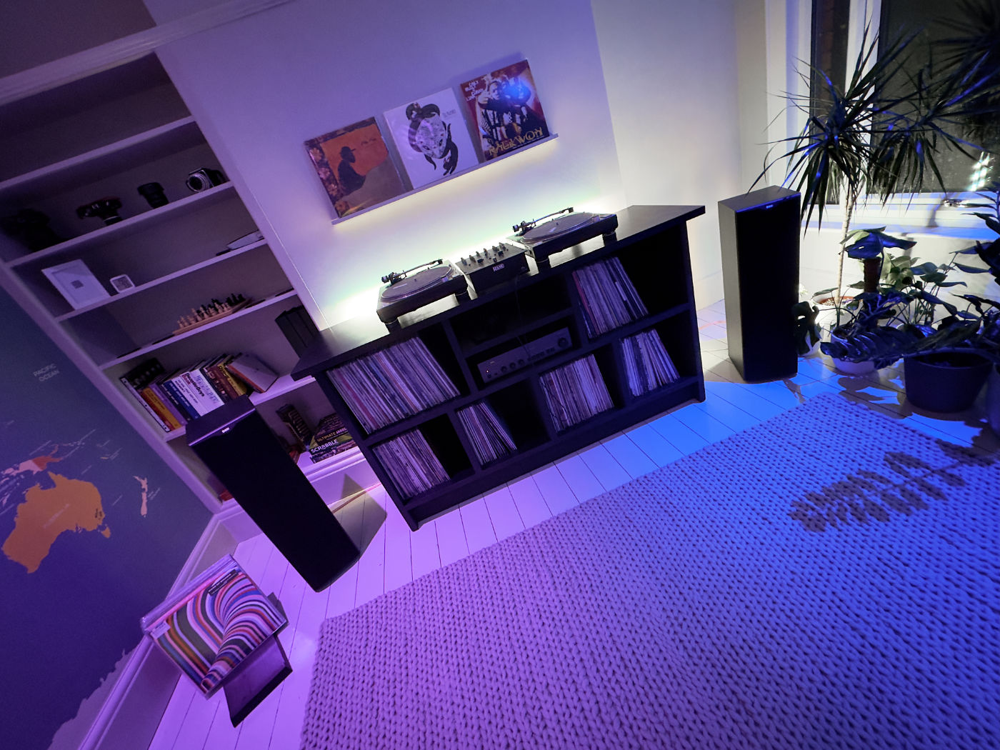
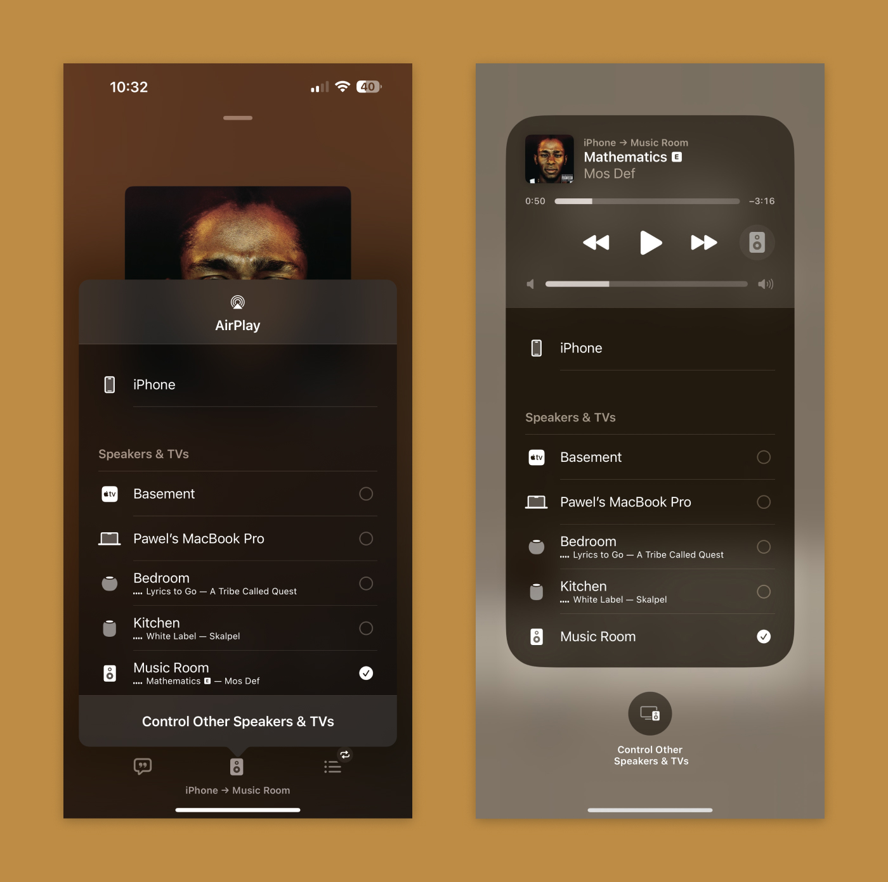

I have an always-growing collection of records. It is my way of repaying my past debts to the musicians I ripped off by illegally downloading albums from the [Soulseek network](https://www.slsknet.org). I have tons of rap, funk, jazz, soul, and recently more techno and garage music. For those interested, I have a [music collection page](/music).

I play and mix my records on a pair of classic [Technics SL-1200MK2](https://en.wikipedia.org/wiki/Technics_SL-1200) connected to an analogue Rane TTM-56s. The sound is amplified by [the NAD 3020](https://en.wikipedia.org/wiki/NAD_3020), which drives a pair of Bowers & Wilkins 603 S2. It is neither an expensive setup nor an audiophile one, but it produces sound I enjoy listening to.

In the kitchen, we have a second-generation [Apple HomePod](https://www.apple.com/uk/homepod-2nd-generation/). The background music in the bedroom is played by its little brother [HomePod mini](https://www.apple.com/uk/homepod-mini/). They do sound good enough for what they are, but I would not use them for serious listening. The thing I like the most about them is the convenience of [AirPlay](https://www.apple.com/uk/airplay/). I can play music from my phone, laptop or tablet without messing around with pairing or cables. It just works!

I recently came across [Belkin Soundform Connect](https://www.belkin.com/uk/audio-adapter-with-airplay-2/P-AUZ002.html). This little device enables AirPlay on any audio system that can take the source from the optical or 3.5mm jack output. It is a perfect solution for my vintage stereo system. I ordered one, and I am well impressed. The setup took seconds, the connectivity is equally good as any other AirPlay device I have around the house, the sound quality is excellent to my ears, and the price is very reasonable.

I rarely write review-like posts like this one. I am so chuffed with this addition to my sound system that I decided to share. Peace ✌️

