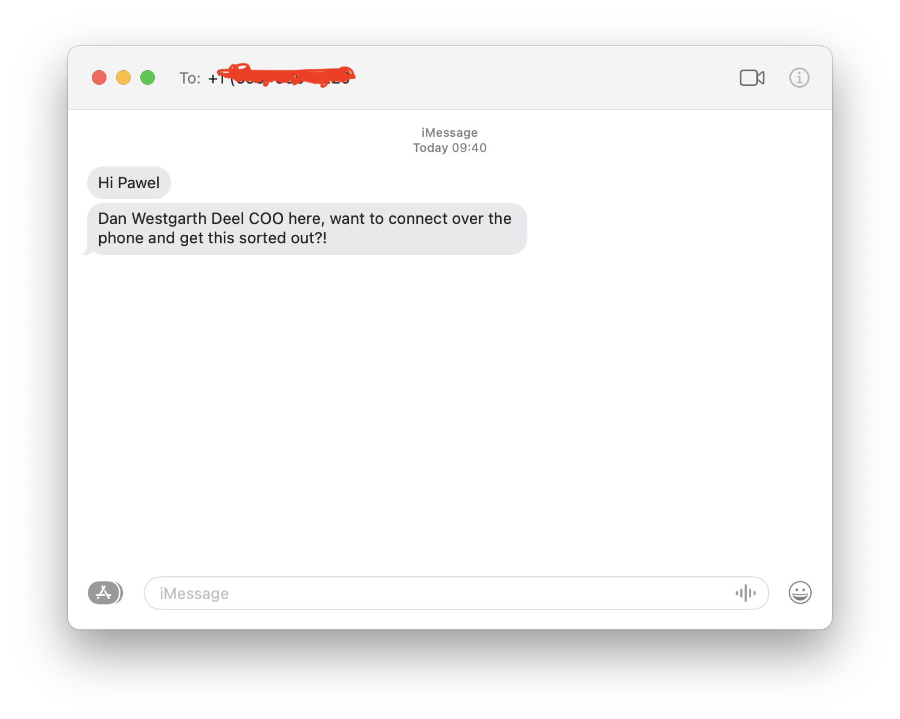

Working with people from around the world is incredible and has become the norm in the tech industry. However, handling legal regulations and payroll across multiple countries can be a pain in the backside. A few HR solutions have emerged to offload these tedious duties from distributed teams. Some popular ones are [Remote](https://remote.com), [Rippling](https://www.rippling.com), and the one adopted by my employer, [Deel](https://www.deel.com).

My experience with this company has been terrible so far. It doesn't matter how modern the web app's UI looks if the user experience is so broken. Missing documents, broken links, or non-working redirects are just a few issues I encounter often. Math miscalculations or missing data on automatically generated documents by their software are the norm. It would be acceptable if their customer service team quickly addressed all these mistakes. Unfortunately, customer service is the area where Deel sucks the most.

They are a bunch of lazy folks who know fuck all about the things they do. Pardon my French, but I struggle to express myself more politely. Due to their incompetence, I overpaid taxes significantly, and rolling their mistake back takes forever. I gained extensive knowledge about UK taxes and the internal payroll systems' communication with HMRC (the department of the UK Government responsible for collecting taxes) because of their inability to do their job correctly.

Off my chest, and it feels better. For all the hardworking folks who are excited about joining a new company, I wanted to tell you about my unpleasant experience. I would love to hear from others about your experience with Deel or similar HR solutions.

## Update, 2023.11.28

A few hours after I published this post, the COO of Deel, Dan Westgarth, messaged me and suggested jumping on a call to discuss what was going on. Since then, all the issues I had open in their ticketing system have started progressing.

After a few days, the Deel team returned to me with genuine apologies and a detailed explanation of the bug in the payroll software that duplicated my records. It took only a few phone calls from that moment to rectify my tax situation to where it should be. I thank Dan and Terry for removing this stress from my life.
