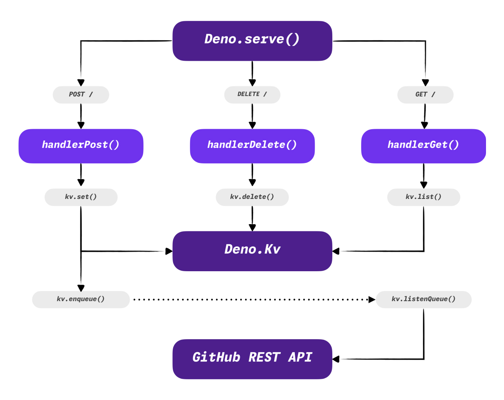

Scheduling a pull request merge at a specific date and time would be helpful in
some situations. Unfortunately, this is not a feature that GitHub currently
offers. I know third-party services and GitHub actions that help with that, but
they are overkill for my use case. Of course, I built a thing!

In
["Deno, a breath of fresh air for the server-side JavaScript"](/deno-a-breath-of-fresh-air-for-the-server-side-javascript/),
I explained why I like this runtime so much, but after the series of recent
announcements, I like it even more. [Deno KV](https://deno.com/kv) opens a whole
new world of possibilities, and this is the core feature I used to build this
project around. Combined with a simple HTTP router, I created a little service I
always wanted.

## Router and Deno KV queue

The source code for
[deno-gh-merge](https://github.com/pawelgrzybek/deno-gh-merge) is open-sourced
on GitHub, so feel free to fork it and deploy your own instance on
[Deno Deploy](https://deno.com/deploy) (a free account is more than enough for a
little project like this). In this article, I will go through each key component
of the codebase. For clarity, I am skipping noisy parts of code like type
definitions, imports, exports, error handling 🙈, etc.



### Router and opening a Deno KV connection

We need to retrieve all scheduled entries from the database via `GET` request,
create a new one using `POST` and delete one by sending a `DELETE` request. I am
also opening a Deno KV connection (`kv`) at the top of the file and passing it
down to every route handler alongside the `request` object.

```ts
// index.ts

const kv = await Deno.openKv();

const HANDLER_MAPPER = {
  GET: handlerGet,
  POST: handlerPost,
  DELETE: handlerDelete,
};

Deno.serve(async (request) =>
  await HANDLER_MAPPER[request.method as keyof typeof HANDLER_MAPPER](
    request,
    kv,
  );
```

The example below presents a data structure of entries in the KV database.
Combining the prefix, repository owner and name followed by the ID of a pull
request creates a unique key. The value is the scheduled time of a merge action.

```
key                                     |  value
----------------------------------------------------------------
['gh-merge', 'pawelgrzybek', 'div', 1]  |  "2023-12-25T09:30:00"
['gh-merge', 'pawelgrzybek', 'div', 2]  |  "2023-12-28T17:00:00"
```

### GET handler

The handler for the `GET` request returns all the items with a `PREFIX`. The
prefix can be anything (`gh-merge` in my project). The `kv.list()` method
returns an async iterator, and the easiest way to convert it to an array is
[Array.fromAsync()](https://tc39.es/proposal-array-from-async/#sec-array.fromAsync).

```ts
// handlerGet.ts

const handlerGet = async (_request: Request, kv: Deno.Kv) => {
  const entries = kv.list<string>({
    prefix: [PREFIX],
  });
  const response = await Array.fromAsync(entries);

  return Response.json(response);
};
```

### DELETE handler

If we change our mind and don’t want to merge previously scheduled PR, we can
call API with the `DELETE` request.

```ts
// handlerDelete.ts

const handlerDelete = async (request: Request, kv: Deno.Kv) => {
  const body: Entry = await request.json();
  await kv.delete(
    [PREFIX, body.owner, body.repo, body.pull_number],
  );

  return Response.json(body);
};
```

### POST handler

The `POST` request handler receives a body that contains information about the
pull request ID `pull_number`, repository `repo`, owner `owner`, and the desired
scheduled merge time in a string format (ISO 8601) `schedule`. It ignores
requests with incorrect schedule timestamps. Valid requests are saved to the
database, and events are enqueued to be processed in the future using
`kv.enqueue()`.

```ts
// handlerPost.ts

const handlerPost = async (request: Request, kv: Deno.Kv) => {
  const body: Entry = await request.json();
  const now = new Date().getTime();
  const schedule = new Date(body.schedule).getTime();
  const delay = schedule - now;

  if (delay < 0) {
    console.error("Schedule date should be in the future");
    return Response.json({ error: "Schedule date should be in the future" }, {
      status: 400,
    });
  }

  await kv.set(
    [PREFIX, body.owner, body.repo, body.pull_number],
    body.schedule,
  );
  await kv.enqueue(body, { delay });

  return Response.json(body);
};
```

### Process enqueued messages

As part of the `POST` request handler, I enqueued a message to be processed in
the future, determined by the `delay` property. The `listenQueue()` method from
the `Deno.Kv` instance lets us define a handler for messages in the queue that
are ready for processing. Let's get these PRs merged, then!

This handler checks if the scheduled event matches the entry in the database and
swallows the event in case of a mismatch. Later, it clears the record from the
database and calls GitHub API to merge a scheduled pull request. This action
requires
[an authentication to REST API](https://docs.github.com/en/rest/authentication/authenticating-to-the-rest-api?apiVersion=2022-11-28),
so you must generate a token with sufficient permissions. The `Deno.env.get()`
method allows me to retrieve secrets added to the Deno Deploy dashboard.

```ts
// index.ts

kv.listenQueue(async (event) => {
  const entry = await kv.get<string>([
    PREFIX,
    event.owner,
    event.repo,
    event.pull_number,
  ]);

  if (entry.value !== event.schedule) {
    console.log("Entry has been updated or deleted.");
    return;
  }

  const headers = new Headers({
    "Accept": "application/vnd.github+json",
    "Authorization": `Bearer ${Deno.env.get("GH_MERGE_GITHUB_TOKEN")}`,
    "X-GitHub-Api-Version": "2022-11-28",
  });
  const body = JSON.stringify({
    commit_title: "✨ Automated merge title by the Deno gh-merge",
    commit_message: "✨ Automated merge message by the Deno gh-merge",
  });

  await kv.delete(
    [PREFIX, event.owner, event.repo, event.pull_number],
  );

  await fetch(
    `https://api.github.com/repos/${event.owner}/${event.repo}/pulls/${event.pull_number}/merge`,
    {
      method: "PUT",
      headers,
      body,
    },
  );
});
```

## Let's merge it

That’s it. A lot can be improved, like checking if the PR exists before
scheduling its merge, checking if the merge is allowed before triggering the
operation, making dynamic commit messages, and more. This should work as a base.
I hope that by the simplicity of this project, I inspired you to build something
new.

Let's give it a go and schedule this article to go live on Thursday, 2023.12.21,
at 14:00, and merge
[this pull request](https://github.com/pawelgrzybek/pawelgrzybek.com/pull/152).

```
curl --request POST \
  --url https://gh-merge.deno.dev/ \
  --header 'Content-Type: application/json' \
  --data '{
	"owner": "pawelgrzybek",
	"repo": "pawelgrzybek.com",
	"pull_number": 152,
	"schedule": "2023-12-21T14:00:00"
}'
```
