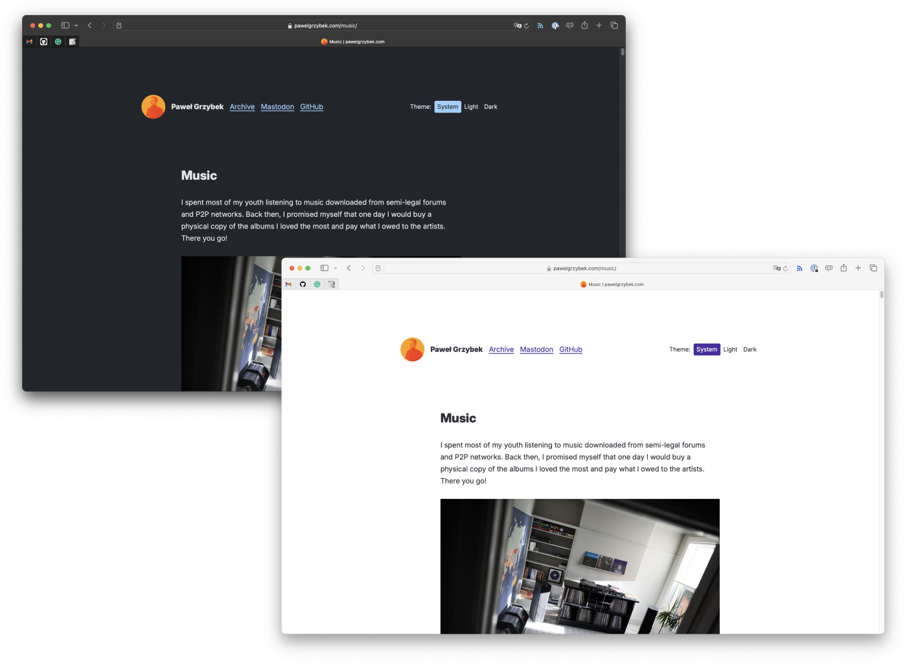
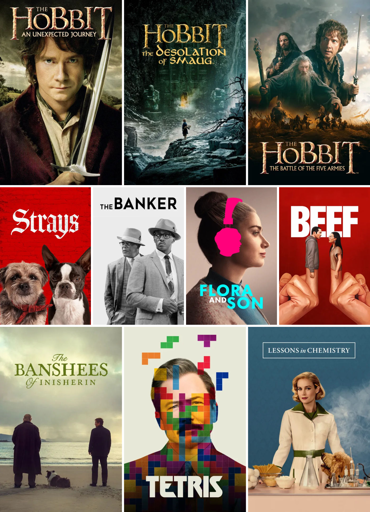
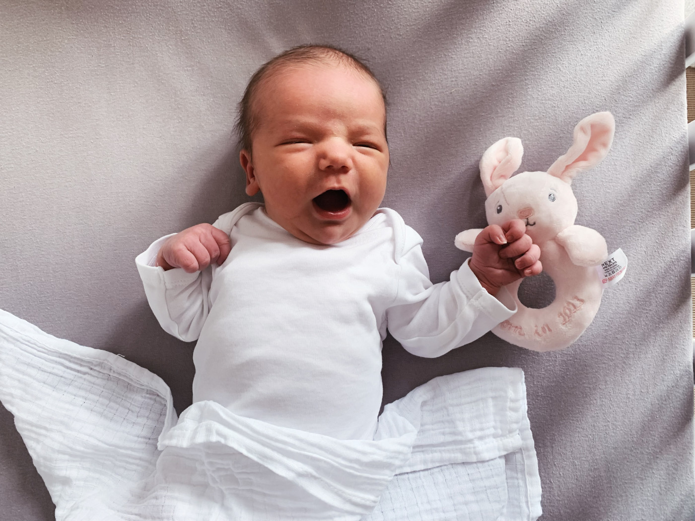

This time of the year again! Just after Christmas, before the new year kicks in, I like to slow down and have a retrospective moment of gratitude for everything life has brought in the past year. It is also an excellent time to think about goals for the upcoming months. To keep the tradition going, I am sharing some highlights and a little fiasco to balance things.



## Job situatoin fiasco

Despite my doubtful sympathy for the Web3  universe, I joined Polygon a year and a half ago. I did it for money, which was a good decision for me then. I joined the team to work on a product that was supposed to solve another non-existing problem. A few months after I joined, the whole division was acquired by an investor with even less realistic goals in mind just to shut down the initiative in November this year. I published, ["Just like that, we are shutting down! So, I am looking for a new role"](/just-like-that-we-are-shutting-down-so-i-am-looking-for-a-new-role/), where I shared more details.

I am closing the year unemployed, ready to start a new journey with very different priorities. I would love to work for a company that shares similar values, aligns with my love for open Web standards, and solves real problems for real people.

## Writing

I will refrain from bragging about this page's number of unique visitors, session duration and insignificant bounce rate. Quite the opposite because I don't care about all this noise. I am writing to express my happiness by publishing new content, learning new things and sharing it with you. In March, I published ["Eight years of blogging"](/eight-years-of-blogging/) and elaborated on all the beautiful things that consistent publishing brought to my life.

Since the beginning of the year, I published 60 new articles, which is more than ever. I did a light redesign and added a new [music collection page](/music). My brain is a never-ending queue of ideas for fresh articles, and I look forward to publishing them. Thank you all for reading!

## Proficiency in Rust

I have been learning Rust for a while now, but only recently have I finally reached the stage when I choose Rust more often than any other tool I know to solve my programming problems. I am far from using this programming language professionally, but it feels good to be equipped with such a powerful tool.

## Read and watched

A productive year as a writer resulted in a lighter year as a reader, but I read some pieces worth mentioning. I also watched a few good movies and TV shows that I enjoyed a lot.

["The Body" by Bill Bryson](/book-review-the-body-by-bill-bryson/) and ["The Book You Wish Your Parents Had Read" by Philippa Perry](/book-review-the-book-you-wish-your-parents-had-read-by-philippa-perry/) were my favourite books of the year.

I was late to the party, but finally watched [the Hobbit movie series](https://en.wikipedia.org/wiki/The_Hobbit_(film_series)) this year and enjoyed the whole saga. ["Tetris"](https://www.imdb.com/title/tt12758060/) was a lot nicer than I expected. I laughed the most on ["Strays"](https://www.imdb.com/title/tt15153532/). ["Flora and Son"](https://www.imdb.com/title/tt25471950/), ["The Banshees of Inisherin"](https://www.imdb.com/title/tt11813216/), and ["The Banker"](https://www.imdb.com/title/tt6285944/) are the ones we enjoyed as well. ["Beef"](https://www.imdb.com/title/tt14403178/) and ["Lessons in Chemistry"](https://www.imdb.com/title/tt13911628/) were my favourite TV shows of 2023.

## Fighting bad habits and re-learning good ones

Life events, the beginning of a new year and the desire to change something nicely aligned resulted in one of the best things I have ever done to my physical and mental state. On the last day of the previous year, I had an alcoholic drink for the last time. I observed a lot of benefits: extended attention span, productivity boost, improved metabolism, better sex life and plenty more. It is quite a good way to save some cash as well. I elaborated a bit more about it in ["Book review: The Alcohol Experiment by Annie Grace"](https://pawelgrzybek.com/book-review-the-alcohol-experiment-by-annie-grace/) if you are curious.

I also defeated my panic fear of driving. After over a decade of avoiding the driver's seat, I took some lessons and re-learned driving. I enjoy doing it now and feel more comfortable doing it than ever. Maybe it sounds like nothing to you, but it was a biggie for me.

## Three of us

No matter what words I use to write this paragraph, it won't describe my emotions for this news. In September, our daughter entered this world. Her name is Antonia, and she is strong, healthy and incredible in every aspect. This little angel fulfilled our biggest dream.

I would love to thank my fiance for being the best partner a man can have on his side and for being the best mother for little Tosia (the Polish diminutive of the name Antonia). After everything you have done for us, after all you do, you still have the energy to support me. Thank you ❣️

## I am ready for 2024

It took me forever to condense a year of my life into this article, but I love this annual tradition. As said before, it is a moment of gratitude and an opportunity to set goals for the upcoming year. This time, I will avoid vague-sounding targets that are easy to ignore but set some concrete achievements to aim for.

1. Run a half-marathon distance and stay alive.
2. Get involved in the Rust open-source community.
3. Change a decade-old profile picture.

I am ready for 2024. Have a good year, everybody 🎉
