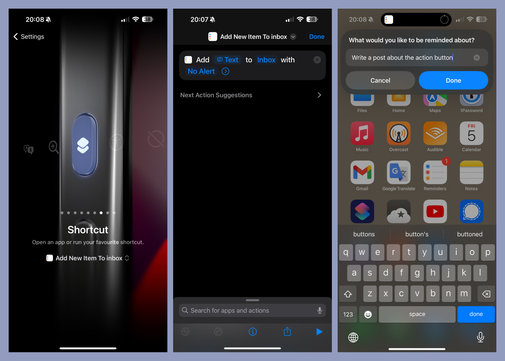

I live by my to-do list. Otherwise, I can't get shit done at all. As I mentioned in ["My defaults 2023"](/my-defaults-2023/), the default Apple Reminders app is my [GTD](https://en.wikipedia.org/wiki/Getting_Things_Done) tool of choice. Every task, idea for a future article, plan for the next trip, ingredient to pick up from the grocery store and so on initially lands in an Inbox list. The most important thing is to capture what's in my brain immediately.

Following my phone exchange four-year cycle, it was a year when I bought myself a new iPhone 15 Pro Max. It is all great, the camera and titanium and everything. The thing I like the most is the new customizable Action Button. All my previous attempts to use it for something useful spectacularly failed until I mapped it to a shortcut to capture items to the Inbox list. I use it gazillion times a day, and it is by far my favourite way of quickly saving stuff to my Inbox list.

I am sharing with you my use case for the Action Button. If you own the latest iPhone, what do you use it for? Until next time, stay productive ✌️
