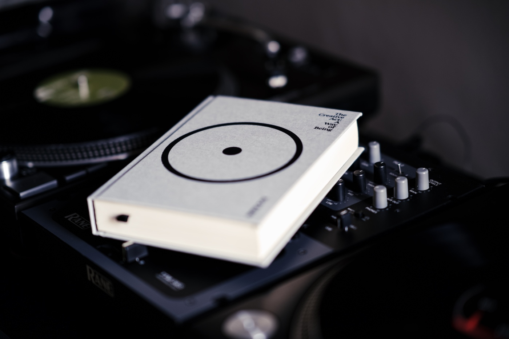

Rick Rubin is the founder of legendary Def Jam Recordings and the producer behind Red Hot Chilli Peppers, LL Cool J, Public Enemy, Beastie Boys, Run-DMC, Jay-Z, Adele and many more. Besides music-related achievements, he is known for his deep spirituality—also the owner of the most calming voice ever.

Rick put together his thoughts about art making and everything around this process and released a book, ["The Creative Act: A Way of Being"](https://www.goodreads.com/book/show/60965426-the-creative-act). The book by itself is a beautiful piece of art. Divided into "78 Areas of Thought", with each section spanning only a few pages, it feels more like a set of rules to live by than a story I expected when I heard about it for the first time.

Do not be discouraged by the word "art" in the title, as this publication applies to professionals and hobbyists of any genre. "Everyone Is a Creator", as the first chapter states. I found a massive dose of inspiration in this book and calibrated my point of view about the things I make. It helped me deal with the self-doubt accompanying each article's publication on this website. The chapter I loved the most was "Beginner's Mind", which reminds us about the power of not knowing about the difficulty of the challenge and how helpful this state can be for innovation.

> There's a great power in not knowing. When faced with a challenging task, we may tell ourselves it's too difficult, it's not worth the effort, it's not the way things are done, it's not likely to work, or it's not likely to work for us.
If we approach a task with ignorance, it can remove the barricade of knowledge blocking progress. Curiously, not being aware of a challenge may be just what we need to rise to it.

I loved this book, and I highly recommend it. Besides that, check the recent [interview with Rick Rubin by Andrew Huberman on YouTube](https://youtu.be/GpgqXCkRO-w). The author answers some of the fan's burning questions. Good one!


