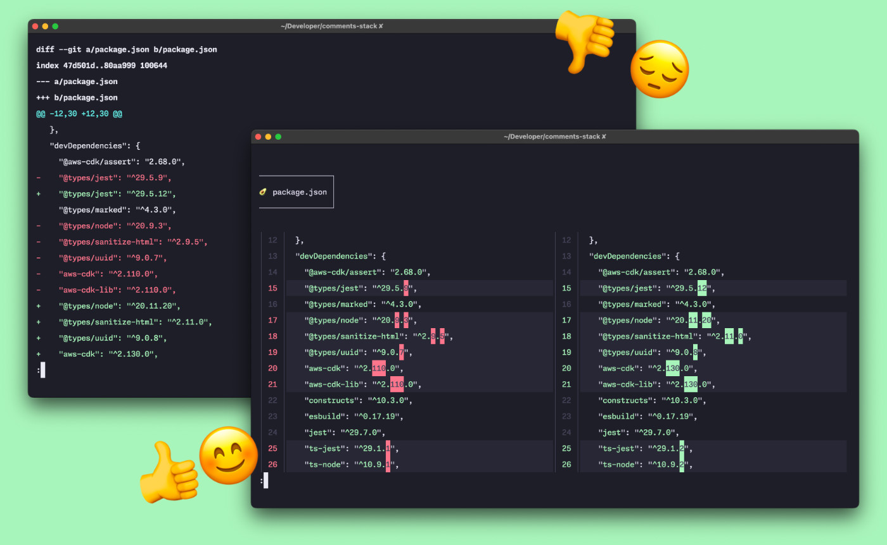

After [switching from Visual Studio Code to Helix](/the-joy-of-learning-helix-and-probably-other-modal-terminal-based-editors/) a few months ago, I occasionally miss a side-by-side preview of changed files. I don't find the output of `git diff` readable. Despite the [millions of ways you can configure this command](https://git-scm.com/docs/git-diff), the ability to present changes next to each other is impossible. Luckily, I found [delta](https://github.com/dandavison/delta), a diff pager for `git` and `grep` output written in Rust by Dan Davison.

Delta executables are available for most operating systems. The recommended way is to configure delta as your default git pager inside a `.gitconfig`, so you don't need to learn any new commands and change your workflow. Also, this CLI tool is wildly configurable. If interested, [my config is publicly available on my dotfiles repository](https://github.com/pawelgrzybek/dotfiles/blob/master/.gitconfig#L25-L43). I am attaching screenshots of the default `git diff` and `delta` output for comparison.

Ps. The avocado icon next to the file name is not the default. It is part of my config. Keep things fun!
