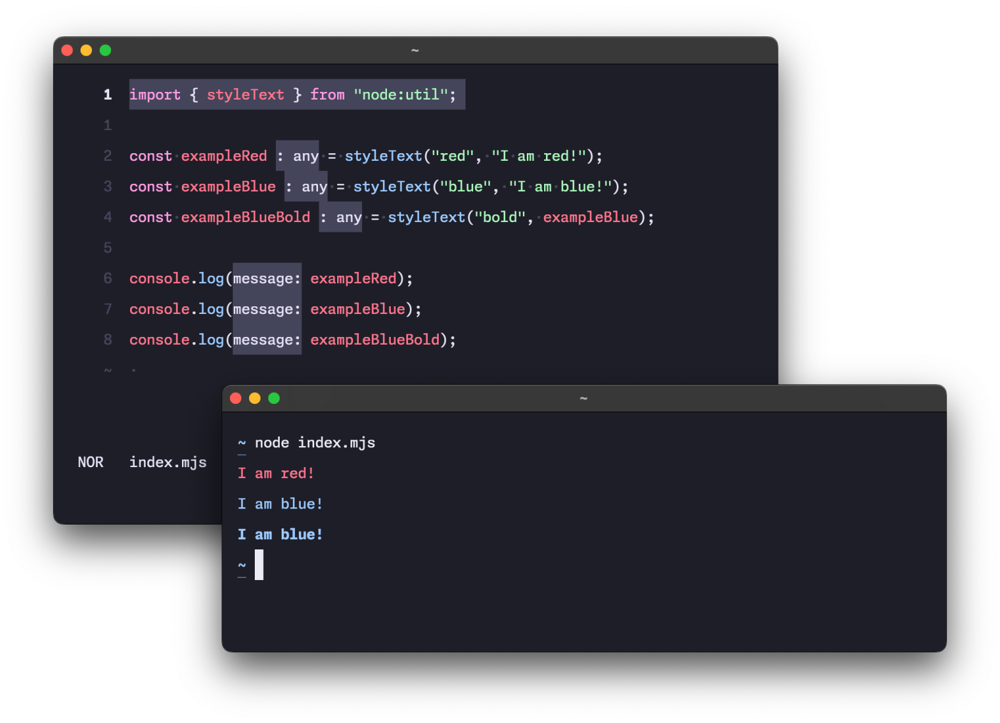

[Node.js 21.7.0](https://nodejs.org/en/blog/release/v21.7.0) comes with a new text formatting utility. It is simple to use but powerful because modifiers can be combined. You may not need [chalk](https://www.npmjs.com/package/chalk) anymore. Let's have a look at how it works.

```js
import { styleText } from "node:util";

const exampleRed = styleText("red", "I am red!");
const exampleBlue = styleText("blue", "I am blue!");
const exampleBlueBold = styleText("bold", exampleBlue);

console.log(exampleRed);
console.log(exampleBlue);
console.log(exampleBlueBold);
```



Nice, right? Here is a handy list of [all the available modifiers](https://nodejs.org/api/util.html#modifiers) divided into general, foreground and background colours.

- **modifiers**: `reset`, `bold`, `italic`, `underline`, `strikethrough`, `hidden`, `dim`, `overlined`, `blink`, `inverse`, `doubleunderline` and `framed`
- **foreground**: `black`, `red`, `green`, `yellow`, `blue`, `magenta`, `cyan`, `white`, `gray`, `redBright`, `greenBright`, `yellowBright`, `blueBright`, `magentaBright`, `cyanBright` and `whiteBright`
- **background**: `bgBlack`, `bgRed`, `bgGreen`, `bgYellow`, `bgBlue`, `bgMagenta`, `bgCyan`, `bgWhite`, `bgGray`, `bgRedBright`, `bgGreenBright`, `bgYellowBright`, `bgBlueBright`, `bgMagentaBright`, `bgCyanBright`, `bgWhiteBright`


[Node v20.13.0 release](https://nodejs.org/en/blog/release/v20.13.0) added an ability to pass an array of modifiers, like `util.styleText(['underline', 'italic'], 'Hi')`. Super handy!

