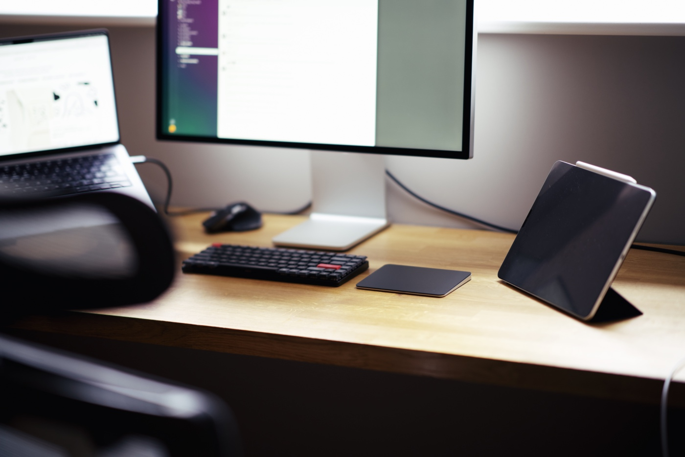

If you’re here to read my review of the Apple Magic Trackpad, you can skip the AI rant and [scroll down to the brief review](#apple-magic-trackpad-review). Otherwise, enjoy my AI rumblings.

[Logitech MX Master S3 for Mac](https://www.logitech.com/en-gb/products/mice/mx-master-3s-mac-bluetooth-mouse.910-006572.html) is a great mouse. It is a good-looking product, built like a tank, very customisable, and has this fancy electromagnetic scrolling wheel. I liked it a lot until the recent Logi Options+ software update to [version 1.70](https://support.logi.com/hc/en-gb/articles/1500005516462-Logi-Options-Release-Notes#h_01HR93P0DT3Y8T5NEFGR5YXTKV) that introduced [the Logi AI Prompt Builder](https://www.logitech.com/en-gb/software/logi-ai-prompt-builder.html).

Some people need [AI Smart Cooking technology](https://www.tefal.com.sg/Cooking-appliances/Rice-Cookers/RK736B-EASY-RICE-PLUS-spherical-pot-rice-cooker-1-8L/p/7211004623) to get a perfect bowl of rice, but I am OK with a cheap IKEA pot with a lid. Some need [3D teeth tracking with AI](https://shop.oralb.co.uk/io10-cosmic-black-electric-toothbrush-with-charging-travel-case/13997362.html) to preserve good oral hygiene, but I am happy with my dumb brush. I absolutely don't need any ChatGPT-driven features built into my mouse. Naively, I thought I would turn off this feature and carry on. So naive I was! 

Turning off the Logi Options+'s AI capabilities takes work. It requires [digging into the Application Support](https://mastodon.social/@flipneus/112321297224942175) dungeon of files. Additionally, the new version of this software creates an `ai_overlay_tmp` directory in the user's home folder that recreates itself a moment after it's deleted. I contacted Logitech customer support, who confirmed that the permanent folder in the user's root is a bug and will be fixed in the upcoming version of the software. Disabling AI Prompt Builder via the UI will also be coming soon.

As a result, I uninstalled Logi Options+, put aside my fancy mouse, and got myself an [Apple Magic Trackpad](https://www.apple.com/uk/shop/product/MMMP3Z/A/magic-trackpad-black-multi-touch-surface). If you want me to ditch products made by your company, just add AI features where they are absolutely not needed.

## Apple Magic Trackpad review

It is fine — I rarely move my hands off the keyboard anyway 🤷‍♂️
