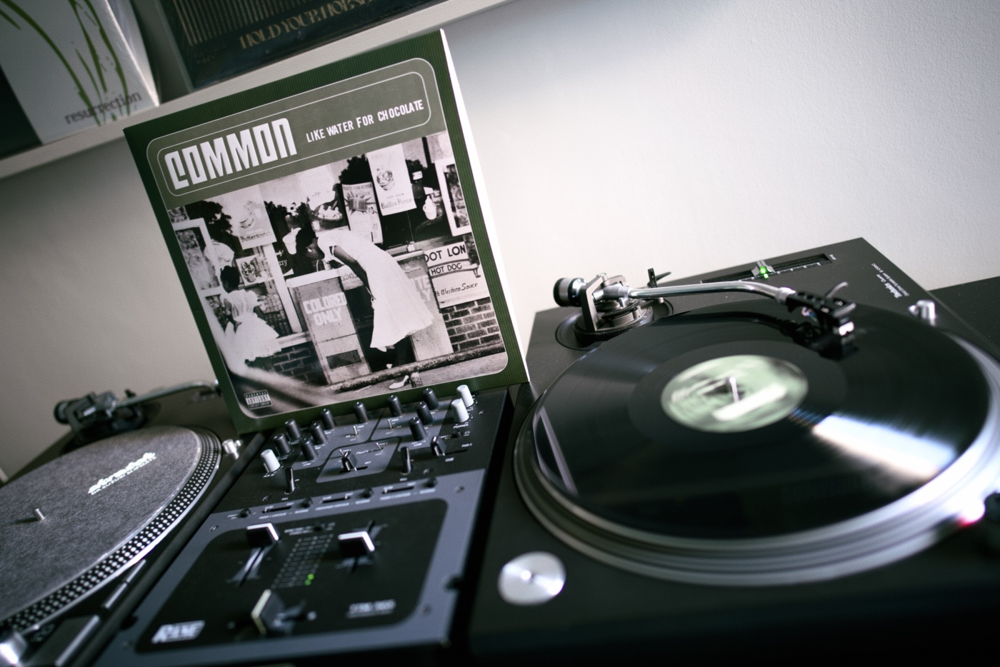

I have been publishing my "top picks" for over nine years, and the format of this series has never changed—just a dry list of links annotated by a paragraph of my thoughts. Inspired by [Web Weekly by Stefan Judis](https://webweekly.email) and [Own Your Web by Matthias Ott](https://buttondown.email/ownyourweb), I decided to bring more life to it. You should subscribe to these two newsletters if you haven't already done so! 

I love Stefan's idea of sharing a song recommended by a reader or [Roma](https://blog.kizu.dev)'s "current drink" that he enjoyed while writing a blog post. The spin I will add to my series combines these two. Album of the Month is a new section with a picture of the album cover from my collection that I enjoyed listening to in the past month. Something like this!

---

## Album of the month

It was easy to pick ["Like Water for Chocolate" by Common](https://www.discogs.com/master/32409-Common-Like-Water-For-Chocolate) this month because I barely listened to anything else. Despite the steep price, I recently picked it up on [Juno Records](https://www.juno.co.uk), and since then, this album has kept spinning on my turntable.

Classic Soulquarians production. It has a bunch of afro and neo-soul vibes in there, composed mostly by two of my beloved producers (J Dilla and Dj Premier), all produced by Questlove. "Dooinit", "Funk For You", and "The 6th Sense" are my favourite songs from the album, but the whole thing plays incredibly from the beginning up to the outro recited by Common's father.

---

## Top picks

### ["If View Transitions and Scroll-Driven Animations had a baby" by Bramus van Damme](https://youtu.be/a6ZN9jM-1K4)

In this talk, Bramus looks into the [View Transitions poster-child demo, created by Maxi Ferreira](https://live-transitions.pages.dev/) and inspired by the [work of Ehsan Rahimi](https://dribbble.com/shots/4650389-Music-Playlist-App-Interaction). In the second part of his talk, he adds his spin to the demo by introducing scroll-driven animations to recreate the dragging animation from the original animation. This presentation is a super insightful talk and a great explainer of these powerful modern CSS concepts: View Transitions and scroll-driven animations.

### [Unleash the power of Scroll-Driven Animations](https://youtube.com/playlist?list=PLNYkxOF6rcICM3ttukz9x5LCNOHfWBVnn&si=GmuTUG_I_SDk_KI-)

Bramus (the same bloke from the previous pick) has just released a ten-episode series about scroll-driven animations. The first part covers the basics of the new primitives responsible for scroll-driven animations, and the remaining part provides practical examples. It is a great resource, and it is well worth your time.

### [The Forensics Of React Server Components (RSCs)](https://www.smashingmagazine.com/2024/05/forensics-react-server-components)

React is on fire (again), and we are confused about the new stuff added to React and how it works (again). Lazar from the Sentry team published this in-depth explanation of React Server Components and how they are implemented and used in Next.js. It explains nuances that most developers don't need to build an app using this framework, but I enjoyed going into the weeds.

### [Ryan Dahl introduces JSR at DevWorld 2024](https://youtu.be/MFCn4ce5dVc?si=WKNicCFOGxYAyzXI)

You may have heard about the [JRS (JavaScript Registry)](https://jsr.io) created by the Deno team. Ryan Dahl, the original creator of Node.js and later founder of Deno, officially announced the JSR in Amsterdam on March 1, 2024. This is a recording of his talk. It is a practical, hands-on talk with plenty of demos that present core features of the npm superset.

### [Web at Google I/O 2024](https://www.youtube.com/playlist?list=PLOU2XLYxmsIKeQI4KTrrplA_mUPI3Lq5b)

May is a month of huge tech events, and one of the biggest is Google I/O. This year was full of announcements for Web enthusiasts. This is a link to a playlist containing only web-related talks, but if you don't have a spare 14 years to watch them all, let me summarise what's worth watching (or not).

- [The opening Developer Keynote](https://www.youtube.com/live/ddcZnW1HKUY) summarises everything happening, but it is primarily an AI-related show, which I found super dull.
- ["What's new in the Web" by Rachel Andrew](https://youtu.be/W8bokbLn1G8) is the talk you should watch if you have time to go through only one. It is a speedrun through the most exciting features recently added to the platform. It contains a summary of the Baseline initiative, a recap of the past year and plans for the upcoming one around browser interoperability, an overview of the latest CSS features added to the Web, new performance and video features, word about the changes around the colour spaces, and a lot more. It also introduces the Web Platform Dashboard, and I love it!
- ["The latest in Web UI" by Una Kravets](https://youtu.be/_-6LgEjEyzE) is an excellent summary for front-end developers. It elaborates on features in three categories: interactive experiences, UI components, and quality-of-life improvements.
- ["Multi-page application View Transitions are here" by Bramus Van Damme](https://youtu.be/eY6C_-aDdTo) (clearly, the dude is my hero of this month) walks through one of the most exciting features added to the Web.
- ["From fast loading to instant loading" by Barry Pollard](https://youtu.be/bSua9vMdrNM) is an excellent walk-through of the Speculation Rules API, which I had never heard of before watching this talk. "Improvements to the Speculation Rules API" goes in-depth about the possibilities of this API and recently added changes.
- ["Navigating the JavaScript framework ecosystem" by Katie Hempenius and Addy Osmani](https://youtu.be/XaNqdlfVF-M) helps understand the latest additions to leading JavaScript frameworks like Angular, React, Next.js, Remix, Vue, Nuxt.js, Astro and Svelte and SvelteKit.
- ["Chrome DevTools: From friction to flow" by Jecelyn Yeen](https://youtu.be/nIO_q1u1u0E) is about some of the recently added helpers for developers, and some of them are very useful! Even though I don't use Google Chrome as a daily driver, the dev tools built into this browser are the best and have just improved.

### [React Conf 2024 Day 1](https://www.youtube.com/live/T8TZQ6k4SLE) & [React Conf 2024 Day 2](https://www.youtube.com/live/0ckOUBiuxVY)

Among frontend frameworks, React dominates them all by a significant margin. It is used by most of the companies I have had the opportunity to work for, and the current workplace situation is no different. If it is not a React, it is a meta framework level above it. It is worth following recent React announcements, especially since they released the RC version of their 19th major release. On the 15th and 16th of May, the 7th [React Conf](https://conf.react.dev) took place in Las Vegas, and it was full of great talks. Similarly, as in the last post, I prepared a quick summary of everything I found most interesting.

- The opening keynote by Joe Savona, Mofei Zhang, Lauren Tan, Sathya Gunasekaran, Andrew Clark, and Josh Story summarizes the current state of the React ecosystem, what's new in React 19, and the plans for the upcoming versions. The keynote is a worth-watching talk to stay current without going into the weeds too much.
- "Vanilla React" by Ryan Florence is a story about React Router, how it became a Remix, and how everything was merged back to React Router v7. Ryan also presents a few demos of client/server-side rendered projects, static prerendering, and RSC. "Merging Remix and React Router" by Brooks Lybrand is an alternative if you prefer written content.
