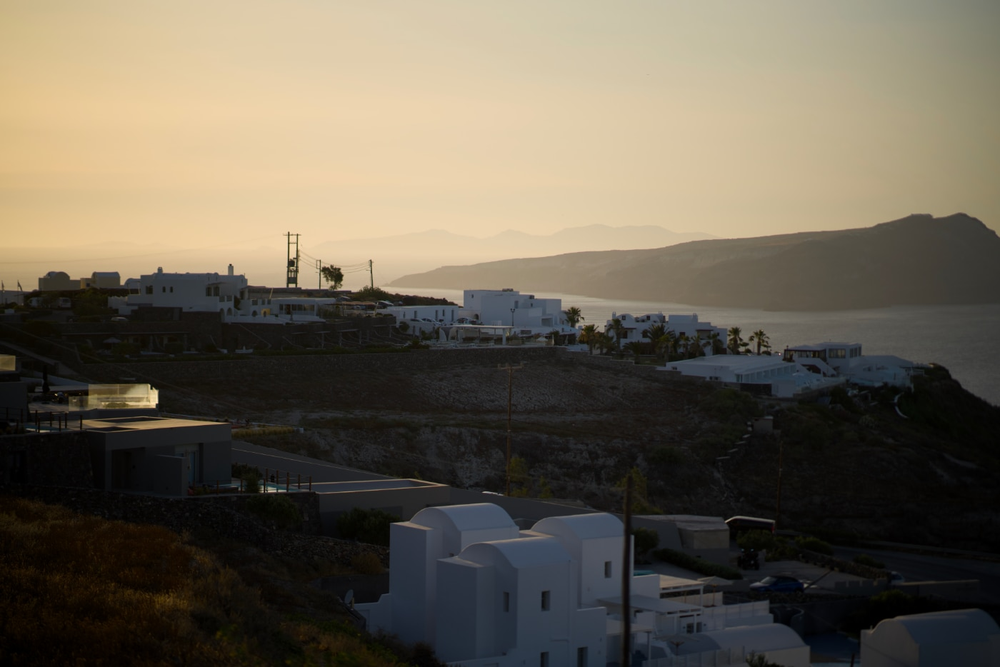
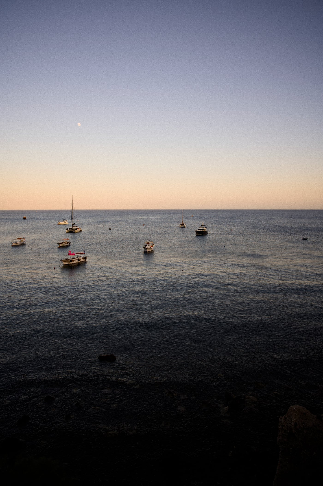
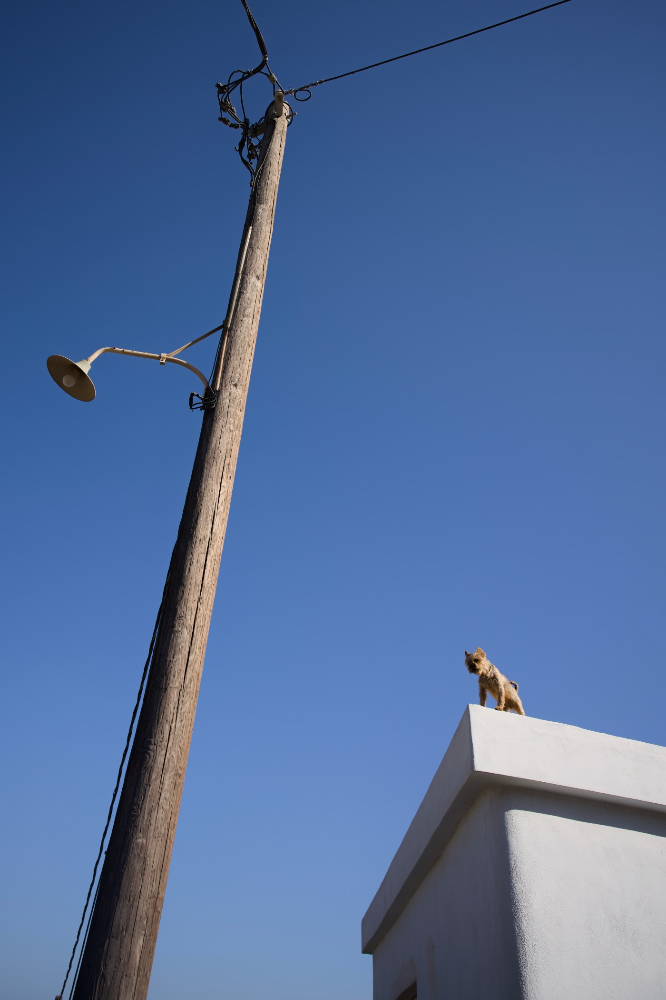
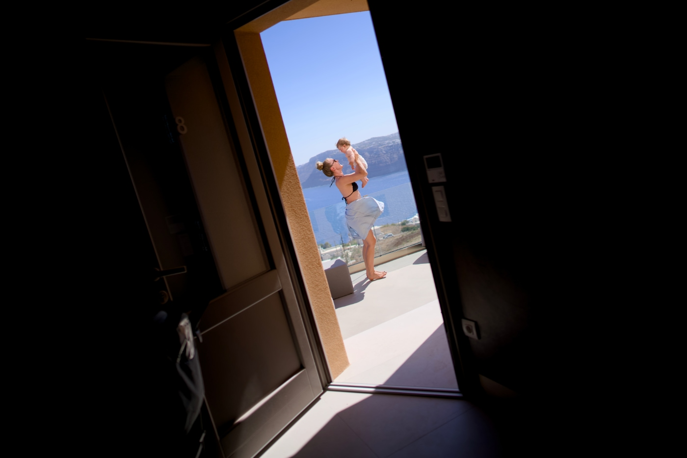
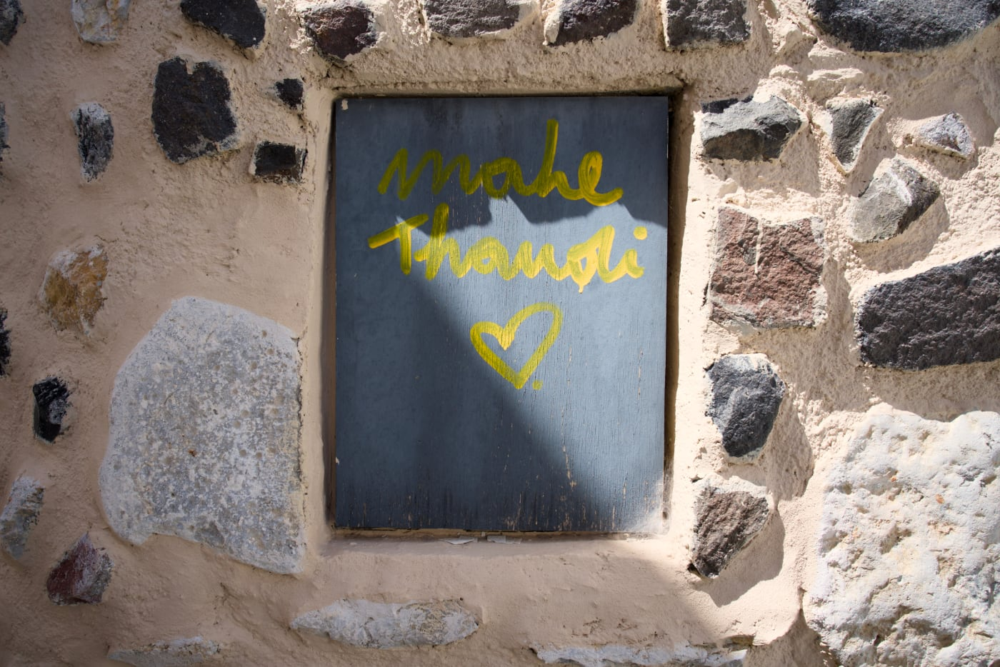
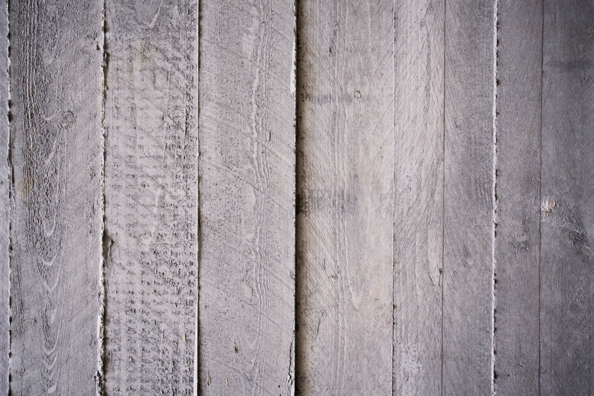
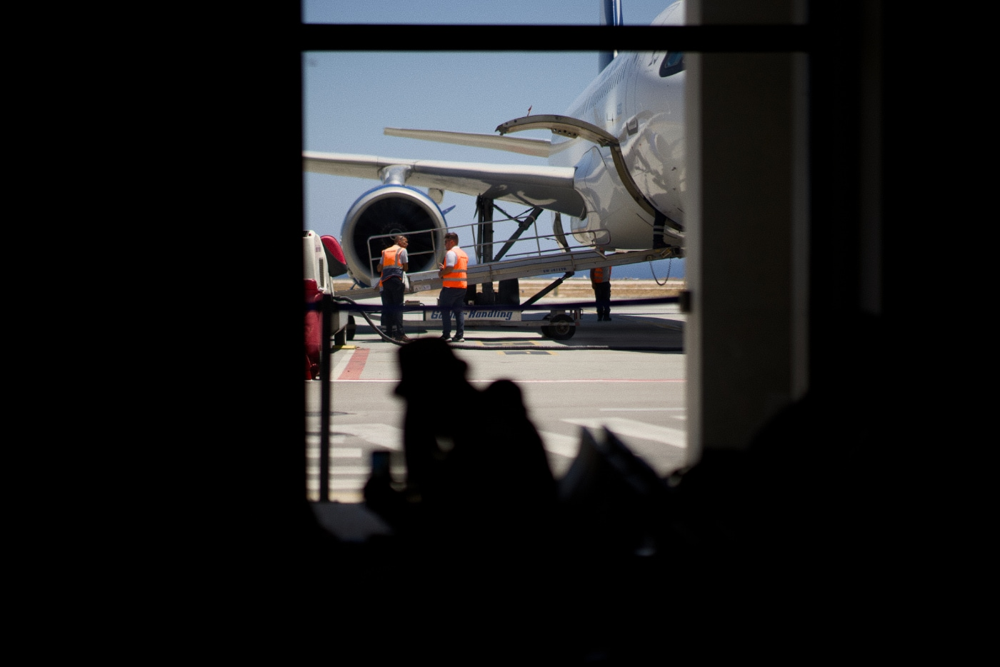

We are just returning from a week in Akrotiri, a village south of Santorini. Stunning place! The picturesque north of the island is too crowded, overpriced, and dominated by selfie addicts, but the southern part is relaxing and traditional, and it is where we stay most of our time. I wanted to share a few pics 🇬🇷

