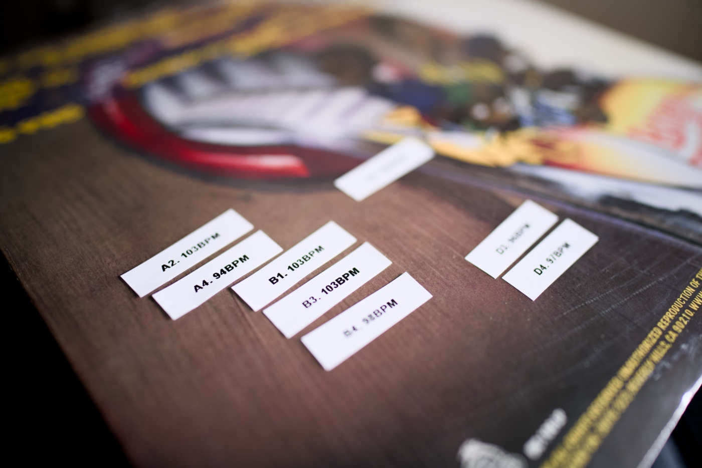

It was a pretty busy month! As an organisor of [NN1 Dev Club](https://nn1.dev) I decided to ditch [Eventbrite](https://www.eventbrite.co.uk) as a ticketing platform due to many limitations, costs and unpredictable email schedules. I had tons of fun with [Deno](https://deno.com) and [Astro](https://astro.build) while rebuilding a bunch of functionalities a meetup page may need (ticketing, feedback and newsletter API). Event organisation is fun, but it can be time-consuming. I love it, though!

A side-effect is a little blogging slow down, and this top picks issue is shorter than usual. Nonetheless, enjoy a few great resources I found in July and, of course, a music recommendation from my vinyl crate!

---

## Album of the month

Goofy guys from LA (that's how the band's producer, J Swift, described the group) have kept spinning on my turntable most often for the past few weeks. ["Bizarre Ride II The Pharcyde" by the Pharcyde](https://www.discogs.com/release/7992269-The-Pharcyde-Bizarre-Ride-II-The-Pharcyde) is a funny, melodic storytelling rap with outstanding "Passing Me By". Also, I played this one more often than anything else because I will see them live next week. Buzzin!

---

## Top picks

### [Slash pages - A guide to common pages you can add to your website](https://slashpages.net)

Slashpages are top-level static pages that describe the author, the tech behind the page, the intention of a page, current project, favourite software, hardware, etc. I cannot see myself adding 20 new pages to my website because I doubt that I have a lot of exciting things to put on them, but I may partially adopt this new IndieWeb movement. I like the most: `/blogroll`, `/colophon`, `/feeds`, `/slashes`, `/tip` and `/uses`.

### [Introducing Writebook](https://world.hey.com/jason/introducing-writebook-e217cae3)

Jason Fried and other folks at Basecamp released a few books I enjoyed reading. They had to re-invite a custom web publishing solution for each of them. After going through this unpleasant experience, they decided to tackle the web publishing problem and released a Writebook. I like the name! I am not a book publisher, but it is a well-thought-out product after looking at the examples. If you are planning to write a book, check this one out.

### [Add node:sqlite module](https://github.com/nodejs/node/pull/53752)

Modern JavaSccript runtimes come with native support for some databases. Bun has native support for SQLite. Deno comes with KV. Node.js recently rapidly added stuff influenced by other runtimes. Node.js just merged a pull request to add support for SQLite.

### [module: add --experimental-strip-types](https://github.com/nodejs/node/pull/53725)

Another Node.js-related news that exploded, and I am super excited about it. The experimental types stripping feature has been merged with the Node.js core. Native TypeScript support is coming without extra loaders and confusing tooling.

### [Get The Screen Width & Height Without JavaScript](https://css-tip.com/screen-dimension/)

What you can do with CSS nowadays is pretty cool!

### [Problems solved by OpenType | Roel Nieskens | CSS Day 2024](https://youtu.be/TreBK-EyACQ)

This presentation by Roel Nieskens is a very practical deep-dive into the little-known features of OpenType. I found it super helpful. Also, the whole talk concludes with a quick demo of a tool made by the author, [Wakamai Fondue](https://wakamaifondue.com). It is a handy helper for exploring hidden gems in your .otf files.

