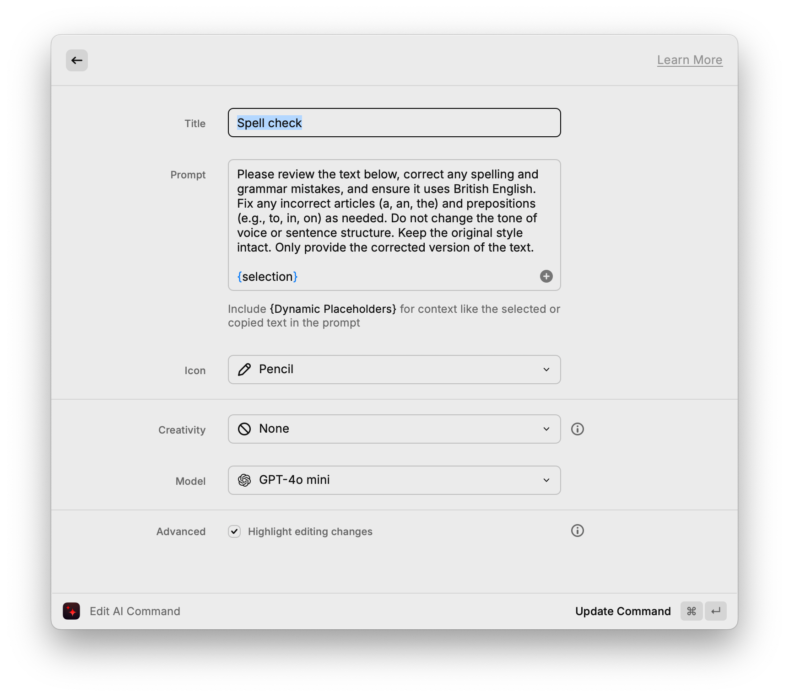

As a non-native English speaker, I used to use Grammarly as a writing assistant for years. I used it as a last step just before publication to catch misspelled words and grammar issues. Other than that, it provides a lot of suggestions that I rarely care about. Shortening paragraphs, changing the tone of voice, or suggestions to avoid passive voice are not what I need. Overall, it is a helpful tool, and my English has massively improved because of it. It is crazily expensive, though. The premium subscription costs £25 a month, or £10 a month when paid for a year upfront. A pretty steep price for a dictionary on steroids.

One thing that I happily pay money for is Raycast. I use this tool all the time! It is a great app launcher, window manager, units converter, and translator. Extra power comes with plugins, but you should do your due diligence and check it out yourself. As much as I am not a great fan of adding AI features everywhere [^1], the AI features integrated with Raycast are solid.

[^1]: ["From Logitech MX Master 3S to Apple Magic Trackpad — my honest review (of the AI hype)"](/from-logitech-mx-master-3s-to-apple-magic-trackpad-my-honest-review-of-the-ai-hype/) that I published a not long ago about the impossible-to-disable AI capabilities of the Logitech mouse is a good example of AI implementation that is simply stupid.

It turns out that with a little bit of prompt tweaking and Raycast AI commands, I can have a spell and grammar checker that works how I want without unnecessary bells and whistles.

## Spell checker using Raycast AI

The ChatGPT 4o is great for this use case. I reduced its creativity to none, to avoid potential tone changes. Thanks to my friend Jordan from [takara.ai](https://takara.ai), who explained it all to me and helped me with a prompt for a custome "Spell check" AI command. There is a high chance that other models and prompts work equally well, but I am sharing what works great for me.

> Please review the text below, correct any spelling and grammar mistakes, and ensure it uses British English. Fix any incorrect articles (a, an, the) and prepositions (e.g., to, in, on) as needed. Do not change the tone of voice or sentence structure. Keep the original style intact. Only provide the corrected version of the text.

The default “Fix spelling and grammar” command that comes predefined in Raycast is a little bit too aggressive to my taste. Changes in tone of voice or changing the verbosity of my writing is not what I want. I want to keep my personality even if sometimes articulated incorrectly; this is how I would express it in a real-life conversation with you. Rewriting my words with computer-generated phrases totally defeats the purpose of writing in the first place for me.

I like my new workflow. Thanks to Raycast, I don’t need to jump back and forth from one tool to the other, and the spell check doesn’t suggest any undesired changes other than those I really struggle to get right by myself. Also, I have some extra money because I don’t need to renew my Grammarly subscription.
