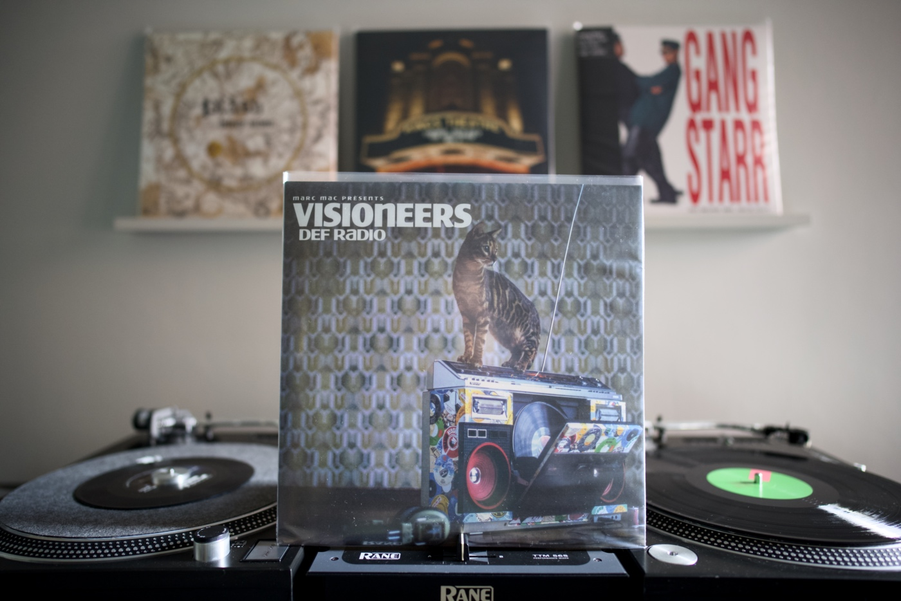

This is probably the shortest list that I have ever shared with you. I was just
too busy with work-related stuff, some activities around
[NN1 Dev Club #4 meetup](https://nn1.dev/events/4), and my exploration of new
subjects were a bit overshadowed by the fact that I changed a code editor
(again). Neovim that is now, and I truly enjoy the ride. I did not forget about
the music recommendation, though.

---

## Album of the month

Marc Mac came back with his Visioneers project!
["Def Radio"](https://www.discogs.com/release/32075256-Marc-Mac-presents-Visioneers-Def-Radio)
is a record that has kept on spinning on my Technics turntable nonstop for the
past month. It is full of incredible funky beats, b-boy breaks, and mellow jazzy
sounds. One of those records that can play from the very beginning to the end,
and your head cannot stop nodding. I need to hunt for some previous releases by
Visioneers!

---

## Top picks

### [1 dataset. 100 visualizations.](https://100.datavizproject.com)

How creative that is! A simple dataset represented in 100 different ways, each
of them telling a different story. This is good inspiration for diagram design
in your next project. I really like the idea of the project.

### [kickstart.nvim](https://github.com/nvim-lua/kickstart.nvim)

A year ago, I made a move from Visual Studio Code to
[Helix](https://helix-editor.com). It was my first experience with a modal-based
text editor, but I quickly became so productive that I never returned to a
conventional IDE. I hit a roadblock, though, after a while, and as much as I
love Helix and its philosophy, I cannot wait for the plugin system anymore
because I need some features now. So I made a move again. Neovim is my new daily
driver, and since I was familiar with a modal editor, it took me only a few days
to get back to the productivity level I had with Helix. Famously, the
configuration of Neovim can be daunting, but luckily one of the core
contributors made my life a lot easier and released kickstart.nvim. There is
also [a complementary video](https://youtu.be/m8C0Cq9Uv9o) where TJ DeVries goes
through the repo.



### [Creator of Node talks Deno 2.0 and the Future of JS](https://youtu.be/2x2eIhn2BJM)

You probably have seen many interviews with Ryan Dahl before, but this
conversation is a lot more technical than the rest of the technically light
discussions. This one reveals a lot more details that I actually care about.



### [Overflow Clip](https://ishadeed.com/article/overflow-clip/)

Ahmad's deep dives into particular parts of modern CSS are my favourites. I have
never really understood the difference between the `hidden` and `clip` values of
the CSS `overflow` property. This is all I needed! Extending the clipping
margins around the element that contains focusable elements is by far my
favourite example and technique that I am adopting straight away.
