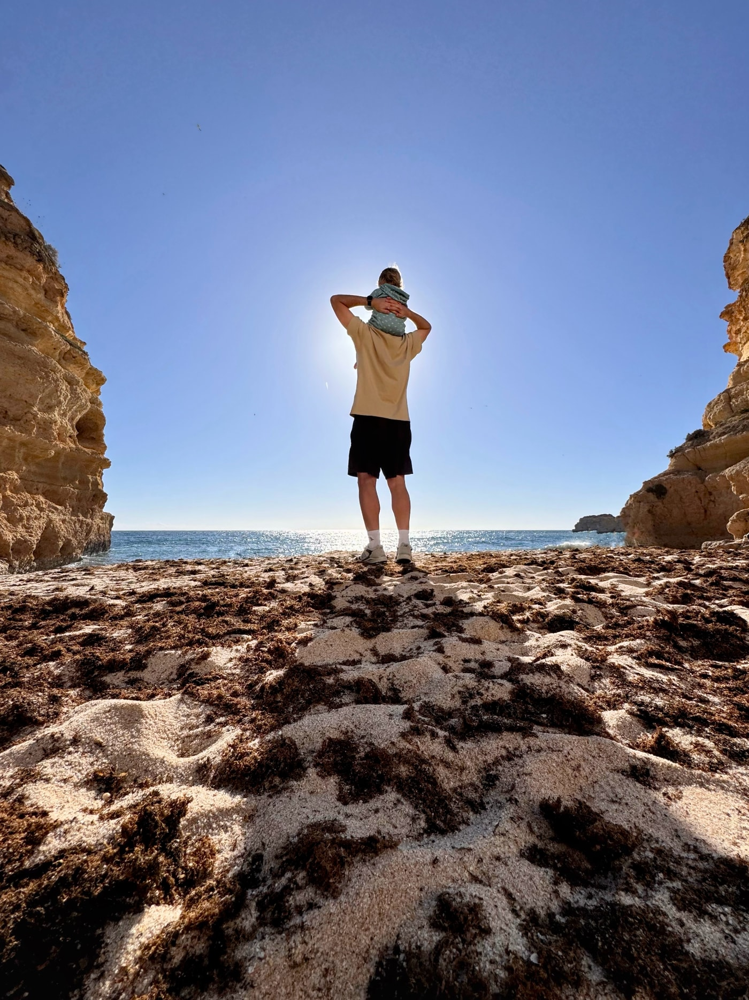
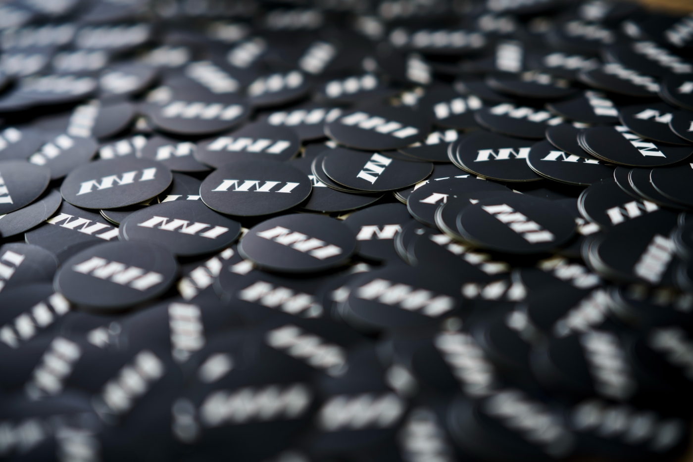
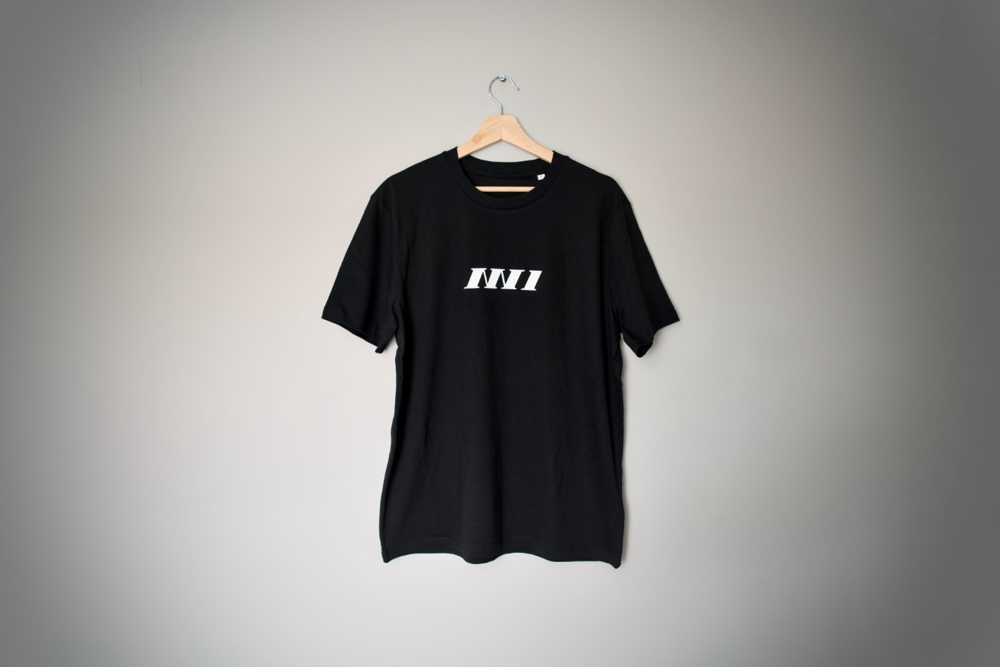
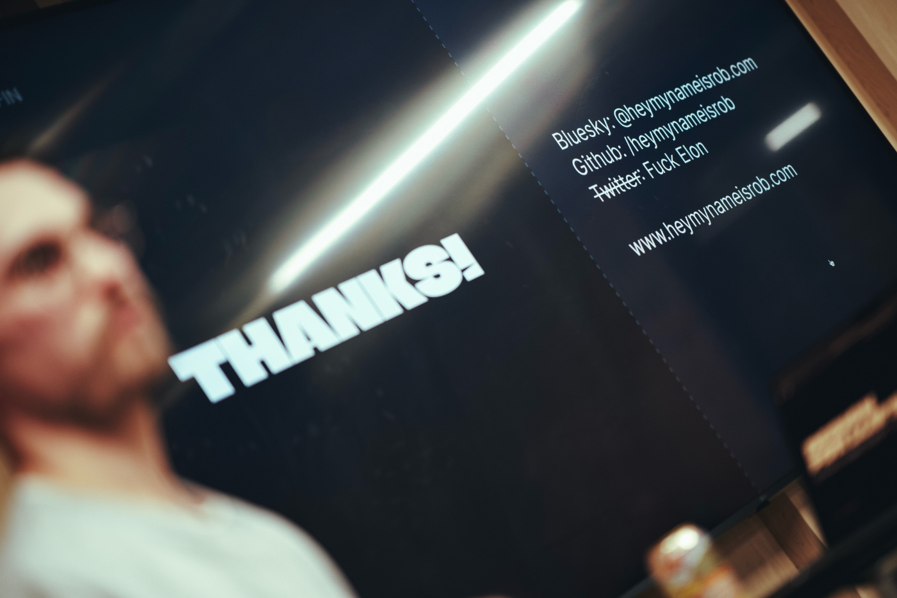

This year I'm not next to the Christmas tree surrounded by reindeers and blinking lights, but I'm in sunny [Carvoeiro](<https://en.wikipedia.org/wiki/Carvoeiro_(Lagoa)>) on the south coast of Portugal with my family, relaxing and reflecting on the past year. To keep an annual tradition, I would like to share with you some of the highlights and set some goals for the upcoming year.



A quick goals check from the previous year. I embarrassingly failed my running goal, but I managed to accomplish the others. I'm not sure why I force myself to get into running so much, but I am keeping this resolution for the next year. I contributed to a number of open-sourced Rust-based projects, and after a decade of using the same profile picture, I have a new one (maybe it sounds trivial to you, but I just hate being on this side of a camera).

1. ❌ Run the distance of a half-marathon
1. ✅ Get involved in the Rust open-source community
1. ✅ Change a decade-old profile picture



## Fatherhood

I’m the proudest father of a 15-month-old Antonia, and she is the driving force for everything I do in my life. So far, we have experienced a few stages of parenting, and every single one of them, despite its challenges, is the most rewarding thing that could happen to us. Being a father opened another level of emotional understanding inside me. This all probably sounds super boring to you if you don’t have kids, or perfectly obvious if you do. I just wanted to express my love and gratitude for having an incredible family.

## NN1 Dev Club

When you have a busy life and a little time to spare, throwing more responsibilities at yourself is the worst thing you can do, right? So, at the beginning of the year, I organised a meetup. Being inspired by tech meetups I attended in the past, and additionally motivated by the lack of such a thing in the area I live in, I teamed up with my buddy Darren, and the [NN1 Dev Club](https://nn1.dev) became a thing.

The NN1 prefix is the postcode for Northampton town centre, a place where I and plenty of other software enthusiasts live. Ever since I moved to this town 13 years ago, I have met only a few local programmers, but I knew they were around, coding in their caves, also seeking a community of like-minded geeks. Organising a meetup was an incredible idea to bring this crowd together.

Everything about this initiative exceeded my expectations! The enthusiasm of the attendees, the turnout, the engagement of the members, and the connections it formed. We have an incredible, thriving community of local techies and tons of ideas for the upcoming year. We put a lot of hard work into it, but it was worth it. Thank you, Northamptonshire geeks!

## Avant Arte

Last year at this time, [my job situation was complicated](/a-look-back-at-2023/#job-situation-fiasco). After losing my job in November 2023, I stayed unemployed for five months. There were very few job openings for companies that I would like to work for. The recruitment process is a lot more difficult when you need to find a job compared to switching jobs. It was stressful, annoying, time-consuming, and momentarily embarrassing. I was rejected a number of times, and I wasted silly time on conversations that led to nothing. Luckily, I met incredible friends along the way. Finally, I ended up with four job offers, and at the beginning of April, I joined [Avant Arte](https://avantarte.com).

Helping artists make a sustainable living is what makes me happy working for this company. I’m part of a small engineering team where everyone shares a wide scope of responsibilities. It allows me to grow as a programmer while keeping a healthy work-life balance, which is more important to me than ever before. I’m grateful to be part of this team.

## Modal editors recovered my joy of coding

Striving for the most optimal solution for a given problem brings me joy, and it is a significant part of a programmer's job. Nowadays, AI assistants can partially do it for you (the quality of suggested solutions aside), and most of the programming tools are optimised for the collaboration between you and an AI helper. This trend has led to bloated editors with the AI front and centre. For me, this movement has killed the joy of writing code!

I abandoned all of the modern programming tools in favour of rudimentary, simple tools. [Helix](https://helix-editor.com) was the first terminal-based modal editor I used, and I loved it. After a while, I switched to [Neovim](https://neovim.io), but I elaborated on the motivation and process in ["The Joy of Learning Helix"](/the-joy-of-learning-helix-and-probably-other-modal-terminal-based-editors/) and ["From Helix to Neovim"](/from-helix-to-neovim/). Potentially, this change made me slower, and I'm not as efficient as some of the modern tooling users, but I manage to get the job done, and I have tons of fun doing it.

I didn't ditch AI tools from my day-to-day workflow. I still use a few of them for things like spell checking, quick searches, and help with programming constructs of languages that I don’t know. I just removed their integration from my coding environment.

## Blog

In the past years, I published 40 articles, which is a lot less than in the past few years. Considering how hectic a year it was, I'm super proud of this number.

I’m not losing interest in writing, quite the opposite. I take pride in publishing to my very own corner of the internet more than ever before. In a generation when folks jump between social media services like crazy and most of the content is not even written by a living human being, having this blog makes me proud.

PS. [Chris Coyier called me "a great blogger"](https://shoptalkshow.com/639/) in one of the Shop Talk Show episodes, and I struggle to think of a better recognition than getting that from one of the most inspiring bloggers out there.

## Next year's focus

Nothing goes higher on my priority list than being a good father and partner for my loved ones. I have a bunch of plans for the NN1 Dev Club to be something more than just the best tech meetup in the central part of England. I hope to find more time for technical writing on this blog – I really miss that!

Inspired by [the latest book by Cal Newport, "Slow Productivity"](https://calnewport.com/my-new-book-slow-productivity/), I just want to do fewer things. We live in the age of people with short attention span looking for instant gratification. Patience is not our generation's strength. Omnipresent AI helpers have allowed us to iterate on small tasks quicker than ever, reaching the state of pseudo productivity without putting any effort into the thing. I don’t want to end up in this trap. I want to work hard on fewer things. I want to exercise my patience, solve problems that require well-thought-out solutions, and discard meaningless distractions in all areas of my life.

That's all from me in 2024. Have a wonderfull 2025 😘

---

## Others blog about 2024

For me, it became an annual tradition to publish annual reviews, but I’m not the only one with this habit. I put together a list of others’ reviews that I enjoyed reading.

- ["What I got up to in 2024" by Hidde de Vries](https://hidde.blog/2024-review/)
- ["Twenty Twenty-Four" by Dave Ruppert](https://daverupert.com/2024/12/twenty-twenty-four/)
- ["A year in review: 2024" by Max Böck](https://mxb.dev/blog/year-in-review-2024/)
- ["2024 in Review" by Garrit Franke](https://garrit.xyz/posts/2024-12-29-2024-in-review)
- ["Just 2024 Things" by Robb Knight](https://rknight.me/blog/just-2024-things-i-didnt-get-the-year-wrong-this-time/)
- ["2024 in Review" by Noah Jacobus](https://www.noahjacob.us/words/2024-in-review.html)
- ["2024 in review" by Rachel Andrew](https://rachelandrew.co.uk/archives/2025/01/01/2024-in-review/)
- ["My 2024" by Remy Sharp](https://remysharp.com/2024/12/31/my-2024)
- ["Creative Year-in-Review 2024" by Devon Dundee](https://devondundee.com/blog/creative-year-in-review-2024)
- ["2024 as bullet points" by Christopher Kirk-Nielsen](https://chriskirknielsen.com/blog/2024-as-bullet-points/)
- ["2024" by Rach Smith](https://rachsmith.com/2024/)
