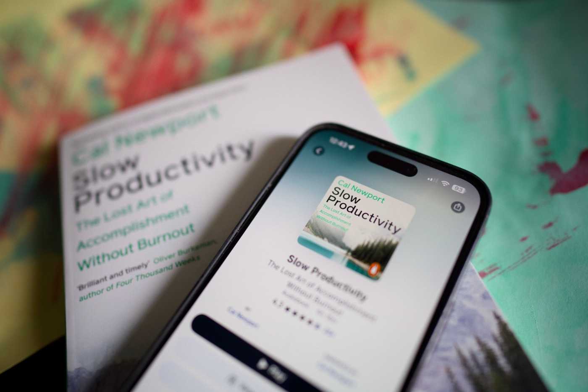

It was Cal's "Digital Minimalism" that inspired me to ditch conventional social media channels, and after two years without mindless scrolling I can only recommend you do the same. "Deep Work" by the same author helped me to refocus and understand the difference between deep and shallow work. I waited patiently for a moment of downtime to read/listen to "Slow Productivity" since I heard about it for the first time on Andrew Huberman's podcast.

After talking to friends and reading plenty of 2024 reviews, the overall busyness is the common denominator. Working on multiple things at once, busy schedules, and plenty of side gigs are just a few things I hear from folks. I ended up in the same trap. How often do all these things lead to actually meaningful achievements? The new book by Cal Newport is a suggestion of a new philosophy for knowledge workers to reduce pseudo productivity by following three simple rules.

Author advocates for applying three principles: do fewer things, work at the natural pace and obsess over quality. He recalls multiple stories of artists and writers, taking long sabbaticals and producing incredible outcomes. The advice about the outstanding quality is also very relevant nowadays, since we live in the an AI-driven world where anyone can produce mediocre results in no time.

For me, this book is not as revolutionary as his previous publications. It feels more like an extension of "Deep Work" to me, but it is more fitted for the post-pandemic burnt-out generation. As much as I liked some of the recommendations given by Cal, some are just impossible to apply for a worker in a less privileged position in a capitalism-driven world. If you have a huge autonomy in your position, I am sure you will find this book helpful if you haven’t read previous books by Cal.
