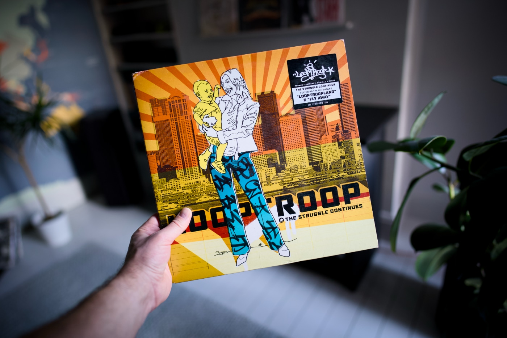

It has been a crazy month for me work-wise. Other than work and family-related responsibilities, I neglected every other area of my life in the past few weeks: blogging, hobbies, and self-care. I am on a good trajectory to slow down, and I am very much looking forward to it. I found a moment here and there to prepare a few great resources for you. I hope you will like them. Catch you next month!

---

## Album of the month

There is not a lot of music I discovered in February other than calming ambient that I listen to when I work. But I had a few great listening sessions with my daughter and we massively enjoyed ["The Struggle Continues" by Looptroop Rockers](https://www.discogs.com/release/406021-Looptroop-The-Struggle-Continues). I can’t freaking believe that this record is 23 years old! It feels like "Bandit Queen" just came out yesterday. I love this record!

---

## Top picks

### [Patterns for Personal Web Sites](http://www.rdrop.com/~half/Creations/Writings/Web.patterns/index.html)

This page is a gem. A collection of patterns for personal websites by Mark L. Irons. The coolest thing about it is that it was last revised in July 2003, over two decades ago. Not a lot has changed since then.

### [Template literal types in TypeScript: parsing during type checking and more](https://2ality.com/2025/01/template-literal-types.html)

Really in-depth deep dive into the TypeScript template literals by Axel Rauschmayer. From explaining the basic concepts to more advanced use cases, followed by examples of this feature used in the wild.

### [Software development topics I've changed my mind on after 10 years in the industry](https://chriskiehl.com/article/thoughts-after-10-years)

Lists are everywhere, lists are cool, and this article is a list. It is actually a list of lists. I love this format, but I also like what Chris Kiehl shared with us after being in the software game for a decade.

### [Less Precious](https://nazhamid.com/journal/less-precious/)

Naz Hamid shares his thoughts about the social media trap and nicely summarises the recent trend of becoming the "content creator". The part that speaks to me the most, obviously, is about the importance of a personal website. Good short read.

### [Interop 2025: another year of web platform improvements](https://web.dev/blog/interop-2025)

Tech giants gather together to work collaboratively on the web features cross compatibility, and the focus of this year is set in stone. Great features like anchor positioning and same document view transitions are part of it, but there is a lot more.
