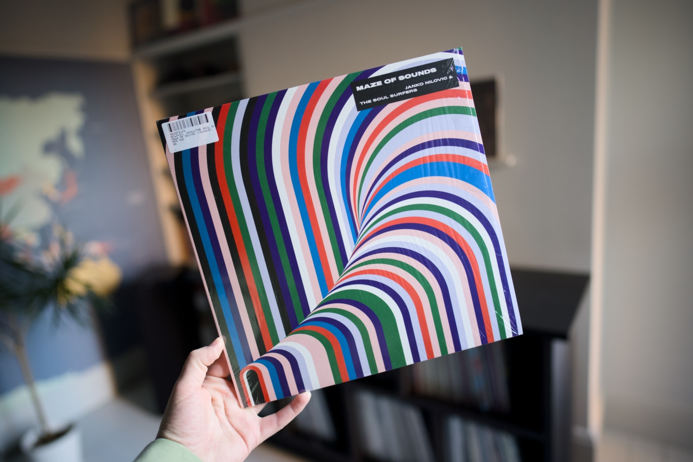

It was precisely 10 years ago when I published [the first article of a "Top picks" series](/top-picks-2015-march/). I have a lot of fun aggregating all my favourite web resources in a single post published monthly. I keep coming back to these articles all the time, and maybe you find them useful. I have very little feedback from readers of this series, so please drop me a comment of you like my Top Picks.

Since it is the last day of the month today, let me do exactly the same as I have been doing for the past decade. Let me share with you a few links that I found interesting in the past month. Before that though, I have a great album recommendation for you all funky/jazzy heads 🎶

---

## Album of the month

This month something softer to break the streak of rap records that I have been recommending for months. [The "Maze of Sounds" by Janko Nilovic](https://www.discogs.com/release/16482717-Janko-Nilovic-The-Soul-Surfers-Maze-Of-Sounds) is probably what I have been playing the most in the last month, and even though it is not a new album for me, I have loved it ever since I heard "Sweet Path" for the first time. Very soulful funky album, with incredible voices of the Slavic choir on it. Also, the vinyl release pressed by Broc Recordz in 2020 sounds so deep and loud! It is one of those records that I really prefer to listen to on vinyl rather than streaming platforms. Also, loook at this beautiful mesmerising cover art!

---

## Top picks

### [A Million Little Secrets](https://www.joshwcomeau.com/blog/whimsical-animations/)

Josh Cameau is about to release a new course, "Whimsical Animation," and [its website](https://whimsy.joshwcomeau.com/) is a stunning piece of art full of little interactive elements and Easter eggs. In this article, he shared an overview of a few techniques he used to build this website. I learned a ton and also explored a big bunch of useful resources for my future pet projects. The attention to detail that this guy puts into his projects is just unbelievable. Who would have thought that image sprites are still a valid technique to build websites in 2025?

### [TypeScript types can run DOOM](https://youtu.be/0mCsluv5FXA)

This is one of the wildest things I have seen in a while. Using nothing but the TypeScript type system, this genius rebuilt a fully functional and interactive DOOM game. The engineering effort put into this project is insane. The scale of the resulting types in comparison to an ordinary web application and Node.js type definitions really helps to visualise the effort that went into it. Absolutely impressive!

### [React Libraries for 2025](https://www.robinwieruch.de/react-libraries/)

Robin Wieruch published a number of great React-related resources in the past, and this one is just another one to add to the pile. A comprehensive list of React solutions related to state management, styling, data management, authentication, payments, component libraries, and others. Very up to date and all in a single place.

### [Don’t Use Fake Bold or Italic in Social Media](https://adrianroselli.com/2025/03/dont-use-fake-bold-or-italic-in-social-media.html)

Adrian with another great accessibility tip. This one is about abusing some UTF characters and using them in place to fact bold or italic styling, and what the impact for screen reader users is. The consequences can be huge! Rule of thumb, plain good old text always wins.

### [How browsers REALLY load Web pages](https://fosdem.org/2025/schedule/event/fosdem-2025-4852-how-browsers-really-load-web-pages/)

A deep dive into the browsers' resources prioritisation strategies by Robin Marx from Akamai Technologies. Very interesting how much browsers differ in terms of loading assets heuristics. Very technical exploration but presented in an engaging way by Robin.

### [Introducing command and commandfor](https://developer.chrome.com/blog/command-and-commandfor)

Simple actions on the web, like opening a navigation when a user clicks on the button, can be a tedious task to implement if it needs to respect all scenarios and does not harm accessibility. Some HTML elements come with native behaviours like `popoverTargetAction` and `popoverTarget` to simplify that, which does not require a single line of JS. These two `popover` attributes do not go anywhere, but now we are getting a much more powerful solution that can fully replace them, but also work with plenty of other interactive elements. The `command` and `commandFor` can trigger an action on target elements like `popover`, `dialog`, and potentially soon on `input` and `detail` elements. This is one of the greatest additions to the web platform in a while, in my opinion.

### [A 10x Faster TypeScript](https://devblogs.microsoft.com/typescript/typescript-native-port/)

Rarely do dev news articles give me as much joy as this one. The TypeScript compiler is being ported to native code written in Go, and the early results report up to a 10 times faster compilation and type checking results. Other than the port of a codebase, something that does not get enough credit is the effort that goes into the proper TypeScript LSP build. Even though TS is well known for its integration with IDEs via ts-server, its implementation predated LSP. It is going to change, so users of LSP will get a much nicer user experience.

In addition to the blog post, the Microsoft team also published ["A 10x faster TypeScript" on YouTube](https://youtu.be/pNlq-EVld70) where Anders Hejlsberg elaborates more and presents the results of the project "Corsa". Additionally, the SyntaxFM crew recorded ["Typescript Just Got 10x Faster"](https://youtu.be/ZlGza4oIleY) that reveals a bit more technical details.

### [Understanding Neovim](https://www.youtube.com/playlist?list=PLx2ksyallYzW4WNYHD9xOFrPRYGlntAft)

This is a niche resource for NeoVim users, but not an ordinary one. This one is to gain a deep understanding of the internals of the core concepts in this modal editor. From the very basics to plugin managers, Treesitter, LSP advanced configuration, and a bunch of other concepts. I learnt a ton from this series!

### [Carousels with CSS](https://developer.chrome.com/blog/carousels-with-css)

Years ago I created a pretty popular carousel, [Siema](https://pawelgrzybek.github.io/siema/). Since I released it, I have been thinking about this design pattern a lot, and nowadays I mostly dislike it. In most cases where people use carousels, there is probably an easier and a lot more accessible way to present content. But the demand for it doesn’t slow down; luckily, the platform provides a lot of tools to make carousels a lot simpler. This post reveals a few parts of the [CSS Fragmentation Module Level 4 specification](https://www.w3.org/TR/css-break-4/) that makes building carousels just trivially easy. It is mad how powerful CSS is getting.

### [Minding the gaps: A new way to draw separators in CSS](https://blogs.windows.com/msedgedev/2025/03/19/minding-the-gaps-a-new-way-to-draw-separators-in-css/)

Nice to see Microsoft's effort on adding guides to the CSS Grid specification. This is one of those things that we have been hacking around using borders, outlines, box-shadows, pseudo-classes and other trickery. The proposed API looks nice and simple. Also, nice to see an initiative like that coming from someone other than Google and Apple. It shouldn't be a surprise; it is Microsoft that landed the first browser implementation in Internet Explorer.
