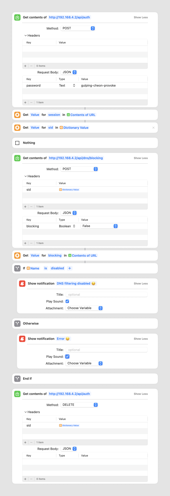

This is the same post as ["Disable/enable Pi-hole using Apple Shortcuts"](/disable-enable-pi-hole-using-apple-shortcuts/) that I published a few years back, but aligned with the 6th major release of [Pi-hole](https://pi-hole.net/). This little piece of software has been running at our place on a Raspberry Pi left and forgotten behind the cupboard for years. It filters the nonsense that the internet is full of and protects our privacy by killing all the trackers at the DNS level. Browsing the internet without it feels really shit now!

Occasionally it causes some disruptions, so it is handy to have a method to switch it on and off in a jiffy, without logging into the Web UI or doing some CLI stuff. I found Apple Shortcuts to be the way. And here is the recipe for the shortcuts I use.



1. Make a `POST` call to `/api/auth` to get the `sid` (session ID). As a body send your password. My password manager generated `gulping-cheon-provoke` for me. Nice, right?
1. Make a `POST` call to `api/dns/blocking` with the `{ "blocking": false }` body to stop the blocking. This endpoint requires an authentication, so attach the `sid` obtained in the first step as a header. Reverse the boolean value of the body to construct the shortcut that enables the blocking. Add a notification for successful confirmation (optional).
1. Make a `DELETE` call to `api/auth` to terminate the session. This one is an easy one to forget but important. The number of sessions is limited by the `webserver.api.max_sessions`, so it is a good practice to close the session when the task is over.



For clarity, `curl` equivalents below.

```
curl --request POST \
  --url http://192.168.4.2/api/auth \
  --header 'Content-Type: application/json' \
  --data '{
	"password": "gulping-cheon-provoke"
}'
```

```
curl --request POST \
  --url http://192.168.4.2/api/dns/blocking \
  --header 'Content-Type: application/json' \
  --header 'sid: XXXXXXXXXXXXXXXXXXXXXXX' \
  --data '{
	"blocking": false,
}'
```

```
curl --request DELETE \
  --url http://192.168.4.2/api/auth
  --header 'sid: XXXXXXXXXXXXXXXXXXXXXXX'
```
