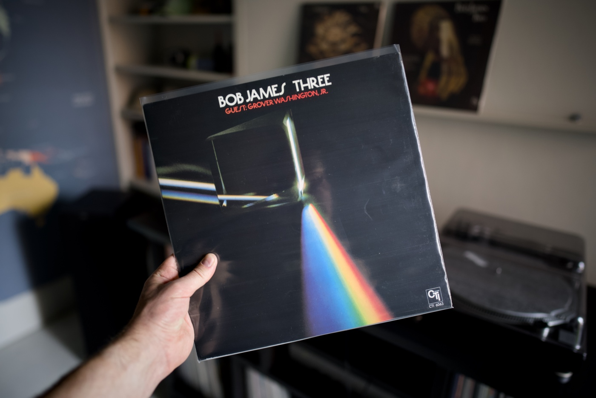

This post was deployed by the [GitHub merge scheduler script](/schedule-a-github-pull-request-merge-using-deno-kv-queues/) that I blogged about a few years back. This little script has saved my butt a few times before, <del>and it is super helpful now when I am in Madrid with my family, enjoying the sun and quality time with my ladies</del>, and now allows me to chill and read some news about the [crazy power outage in Spain and Portugal](https://edition.cnn.com/world/live-news/power-outages-blackout-spain-portugal-04-28-25/index.html). In the meantime, the Deno app triggers the merge on GitHub, Netlify continuous deployment kicks in and spreads new HTML files across the globe. Technology is fantastic, I freaking love the web!

This month, a bunch of great posts from the WebKit blog. They are smashing the game recently with tons of quality publications. Some little Next.js drama, fresh exciting releases, and something for aspiring Go developers. As always, album recommendation from my shelf included as well! I hope you like it 🤗

---

## Album of the month

Bob James is an absolute legend! Probably the most sampled artist in the history of music. Snippets of his melodies are in hundreds of rap and electronic music songs nowadays. A few days back I went for a walk with my daughter and we gave my local record store a quick visit. Finally, I found ["Three" by Bob James](https://www.discogs.com/release/14585807-Bob-James-Three). Incredible record with the outstanding tune ["Westchester Lady"](https://youtu.be/r0wMGQrWKNw) sampled in one of my favourite drum and bass records ["Circle" by Adam F](https://youtu.be/LDRNYUucKvA). Must-have for all jazz and rap collectors!

---

## Top picks

### [Build Times - You should know this before choosing Next.js](https://eduardoboucas.com/posts/2025-03-25-you-should-know-this-before-choosing-nextjs/)

Eduardo Bouças from the Netlify team opened up and released his frustrations about the Next.js interoperability across host providers. Being one of the people involved in the constant backward engineering of Vercel’s framework, he has a lot of interesting points. If Next.js is the tool you are planning to use for your upcoming project, this one may change your mind a little, especially if vendor locking is your concern.

### [Item Flow, Part 1: A new unified concept for layout](https://webkit.org/blog/16587/item-flow-part-1-a-new-unified-concept-for-layout/)

This is the next iteration in the masonry layout hot debate about two competing spec ideas, one coming from Apple and the other made by Googlers. This recent post by Jen Simmons on the WebKit blog looks very promising as it resolves most of the concerns the web development crowd raised before. I am a little bit unsure about the functionality of `item-pack` inside `flex` containers and feel like the two suggested solutions introduce more issues than they solve. Also, `item-slack` sounds too funny to be part of an official spec, but it looks like the debate about renaming this one continues. I like the overall direction of merging `flex` and `grid` properties into one.

### [Better typography with text-wrap pretty](https://webkit.org/blog/16547/better-typography-with-text-wrap-pretty/)

The CSS `text-wrap: pretty` landed in stable Google Chrome in September 2023, and Safari is catching up only now but with a twist. The implementation between these two engines differs quite a lot. On this article Jen Simmons, explains the difference between implementations, why the differences are absolutely allowed in this case and also explains a good typography concepts needed to understand the power of the new `text-wrap` value.

### [Default styles for h1 elements are changing](https://developer.mozilla.org/en-US/blog/h1-element-styles/)

A pretty rare case when the browser implementation needs to be changed and potentially "break" some websites. This article explains what's changing and the reasoning behind it. Also, it is a great explainer of the HTML Outline that was removed from the spec a few years back.

### [Introducing Zod 4 beta](https://v4.zod.dev/v4)

The de facto industry standard schema validation library in the JavaScript ecosystem is becoming a lot better. The author just announced a beta version of the 4th iteration and its performance is significantly better. It also comes with a reduced bundle size, an alternative version mini perfect to use on the client side, a global registry, JSON schema conversion, better support for recursive types, pretty errors, template literal types, and tons more. This is a good release in the JS ecosystem. I personally use Zod on multiple projects and it is just a breeze to work with.

### [The CSS shape() function](https://webkit.org/blog/16794/the-css-shape-function/)

The good old CSS `path()` function is great, but it is limited to absolute units, which makes things a lot harder in the age of responsive design and fluid components. The new `shape()` function solves all those problems and offers a bunch of extra features that open possibilities for really creative ideas. Love it! Great post by Simon Fraser.

### [Learn GO Fast: Full Tutorial](https://youtu.be/8uiZC0l4Ajw)

I started learning Go recently and I enjoy the ride a lot. This video is a gem that I come back to a number of times a day. Alex Mux has a really great talent for explaining things, and also narrowing down the subject to its essence. No matter if you are into Go or not, the chapter about strings and runes is a must-watch for every programmer who would like a quick explainer of strings encoding. Very good resource!

### [What Does "use client" Do?](https://overreacted.io/what-does-use-client-do/)

Dan Abramov is clearly on a mission to explain React Server Side Components to the masses. Recently, he has been blogging a lot on that matter. This article is a relatively short post (compared to some of his other publications) explaining two super confusing directives: `use client` and `use server`. It is a very good read with simple-to-understand analogies and code examples. He even posted it in the form of a [YouTube video](https://youtu.be/31e5c67znF4).
