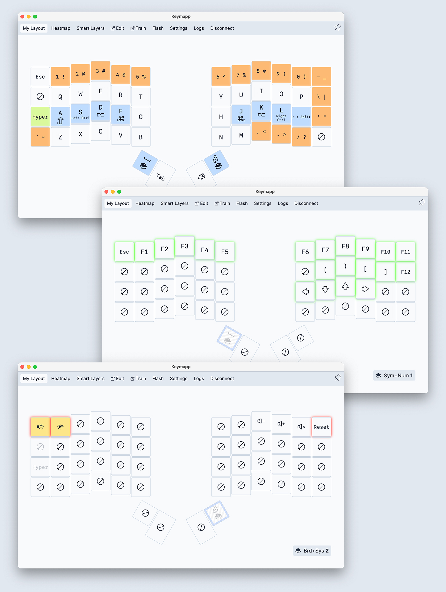
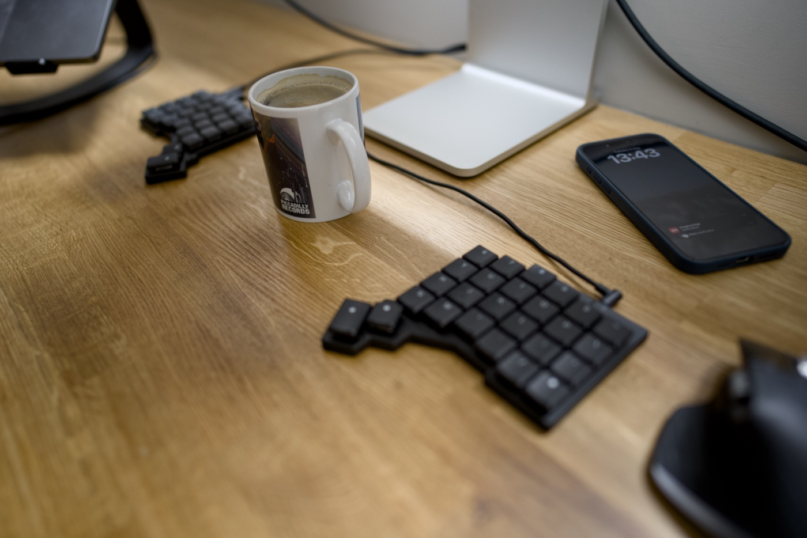
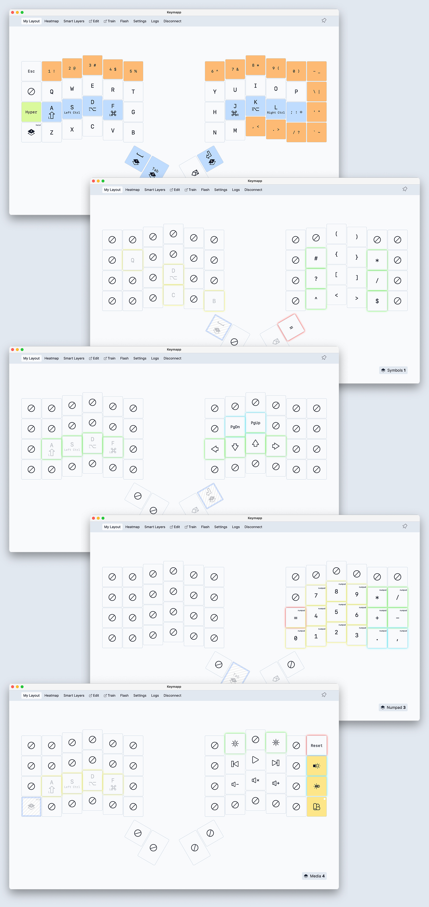
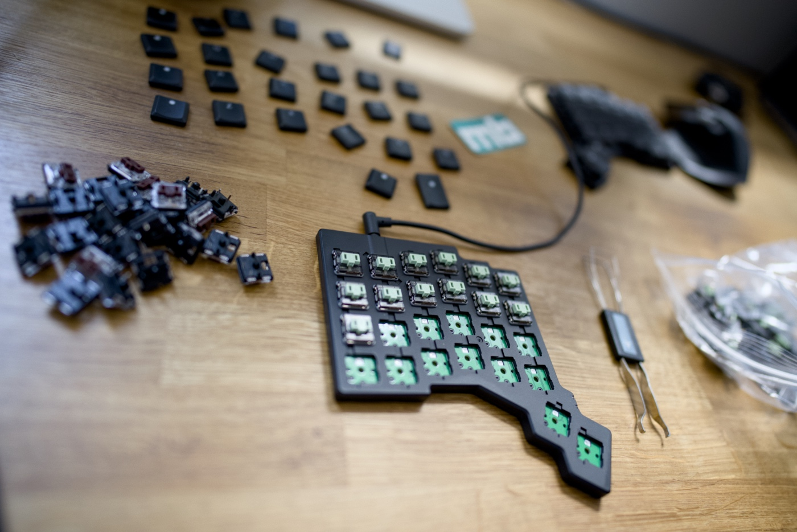

It was a casual BBQ catch-up with a bunch of old friends, when we had a conversation about programming in Go, burgers, podcasts, and keyboards. Something along these lines.

> Savvas: I recently bought a split keyboard and I love it. 
> Gregory: Yeah man, I did the same and I think you should give it a go. 
> Me: Fuck that! 
> Savvas: Just trust me, and try it. 
> Me: OK.

A little bit of background. I don't struggle with RSI or any other discomfort, and I'm an OK typist. Rather slow (50-60 words per minute) but accurate. I can touch type comfortably on the Keychron K3 Pro, which is the keyboard I have been using for the past two years. Pure curiosity and my inner geek won, so I threw a pile of money at ZSA and ordered [the black Voyager with tactile brown switches](https://www.zsa.io/voyager).



A few weeks ago I was listening to the ["Erez Zukerman - ZSA, ErgoDox, and the Future of Keyboards" episode of the devtools.fm podcast](https://www.devtools.fm/episode/118) and I liked the story and business goals. I knew back then that if I ever ended up having an ergonomic keyboard, it was going to be produced by them. Also, keyboards by ZSA are freakin’ sexy compared to some of the competitors. Sorry Glove80 and Kinesis fans 🤷‍♂️

Not a cheap business if I'm honest. The price of the keyboard was £278 and an additional £44 for duties and taxes. The shipment from Taiwan to the UK took 10 days. It arrived well packed and the unboxing was a pretty cool experience. Folks call ZSA the Apple of keyboards, and I no longer wonder why. Superb quality and attention to detail! The only downside for me is the cable but I hope to see a Voyager 2.0 one day with an wireless option.

I have been warned that it takes time and patience to get used to a split keyboard, so I'm going to document my experience as I go and publish the result in a month. If I don't like it after a month, I am going back to a traditional keyboard.

---

## Day 1

Oh my god! Typing a single word is close to impossible. Where the fuck is the question mark? Where are the square brackets? I need to get back to work, so give me my Keychron back. I don't like it!

## Day 2

Now I know where the question mark is and where the square brackets are. It took me a while to understand how it works and to embrace [the companion software](https://www.zsa.io/tools), Keymapp and the Oryx editor. [The ZSA YouTube channel](https://www.youtube.com/@zsatechnologylabs) is an incredible source of information for users of their products. One of the biggest hurdles for me is using modifier keys, but I learned a pretty cool concept of how I can [remap them to my home row keys](https://youtu.be/sLWQ4Gx88h4). It is going to take a while until that lands in my muscle memory, but I think it may work. I did experiment with the layouts a little and this is the snapshot from today.



My Krychrone keyboard is put aside and Voyager is my main driver now. I'm still terribly slow using this thing though. Frustratingly slow!

## Day 3

The ortholinear layout is something very new and hard at first, but not as hard as the new positions of the spacebar, return, and tab key. Where is the plus symbol?! Damn 🤦‍♂️ I'm not a fan of this long TRSS cable. Etsy is full of nice-looking coiled fancy cables, but I'm not paying £40 for it, no way! I don't want this coil either. I got one off AliExpress for £0.77. Now I need to wait 47 years for it to arrive.

## Day 4

Today I noticed that for the last two decades I have developed a very strong muscle memory for using the wrong index fingers to type the characters "b" and "y". Also, hitting "c" and "p" on the new ortholinear layout is a little bit awkward for now. Trying a split keyboard and putting a physical barrier between the buttons and the hands that they should be pressed with made me realise that. I'm generally happy with the layout I came up with a few days ago, but I added some missing things like brackets and media control.

## Day 7

Some folks use the space in between for a mouse, but it is actually a space for a cup of coffee. Split keyboard reviewers do not mention this feature enough. Also, the shortest cable from AliExpress arrived, and it looks better but it was not the length of the cable that I didn't like. It is the cable in general. Until ZSA releases a wireless version of this keyboard, there is not much I can do about it 🤷‍♂️

## Day 9

Today for the first time I was actually productive using a new keyboard. Typing long-form text is slowly becoming natural and the ortholinear layout is seriously a game changer. Coding, in contrast, still feels like a chore, mainly because I didn't build the muscle memory for the new symbols layer. How can I build muscle memory for something that I change twenty times a day? I'm experimenting with a bunch of ideas. I found this presentation to be pretty useful, although not all the mnemonic shortcuts from here translate to the way I use Vim. Helpful though!



## Day 10-16

Click, click, clack...

## Day 17

I enjoy my time in front of the computer again, finally! I have gained back my productivity level in most tasks, with using symbols as the only exception due to never-ending tweaks to this layer. The new position of the spacebar, return, backspace, and tab feels a lot more natural, and using home row modifiers is the idea that deserves an award.

One thing that I don’t like for sure is typing on my MacBook’s keyboard anymore. I went to the local coworking space the other day and I didn't take my Voyager with me. As much as regular typing felt OK, pressing modifiers feels so unnatural. Who the hell put them there in the first place anyway! Home row mods rule! I don’t like the idea of taking my external keyboard with me everywhere I go, so I think I will end up swearing from time to time.

Over the last few weeks, I did a bunch of key layer tweaking, so let me share some of the key observations and rules I follow. I realise that I never use function keys (F1, F2, etc.), so I got rid of them. By default, Oryx makes all keys transparent, which keeps the functionality from the layer below. Disabling them is a lot better for me, at least at this stage. Another thing that I kept on tweaking was the tapping term, which is the delay between when the keyboard registers a regular tap or considers that as a hold. While using home row modifiers, this one is super crucial to get right. The more familiar I am with the keyboard, the more I reduce this delay. At the moment, 160 ms is my sweet spot.

The interesting part of my Main layer is the hyper button, which I use in combination with other keys for launching common apps. For example, the hyper key in combination with <kbd>b</kbd> opens my browser, <kbd>t</kbd> my default terminal client, <kbd>c</kbd> calendar, and <kbd>m</kbd> music player. I do not associate it with the name of the app, but more with the category of the app. Futureproofing!

My second layer with symbols is the one that is tweaked the most. On the right-hand side are pairs of brackets, with the square ones in the middle as they are used the most, mainly with the combination of a very few transparent keys on my left hand to navigate vim changes (<kbd>c</kbd>), diagnostics (<kbd>d</kbd>), quicklinks (<kbd>q</kbd>) and buffers (<kbd>b</kbd>). Around the brackets are a few more pairs that trigger opposite actions in vim. The <kbd>^</kbd> and <kbd>?</kbd> are used to jump between the beginning and the end of the line, <kbd>?</kbd> and <kbd>/</kbd> to perform searches in the backward and forward direction, and similarly the <kbd>#</kbd> and <kbd>\*</kbd> to do the same using a selected word as an input. Some of the things that I use in vim all the time. And there is this bloody <kbd>=</kbd> symbol that I use all the time, but I can't find a good spot for it.

Third is the navigation layer that I use nonstop. The transparent modifiers on my left hand enable me to do text selections and cursor movement easier. Like holding <kbd>Shift + Alt</kbd> to select by word and things like that. There is a chance that my media layer will eventually be merged with this one for simplicity.

The numeric layer is the next one; there is nothing interesting about it. The media layer is the last one, and on this one I kept modifiers enabled to be able to change the brightness of the external screen by holding the <kbd>Ctrl</kbd> key while changing the screen brightness. Perhaps a good candidate to merge with the navigation layer.

## Day 22

I ordered my keyboard with the Kailh Choc Brown tactile switches. I knew very little about different types of switches back then, so I went with the preselected default. If I could go back in time, I would go for the Choc Pro Red ones. The resistance of brown switches is significant, and when I am in the flow and I go fast, the last thing I want to deal with is the gibberish of random characters in my code editor because I didn't press <kbd>Esc</kbd> hard enough. A few other folks on Reddit shared a very similar feedback about the swittches I bought. Luckily, the switches on this keyboard are hot-swappable.

I did spend a little bit of time researching what all these switch parameters mean, and I ordered a set of [Choc Ambient Twilight switches by LowproKB](https://mechboards.co.uk/products/lowprokb-ambients-twilight). An extra £65 to the total cost of my experiment. I need some time to tell you if I like the change or not, but the first impression is promising. Back to work.

## Day 30

OK, time to conclude my month-long trial of using a split keyboard. I will keep it short. I’m keeping my ZSA Voyager as my main driver and I’m not planning to ever go back full-time to the regular non-split board, nor to the keyboard without the ortholinear layout. Wide, open arms position makes a long working session a lot more comfortable. The linear layout of the keyboard makes it a lot easier to memorise, and also to create a mental model for layouts.

This keyboard made me a lot more accurate typist, not necessarily the fastest yet, but over time this may change. A month in my case was not long enough to build muscle memory for some of the more advanced workflows. It gets better day by day, but I’m not quite there yet.

The price of the ZSA keyboards is high, but worth every penny. Brown switches are the only thing I regret choosing, but that was an easy one to solve.

---

So here it is, my first month with the split keyboard and the beginning of a longer relationship with the new workflow. Thanks, Savvas and Gregory ❣️
