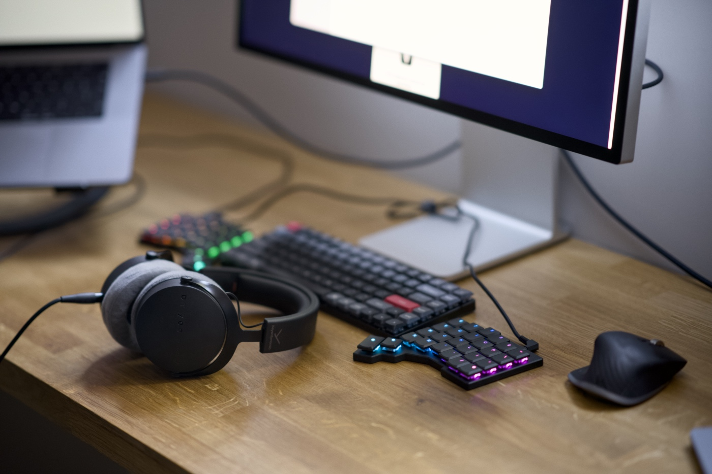
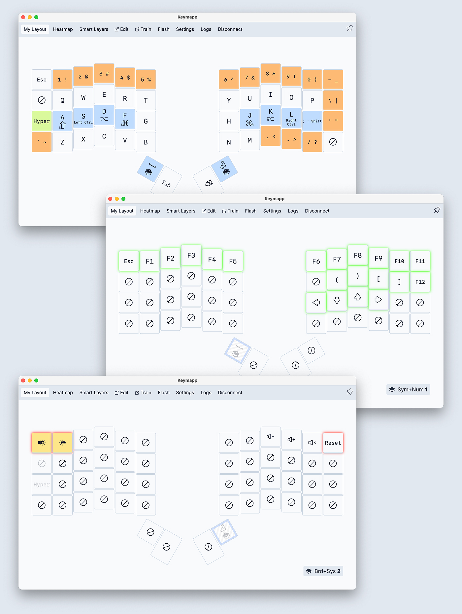
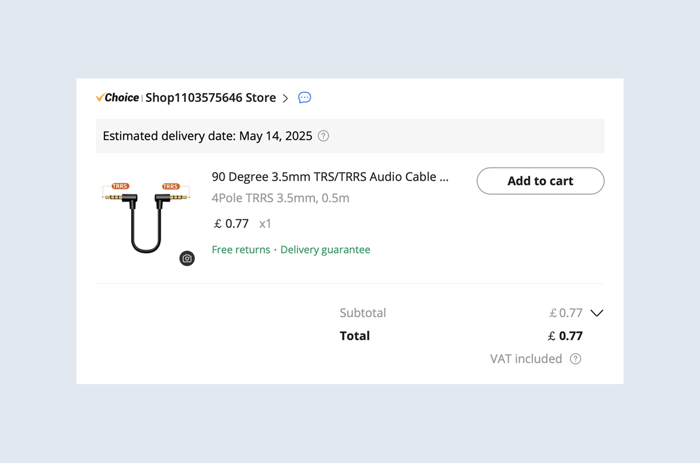
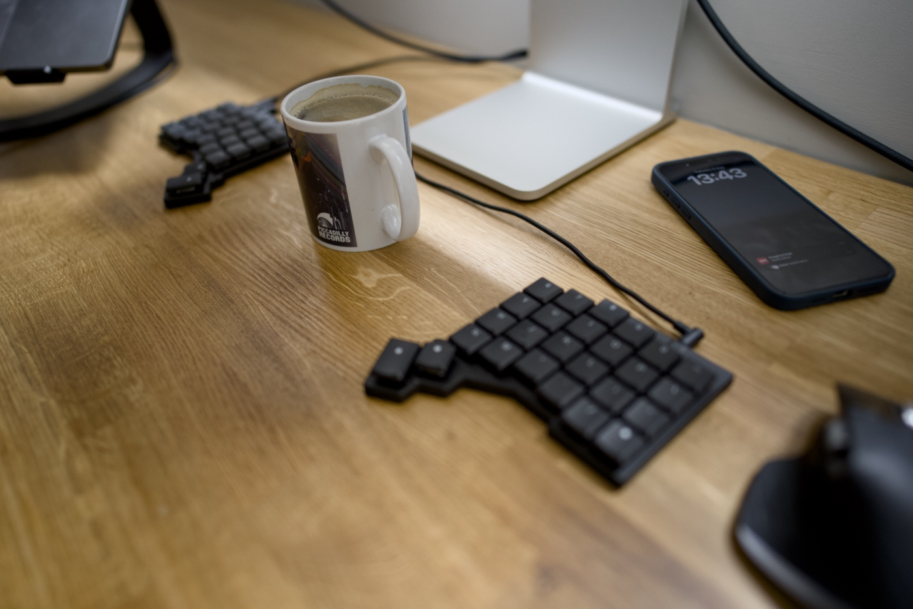

Two of my good friends recently started using a split keyboard, and both of them tried to convince me to give it a go. I was super sceptical at first. I don't struggle with RSI or any other discomfort, and I'm an pretty OK typist. Rather slow (50-60 words per minute) but relatively accurate. I can touch type pretty well on the Keychron K3 Pro, which is the keyboard I have been using for the past two years. Pure curiosity and my inner geek won, and I threw a pile of money at ZSA and ordered [the black Voyager](https://www.zsa.io/voyager).



My research was quick because I knew roughly what I wanted. A good-looking and fully pre-built keyboard without messing around with individual parts and soldering. A few weeks ago I was listening to the ["Erez Zukerman - ZSA, ErgoDox, and the Future of Keyboards" episode of the devtools.fm podcast](https://www.devtools.fm/episode/118) and I liked Erez's approach and motivations. Also, keyboards by ZSA are freakin' sexy compared to some of the competitors.

Not a cheap business if I'm honest. The price of the keyboard was £278 and an additional £44 for duties and taxes. The shipment from Taiwan to the UK took 10 days. It arrived well packed and the unboxing was a pretty cool experience. Folks call ZSA the Apple of keyboards, and I no longer wonder why. Superb quality and attention to detail! The only downside for me is the cable but I hope to see a Voyager 2.0 one day with an wireless option.

I have been warned that it takes time and patience to get used to a split keyboard, so I’m going to document my experience as I go and publish the result in a month.

It took me many minutes to type these few paragraphs above 🤦‍♂️

---

## Day 1

Oh my god! Typing a single word is close to impossible. Where the fuck is the question mark? Where are square brackets? I need to get back to work, so give me my Keychron back. I don't like it!

## Day 2

Now I know where the question mark is and where the square brackets are. It took me a while to understand how it works and to embrace [the companion software](https://www.zsa.io/tools), Keymapp and the Oryx editor. [The ZSA YouTube channel](https://www.youtube.com/@zsatechnologylabs) is an incredible source of information for users of their products. One of the biggest hurdles for me is using modifier keys, but I learned a pretty cool concept of how I can [remap them to my home row keys](https://youtu.be/sLWQ4Gx88h4). It is going to take a while until that lands in my muscle memory, but I think it may work. I did experiment with the layouts a little and this is the snapshot from today.

My Krychrone keyboard is put aside and Voyager is my main driver now. I’m still terribly slow using this thing though. Frustratingly slow!

## Day 3

Things are slow but I'm getting used to it. The ortholinear layout is something very new and hard at first, but not as hard as the new positions of the spacebar, return, and tab key. Where is the plus symbol?! Damn 🤦‍♂️ I'm not a fan of this long TRSS cable. Etsy is full of nice-looking coiled fancy cables, but I’m not paying £40 for it, no way! I don’t want this coil either. I got one off AliExpress for £0.77. Now I need to wait 47 years for it to arrive.

## Day 4

Today I noticed that for the last two decades I have developed a very strong muscle memory for using the wrong index fingers to type the characters "b" and "y". Also, hitting "c" and "p" on the new ortholinear layout is a little bit awkward for now. Trying a split keyboard and putting a physical barrier between the buttons and the hands that they should be pressed with made me realise that. I’m generally happy with the layout I came up with a few days ago, but I added some missing things like brackets and media control.

## Day 7

Some folks use the space in between for a mouse, but it is actually a space for a cup of coffee. Split keyboard reviewers do not mention this feature enough. Also, the shortest cable from AliExpress arrived, and it looks better but it was not the length of the cable that I didn’t like. It is the cable in general. Until ZSA releases a wireless version of this keyboard, there is not much I can do about it 🤷‍♂️

