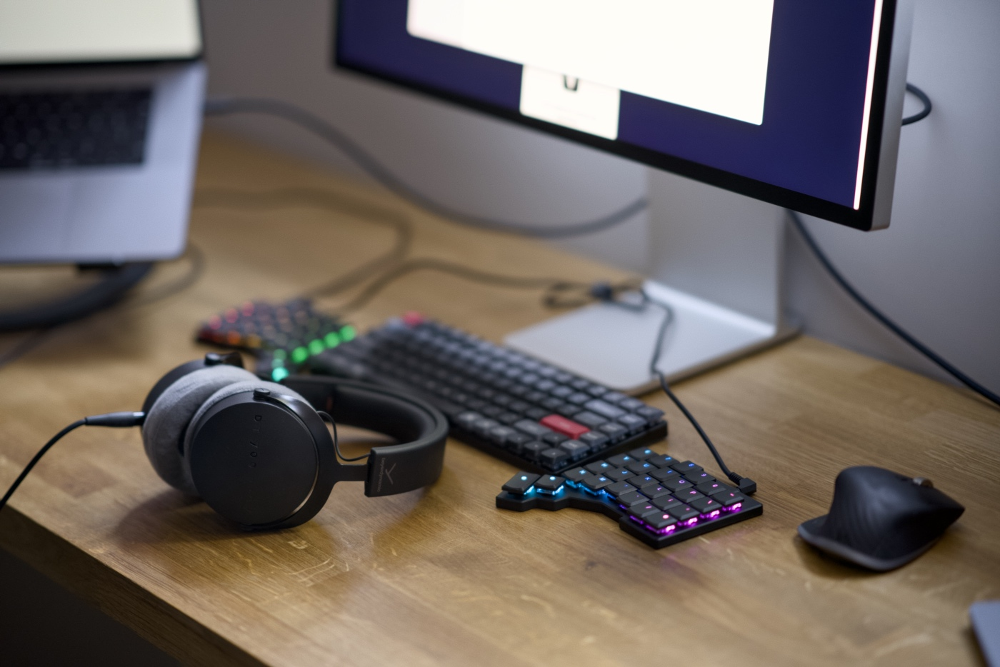

One of my good friends recently started using a split keyboard and tried very hard to convince me to give it a go. I was super hesitant at first because I was efficient using my setup. I don't struggle with RSA or any other discomfort related to my setup. Pure curiosity and my inner geek won, though, and I threw a pile of money at ZSA and ordered [the black Voyager](https://www.zsa.io/voyager).



Not a cheap business if I’m honest. The price of the keyboard was £278 and an additional £44 for duties and taxes. The shipment from Taiwan to the UK took only 10 days. It arrived well packed and the unboxing was a pretty cool experience. Folks call ZSA the Apple of keyboards, and I no longer wonder why. Superb quality and attention to detail!

I’m an OK typist, rather slower (50-60 words per minute) but relatively accurate. I can touch type pretty well on the Keychron K3 Pro, which is the keyboard I have been using for the past two years. I have been warned that it takes time and patience to get used to a split keyboard, so I’m going to document my experience as I go and publish the result in a month.

It took me minutes to type these few paragraphs above 🤦‍♂️

---

## Day 1

Oh my god! Typing a single word is close to impossible. Where the fuck is the question mark? Where are square brackets? I need to get back to work, so give me my Keychrone back. I don't like it!

