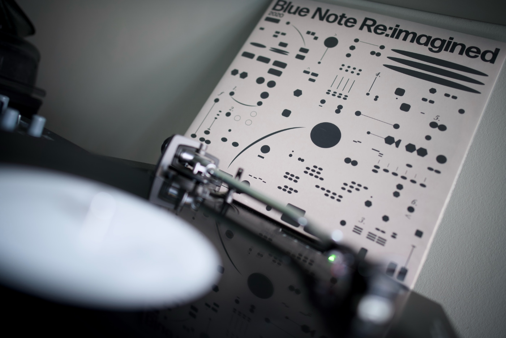

Intro

---

## Album of the month

If there is one album that I was listening to more than anything else in the past month, it needs to be the incredible [Blue Note Re:imagined (2020)](https://www.discogs.com/release/15969349-Various-Blue-Note-Reimagined-2020) compilation. Some of the greatest productionnns from the Blue Note label were recreated by the greatest artists of the British UK scene: Ezra Collective, Nubya Garcia, Poppy Ajudha, Jordan Rakei and plenty more. One of these records that you put a needle on and listen to from the very beginning to the very end. I must get the 2022 edition!

---

## Top picks

### [GSAP is now 100% FREE! 🥳](https://gsap.com/blog/3-13/)

I totally missed the news that Webflow acquired GreenSock at the end of 2024. But I didn’t miss today’s announcement that GSAP is now free for personal and commercial use. Not only is the core of the animation engine becoming free, but also their premium plugins. To top it off, they just dropped a pretty sweet upgrade to some of the GSAP family plugins.

### [Seeking an Answer: Why can't HTML alone do includes?](https://frontendmasters.com/blog/seeking-an-answer-why-cant-html-alone-do-includes/)

Usually, an article is a long-form answer to a question. Chris flipped this rule in this post and published a long-form question about the native ability of HTML includes. The whole post is great, but a lot of value is in the comments section. For example, the ["Client side include feature for HTML"](https://github.com/whatwg/html/issues/2791) GitHub thread opened eight years ago contains a lot of considerations and implementation ideas for of the feature.

### [Config 2025: Figma product launch keynote](https://www.youtube.com/watch?v=HXVlgVWI7tc)

I still need to catch up with the releases from the past year, but this year's news from the Figma Conf is cool. Grid auto layouts (finally), Figma Sites, Make, Buzz and Figma Draw. Figma Sites in the current state is something I'm particularly NOT interested in using, and I would advise you not to fall into the trap of releasing anything using this tool. The output that this tool spits out is just an accessibility nightmare. Nonetheless, a bunch of great announcements on this one. Buzz looks like something that can massively help me with assets for this blog and for [NN1 Dev Club](https://nn1.dev/).

### [Are 'CSS Carousels' accessible?](https://www.sarasoueidan.com/blog/css-carousels-accessibility/)

Sara took a little break from blogging and social media, but now she is back with a really good write-up about the issues with much-hyped last month's pure CSS solutions for carousels. Not only does it highlight the issues with the current state of this implementation, but it also works as a good primer on accessibility debugging, understanding the accessibility tree and other basic concepts.

### [How to title your blog post or whatever](https://dynomight.net/titles/)

This is the article that introduced me to the Dynomight blog, but there are a lot more interesting reads on this website. So great content with tons of personality, a good sense of humour and good knowledge. I love the about page that is totally not about the author/page.

### [How to have the browser pick a contrasting color in CSS](https://webkit.org/blog/16929/contrast-color/)

I love the recent series of articles on the WebKit blog. Behind the simple feature announcement, there is always a deep dive into the subject. From this one I learned a lot about colour contrast, how it is calculated and the pros and cons of a few standards responsible for it. And of course about the new CSS `contrast-color()` function.
